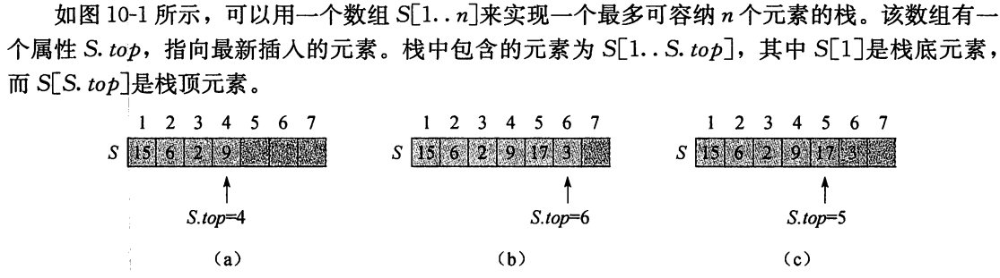

## Chapter 10 基本数据结构

算法操作的集合在整个过程能增大、缩小或发生其他变化，我们称这样的集合是动态的。

不同的算法可能需要对集合执行不同的操作

- 插入和删除元素
- 测试元素是否属于集合

支持这些操作的动态集合称为 **字典（dictionary）**

动态集合上的操作可以分类两类：

- 简单返回有关集合信息的 **查询操作**

  Search(S,k)

  Minimum(S)

  Maximum(S)

  Predecessor(S,x)

  Successor(S,x)

- 和改变集合的 **修改操作**

  Insert(S,x)

  Delete(S,x)

### 10.1 栈和队列

栈和队列都是动态集合，且在其上进行Delete操作所移除的元素是预先设定的。

**栈（stack）**中，被删除的是最近插入的元素：

- 栈实现的是一种**后进先出（last-in，first-out，LIFO）**策略

**队列（queue）**中，被删去的总是在集合中存在时间最长的那个元素：

- 队列实现的是一种 **先进先出（first-in，first-out，FIFO）**

#### 栈

Insert称为压入（Push），Delete操作称为弹出（Pop）：没有元素参数

栈空：S.top = 0

- 对空栈执行弹出操作：栈下溢（underflow）
- 如果S.top超过了n：栈上溢（overflow）

栈的集中操作只需分别用几行代码来实现：

三种栈操作的执行时间都为$O(1)$

#### 队列

队列上的Insert操作称为（入队，Enqueue），Delete操作称为（出队，Dequeue），dequeue没有元素参数

队列有队头（head）和队尾（tail），入队时，元素被放在队尾。出队的元素总是在队头的那个

Q[1..n]来实现一个最多容纳n-1个元素的队列

- Q.head指向队头元素
- Q.tail指向下一个新元素即将要插入的位置
- 环绕
- Q.head = Q.tail，队列为空
- 从空队列中删除一个元素，则队列下溢
- 当Q.head = Q.tail + 1，队列是满的，此时插入一个元素，队列上溢

出队和入队的代码

两种操作的执行时间都为$O(1)$

### 10.2 链表

**链表（linked list）**：各对象按线性顺序排列，链表的顺序是由各个对象里的指针决定的。

**双向链表（doubly linked list）**：每个元素都是一个对象，每个对象有

- 一个关键字key
- 两个指针，next和prev
  - x.next指向它在链表中的后继元素，x.next = NULL，则x没有后继，因此是是链表的最后一个元素，即链表的**尾（tail）**
  - x.prev指向它的前驱元素，x.prev = NULL，则为链表的**头（head）**
- 还可以包含其他的辅助数据（称为卫星数据）
- L.head指向链表的第一个元素，如果L.head == NULL，则链表为空

如果一个链表是**单链接的（singly linked）**，则省略每个元素中的prev指针

如果链表时**已排序的（sorted）**：则链表的线性顺序与链表元素中关键字的线性顺序一致

**未排序（unsorted）**：各元素可以以任何顺序出现

**循环链表（circular）**中，表头元素的prev指针指向表尾元素，而表尾元素的next指针指向表头元素

以下，假设所处理的链表是未排序的且是双链接的

#### 链表的搜索

List_search(L,k)：查找链表L中第一个关键字为k的元素，并返回指向该元素的指针，如果没有该元素，返回NULL

要搜索一个有n个对象的链表，过程List-search在最坏情况下的运行时间为 $\Theta(n)$

#### 链表的插入

给定一个已设置好关键字key的元素x，过程List-insert将x插入到链表的前端

List-insert的运行时间是$O(1)$

#### 链表的删除

过程List-delete将一个元素x从链表L中移除。该过程要求给定一个指向x的指针，然后通过修改一些指针，将x删除出该链表。如果要删除具有给定关键字值的元素，则必须先调用List-search找到该元素

List-delete的运行时间为 $O(1)$

删除具有给定关键字的元素，则最坏情况下需要的时间为 $\Theta(n)$

#### 哨兵

如果可以忽视表头和表尾处的边界条件，则List-delete的代码可以更简单些：

**哨兵（sentinel）**是一个哑对象，其作用是简化边界条件的处理。

假设在链表L中设置一个对象L.nil，该对象代表NULL，但也具有和其他对象相同的各个属性。对于链表代码中出现的每一处堆NIL的引用，都代之以对哨兵L.nil的引用

List-search：把对NULL和L.head的引用调整

List-insert

哨兵基本不能降低数据结构相关操作的渐进时间界，但可以降低常数因子。在循环语句中使用哨兵的好处往往在于可以使代码简洁，而非提高速度。

慎用哨兵，假如有许多个很短的链表，它们的哨兵所占用的额外存储空间会造成严重的存储浪费。

### 10.3 指针和对象的实现

有些语言不支持指针和对象数据类型

#### 对象的多数组表示

对每个属性使用一个数组表示，可以来表示一组有相同属性的对象。

例如一个链表，可以用key, next, prev三个数组表示，变量L存放表头元素的下标

#### 对象的单数组表示

一个对象在计算机内存中占据一组连续的存储单元，指针仅仅是该对象所在的第一个存储单元的地址，要访问对象内其他存储单元可以在指针上加上一个偏移量

这种单数组的表示法比较灵活，因为它允许不同长度的对线存储于同一数组中。

#### 对象的分配与释放

向一个双向链表表示的动态集合中插入一个关键字，就必须分配一个指向该链表表示中尚未利用的对象的指针。

有必要对链表中尚未利用的对象空间进行管理，使其能够被分配。

**垃圾收集器（garbage collector）**负责确定哪些对象是未使用的。

假设多数组表示法中的各数组的长度为m，且在某一时刻该动态集合含有$n\leq m$个元素。则n个对象代表现存于该动态集合中的元素，而余下的m-n个对象是自由的（free）；这些自由对象可以来表示将要插入该动态集合的元素

我们把自由对象保存在一个单链表中，称为**自由表（free list）**。自由表只使用next数组，该数组只存储链表中的next指针。自由表的头保存在全局变量free中。当链表L表示的动态集合非空时，自由表可能会和链表L相互交错。每个对象不是在链表L中，就在自由表中，但不会同时属于两个表。

自由表类似于一个栈

- 下一个被分配的对象就是最后被释放的那个。

Free-object（x）

### 10.4 有根树的表示

树的结点用对象表示，假设每个节点都含有一个关键字key，还有指向其他节点的指针。

#### 二叉树

属性p，left，right存放指向父节点，左孩子和右孩子的指针。

- 如果x.p = NULL，则x是根节点
- 如果x没有左孩子，则x.left = NULL
- 如果x没有右孩子，则x.right = NULL
- T.root指向整棵树T的根节点，如果T.root = NULL，则该树为空

#### 分支无限制的有根树

可以推广到每个节点的孩子数至多为常数k的任意类型的树

$child_1,child_2,...,child_k$

当孩子的节点无限制时，这种方法就失效了，因为我们不知道应当预先分配多少个属性（多数组中就是多少个数组）

即使孩子数k限制在一个大的常数内，但若多数结点只有少量的孩子，则会浪费大量存储空间

采用 **左孩子右兄弟表示法**（left-child，right-sibling representation），对任意n个节点的有根树，只需要$O(n)$的存储空间

每个节点都包含一个父节点指针p，且T.root指向树T的根节点。每个节点中不是包含指向每个孩子的指针，而是只有两个指针：

- x.left-child指向节点x最左边的孩子结点
- x.right-sibling指向x右侧相邻的兄弟节点

如果节点x没有孩子结点，则x.left-child = NULL，如果节点x是其父节点的最右孩子，则x.right-sibling = NULL

#### 树的其他表示方法

完全二叉树用堆来表示，堆用一个单数组加上堆的最末节点的下标表示