## Chapter 11 散列表

**散列表（hash table）**是实现字典操作的一种有效数据结构。

- 最坏情况下，查找一个元素的时间与链表相同，$\Theta(n)$
- 实际应用中，散列表中查找一个元素的平均时间是 $O(1)$

散列表是普通数组概念的推广。对于普通数组可以直接寻址，使得能在$O(1)$时间内访问数组中的任意位置。如果存储空间允许，我们可以提供一个数组，为每个可能的关键字保留一个位置，以利用直接寻址技术的优势。

当实际存储的关键字数目比全部的可能关键字总数要小时，采用散列表就成为直接数组寻址的一种有效替代，因为散列表使用一个长度与实际存储的关键字数目成比例的数组来存储，不是直接把关键字作为数组的下摆哦，而是根据关键字计算出相应的下标。

### 11.1 直接寻址表

当关键字的全域U比较小时，直接寻址是一种简单而有效的技术。

动态集合中的每个元素都是取自于全域 $U = \{0,1,2,...,m-1\}$中的一个关键字，这里m不是一个很大数。另外，假设没有两个元素具有相同的关键字

为表示动态集合，我们用一个数组，或成为 **直接寻址表（direct-address table）**，记为T[0..m-1]，其中每个位置，或成为 **槽（slot）**，对应全域U中的一个关键字。

槽k指向集合中一个关键字为k的元素。如果集合没有关键字为k的元素，则T[k] = NULL

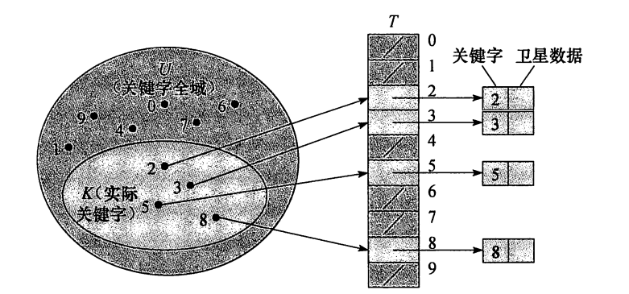

字典操作的实现

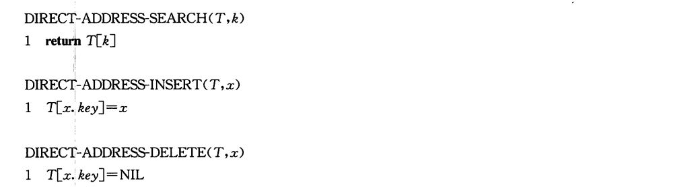

每一个操作都只需$O(1)$时间

对某些应用，直接寻址表本身就可以存放动态集合中的元素。也就是说，并不把每个元素的关键字及其卫星数据都放在直接寻址表外部的一个对象中，再由表中某个槽的指针指向该对象，而是直接把该对象存放在表的槽中，从而节省了空间。

使用对象内的一个特殊关键字来表明该槽为空槽。

### 11.2 散列表

直接寻址技术的缺点：

- 如果全域U很大，则存储大小为 |U|的一张表T不太实际，甚至不可能
- 关键字集合K相对U来说可能很小，浪费空间

当关键字集合K比全域U小很多时候，散列表的存储需求为$\Theta(|K|)$，散列表中查找一个元素只需要$O(1)$的时间

散列方式下，关键字k的元素被存放在槽h（k）中。利用**散列函数（hash function）h**，由关键字k计算出槽的位置。

函数h将关键字的全域U映射到散列表（hash table）T[0..m-1]的槽位上

$h:U\rightarrow \{0,1,...,m-1\}$

h(k)是关键字k的**散列值**。散列函数缩小了数组下标的范围，即减小了数组的大小，使其由$|U|$减小为m

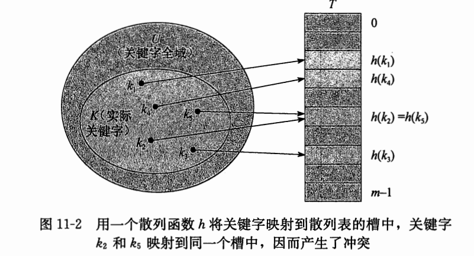

**冲突（collision）**：两个关键字可能映射到同一个槽中

- 一方面设计散列函数尽量减少冲突的次数
- 另一方面有解决可能出现冲突的办法

**链接法（chaining）**

- 把散列到同一槽中的所有元素都放在一个链表中

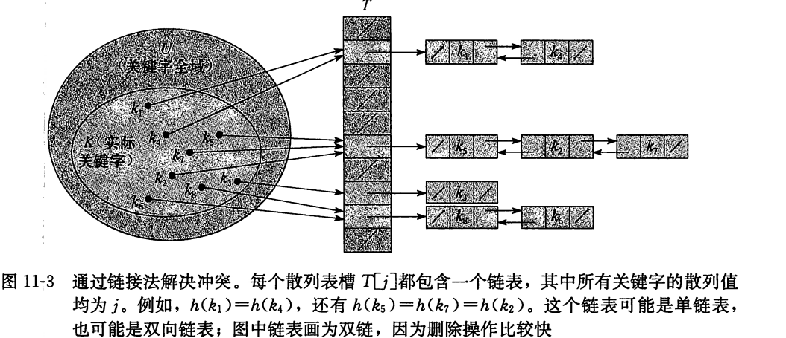

字典操作实现

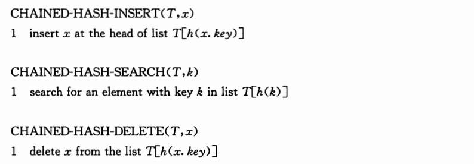

插入操作的最坏情况运行时间为$O(1)$

插入过程在某种程度上要快一些，因为假设待插入的元素x没有出现在表中。

查找操作的最坏情况运行时间与表的长度成正比

如果散列表中的链表是双向链接的，则删除一个元素x的操作可以在$O(1)$时间内完成。

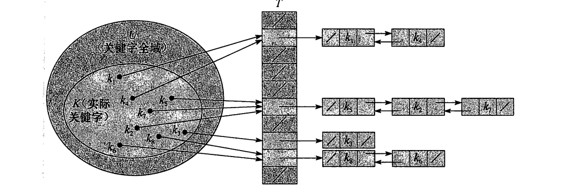

#### 链接法散列的分析

给定一个能存放n个元素的、具有m个槽位的散列表T，定义T的**装载因子（load factor）**

$\alpha = \frac{n}{m}$，即一个链的平均存储元素数。

- $\alpha$可以小于、等于或大于1

链接法散列的最坏情况：n个关键字都散列到同一个槽中，从而产生出一个长度为n的链表。这时候查找的时间为 $\Theta(n)$

平均性能依赖于所选取的散列函数h，将所有的关键字集合等可能的分布在m个槽位上的均匀程度。

**简单均匀散列（simple uniform hashing）**

- 任何一个给定元素等可能的散列到m个槽中的任意一个，且与其他元素被散列到什么位置上无关。

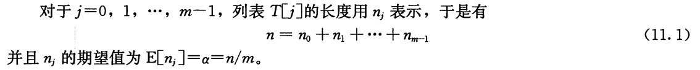

假设在$O(1)$的时间内计算出散列值h(k)，从而查找关键字为k的元素的时间线性的依赖于表$T[h(k)]$的长度$n_{h(k)}$

- 查找不成功，表中没有一个元素的关键字为k
- 成功的查找关键字为k的元素

##### thm11.1

在简单均匀散列的假设下，对于链接法解决冲突的散列表，一次不成功查找的平均时间为 $\Theta(1+\alpha)$

##### thm11.2

在简单均匀散列的假设下，对于用链接法解决冲突的散列表，一次成功查找所需的平均时间为$\Theta(1+\alpha)$

如果散列表中的槽数至少与表中的元素数成正比，则有 $n = O(m)$，从而 $\alpha = n/m = O(m)/m = O(1)$

所以，查找操作平均需要常数时间。当链表采用双向链接时，插入操作在最坏情况下需要$O(1)$时间，删除操作最坏情况下也需要$O(1)$ 时间。

### 11.3 散列函数

本节讨论如何设计好的散列函数的问题，并介绍三种方法

##### 好的散列函数的特点

近似的满足简单均匀散列假设：每个关键字都被等可能地散列到m个槽位中任何一个，并且与其他关键字已散列到哪个槽位无关。

但，很少能知道关键字散列所满足的概率分布，而且各关键字可能并不是完全独立的。

- 运用启发式方法构造性能好的散列函数
- 一种好的方法导出的散列值，某种程度上独立于数据可能存在的任何模式
- 散列函数的某些应用可能会要求比简单均匀散列更强的性质。

##### 将关键字转换为自然数

多数散列函数都假定关键字的全域为自然数集N = {0,1,2,...}，因此，如果所给关键字不是自然数，就需要找到一种方法来将它们转换为自然数。

#### 11.3.1 除法散列法

散列函数为 $h(k) = k~mod~m$

要避免选择m的某些值

- m不应为2的幂
- 一个不太接近2的整数幂的素数，常常是m的一个较好的选择。

#### 11.3.2 乘法散列法

散列函数为：

A（0<A<1）

$h(k) = \lfloor m(kA~mod1)\rfloor$

- 这里kA mod1是取kA的小数部分，即 $kA -\lfloor kA\rfloor$

优点是对m的选择不是特别关键

A为黄金分割 $(\sqrt{5}-1)/2$是个比较理想的值。

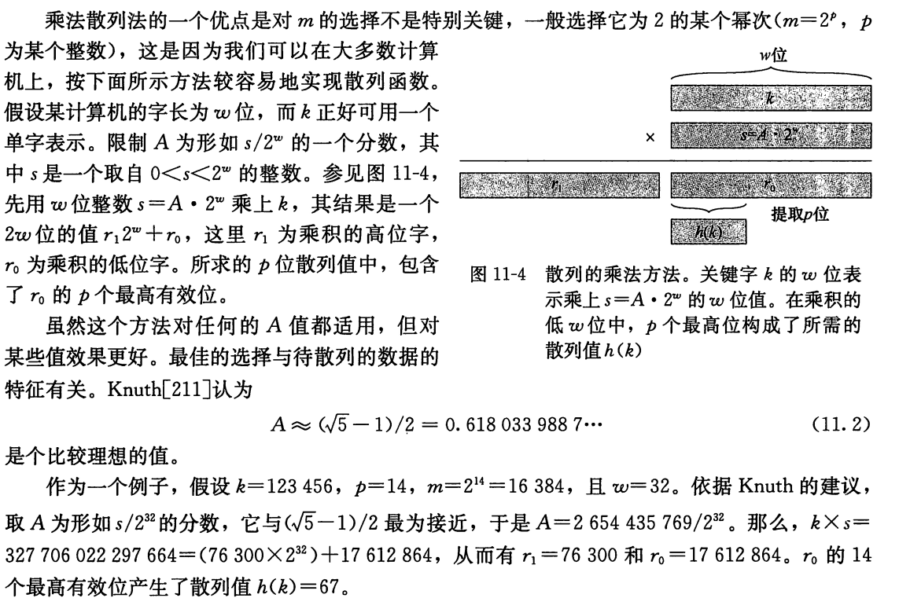

#### 11.3.3 全域散列法

随机的选择散列函数，使之独立于要存储的关键字，这种方法称为 **全域散列（universal hashing）**

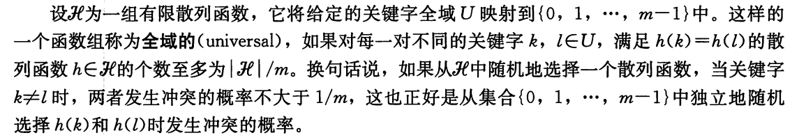

##### thm11.3 

如果h选自一组全域散列函数，将n个关键字散列到一个大小为m的表T中，并用链接法解决冲突。

如果关键字k不在表中，则k被散列至其中的链表的期望长度至多为$\alpha = n/m$

如果关键字k在表中，则包含关键字k的链表的期望长度至多$1+\alpha$

##### 推论11.4 

对一个具有m个槽位且初始时为空的表，利用全域散列法和链接法解决冲突，需要 $\Theta(n)$的期望时间来处理任何包含了n个Insert，search和delete的操作序列，其中该序列包含了$O(m)$个Insert操作

#### 设计一个全域散列函数类

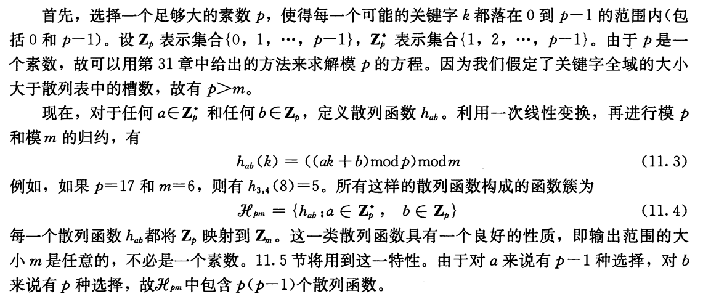

##### thm11.5 

由公式(11.3)和公式(11.4)定义的散列函数簇是全域的

### 11.4 开放寻址法

在**开放寻址法（open addressing）**中，所有的元素都存放在散列表里。

每个表项或包含动态集合的一个元素，或包含NULL。当查找某个元素时，要系统地检查所有的表项，直到找到所需的元素，或者最终查明该元素不在表中。

在开放寻址法中，散列表可能会被填满，以至于不能插入任何新的元素。

装载因子$\alpha$不会超过1

开放寻址法的好处在于它不用指针，而是计算出要存取的槽序列。

为了使用开发寻址法插入一个元素，需要连续的检查散列表，或成为**探查（probe）**，直到找到一个空槽来放置待插入的关键字为止。

检查的顺序要**依赖于待插入的关键字**

散列函数就变为：

- $h:U \times\{0,1,...,m-1\} \rightarrow \{0,1,...,m-1\}$

对每一个关键字k，使用开放寻址法的**探查序列（probe sequence）**

- $<h(k,0),h(k,1),...,h(k,m-1)>$

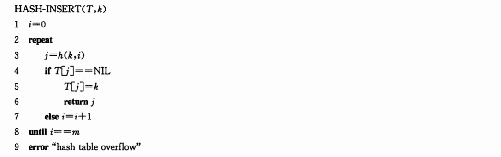

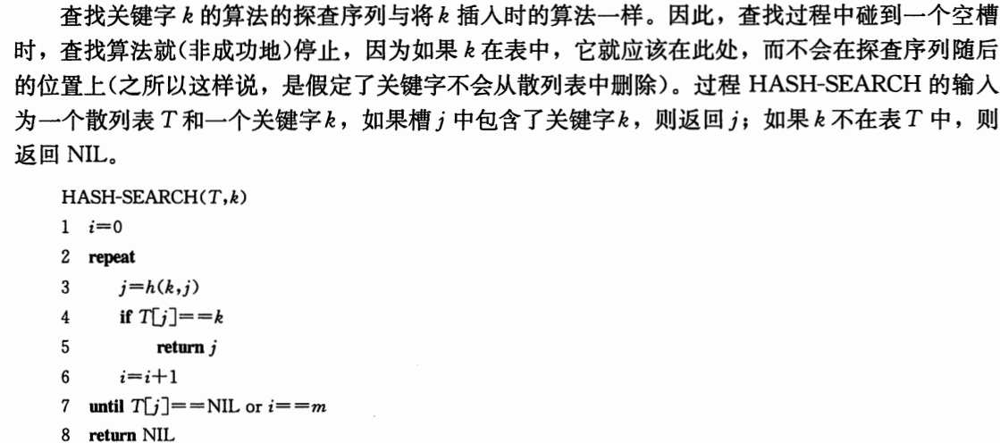

从开放寻址法的散列表中删除操作元素比较困难。当我们从槽i中删除关键字时，不能仅将NIL置于其中来标识它为空。

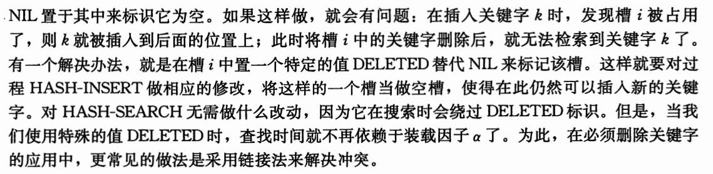

真正的均匀散列是难以实现的，在实际应用中，常常采用它的一些近似方法

线性探查、二次探查和双重探查。这几种技术都能保证对每个关键字k，<h(k, 0), h(k, 1), ..., h(k, m-1)>都是<0,1,...,m-1>的一个排列

三种技术中，双重散列产生的探查序列最多。

##### 线性探查

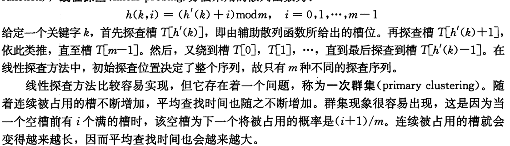

##### 二次探查

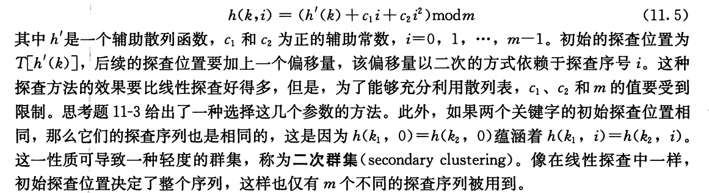

##### 双重散列（double hashing）

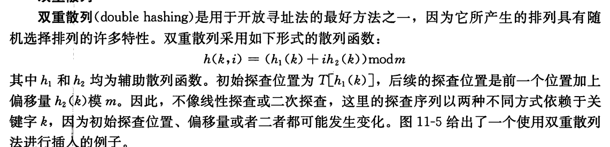

为了能查找整个散列表，$h_2(k)$必须要与表的大小m互素。

- 取m为2的幂，并设计一个总产生奇数的$h_2$
- 取m为素数，并设计一个总是返回较m小的正整数的函数$h_2$

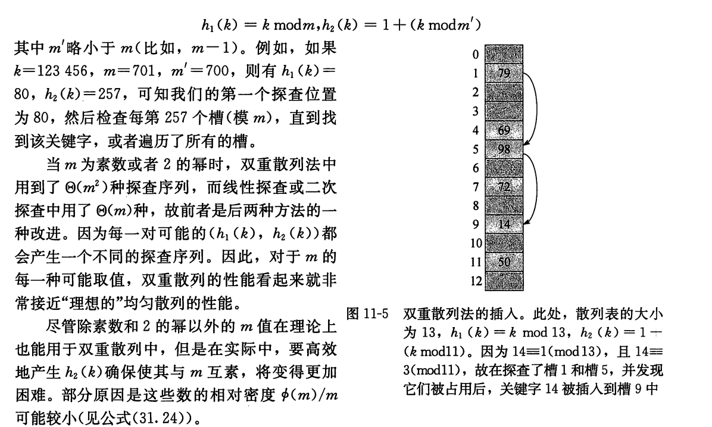

#### 开放寻址散列的分析

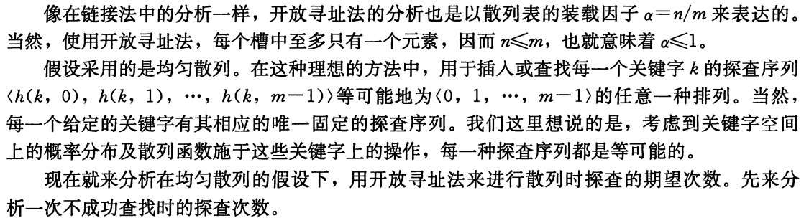

##### thm11.6 

给定一个装载因子位$\alpha = n/m <1$的开放寻址散列表，并假设是均匀散列的，则对于一个不成功的查找，其期望的探查次数至多为$1/(1-\alpha)$

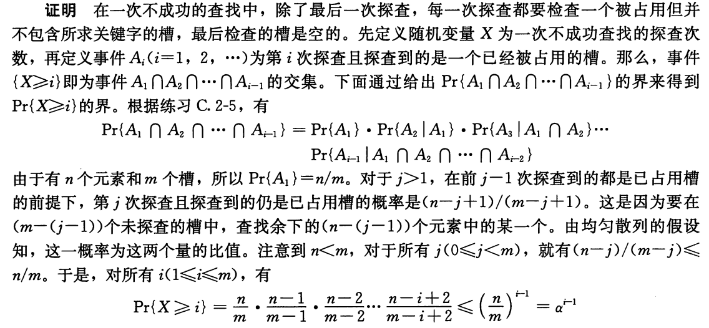

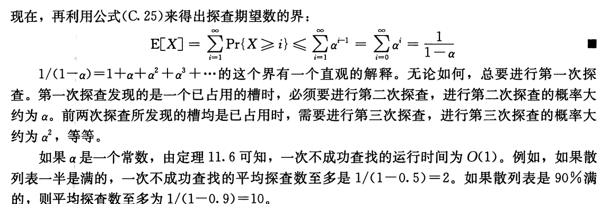

##### 推论11.7 

假设采用的是均匀散列，平均情况下，向一个装载因子位$\alpha$的开放寻址散列表中插入一个元素至多需要做$1/(1-\alpha)$次探查

##### thm 11.8

对于一个装载因子为 $\alpha <1$的开放寻址散列表，一次成功查找中的探查期望数至多为
$$
\frac{1}{\alpha}\ln \frac{1}{1-\alpha}
$$
假设采用均匀散列，且表中的每个关键字被查找的可能性是相同的