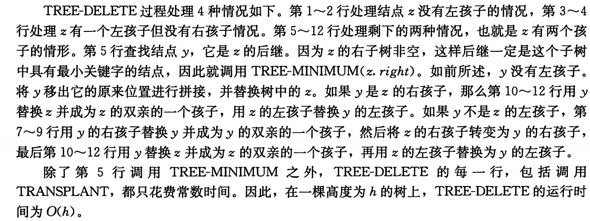
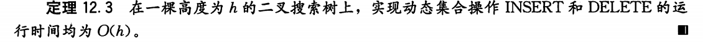

## Chapter 12 二叉搜索树

对于有n个结点的一棵完全二叉树爱说，这些操作的最坏运行时间为$\Theta(lgn)$，然而如果这棵树退化成一条n个结点组成的线性链，同样的操作就花费$\Theta(n)$的最坏运行时间

### 12.1 什么是二叉搜索树

一棵二叉搜索树是以一棵二叉树来组织的。这样一棵树可以使用一个链表数据结构来表示，其中每个结点就是一个对象。

数据结构

- key和卫星数据
- left，right和p

根节点是树中唯一父指针为NIL的结点

二叉搜索树中的关键字总是以满足二叉搜索树性质的方式来存储：

- 设x是二叉搜索树中的一个结点，如果y是x左子树中的一个结点，那么$y.key \leq x.key$
- 如果y是x右子树中的一个结点，那么$y.key \geq x.key$


二叉搜索树性质允许我们通过一个简单的递归算法来按序输出二叉搜索树中的所有关键字，这种算法称为**中序遍历（inorder tree walk）**算法


##### 中序遍历算法


##### thm12.1 证明执行一次中序遍历耗费线性时间

如果x是一棵有n个结点子树的根，那么调用Inorder-tree-walk（x）需要$\Theta(n)$时间


### 12.2 查询二叉搜索树

下面说明在任何高度为h的二叉搜索树算上，如何在$O(h)$时间内执行完每个操作

#### 查找Search


从树根开始递归期间遇到的结点，形成了一条向下的简单路径，所以Tree-search的运行时间为$O(h)$，其中h是这棵树的高度

用while循环来展开递归


#### 最大关键字元素和最小关键字元素

返回一个指向在以给定结点x为根的子树中最小元素的指针


返回一个指向在以给定节点x为根的子树中最大元素的指针


这两个过程在一棵高度为h的树上均能在$O(h)$时间内执行完

#### 后继与前驱

如果所有的关键字互不相同，则一个结点x的后继是大于x.key的最小关键字的结点。一棵二叉搜索树的结构允许我们通过没有任何关键字的比较来确定一个结点的后继。

如果后续存在，下面的过程将返回一棵二叉搜索树中的结点x的后继，如果x是这棵树中的最大关键字，则返回NIL

- x的右子树非空，后继是x右子树的最左结点
- x的右子树非空并由一个后继y，那么y就是x的有左孩子的最底层祖先。


##### thm12.2 


### 12.3 插入和删除

插入和删除操作会引起由二叉搜索树表示的动态集合的变化。

一定要修改数据结构来反映这个变化，但修改要保持二叉搜索树性质的成立

#### 插入


Tree-insert（T，z）

```c++
void Tree_insert(Tree * T, node *z)
{
    node * y = nullptr;
   	node * x = T.root;
    while(x != nullptr)
    {
        y = x;
        if(z.key < x.key) x = x.left;
        else x = x.right;
    }
    z.p = y;
    if(y == nullptr) T.root = z;
    else if(z.key < y.key) y.left = z;
    else y.right = z;
}
```


#### 删除

从一棵二叉搜索树T中删除一个结点z的整个策略分为三种基本情况，但只有一种情况有点棘手


为了在二叉搜索树内移动子树，定义一个子过程Transplant，它是用另一棵子树替换一棵子树并成为其双亲的孩子结点。

当Transplant用一棵以v为根的子树来替换一棵以u为根的子树时，结点u的双亲就变为结点v的双亲，并且最后v成为u的双亲的相应孩子


下面是从二叉搜索树T中删除结点z的删除过程：

```c++
void Tree_delete(Tree * T, int z)
{
    if(z.left == nullptr)
        transplant(T, z, z.right);
    else if(z.right == nullptr)
        transplant(T, z, z.left);
    else 
    {
        y = tree_minimum(z.right)
        // 如果y不是z的直接右孩子
        if(y.p != z)
        {
            transplant(T,y,y.right);//y的右子树代替y在其父节点的中的位置
            y.right = z.right;	//	现在的右子树变为z的右子树
            y.right.p = y;	// 更新右子树的p
        }
        transplant(T,z,y);
        y.left = z.left;
        y.left.p = y;
    }
}
```



##### thm12.3



### 12.4 随机构建二叉搜索树


##### thm12.4

一棵有n个不同关键字的随机构建二叉搜索树的期望高度为$O(lgn)$

证明如下：


>定义了
>$$
>X_n:一棵有n个不同关键字的随机构建二叉搜索树的高度\\
>Y_n = 2^{X_n},指数高度\\
>R_n:这个关键字在n个关键字集合中的秩(rank)，位置\\
>$$
>


