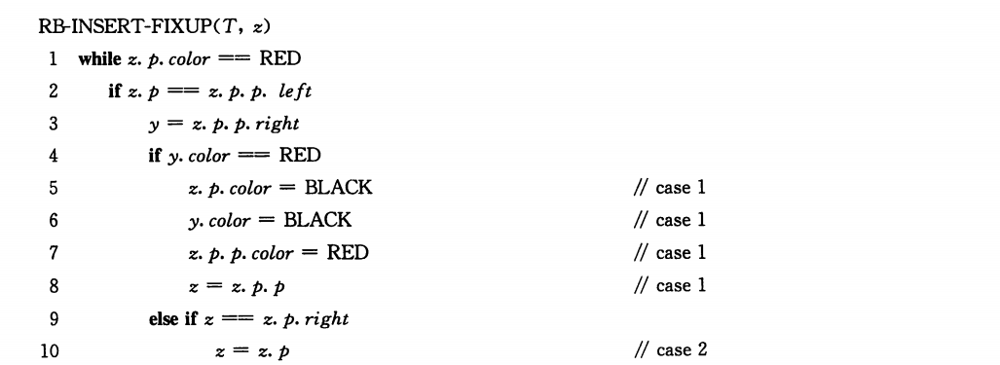
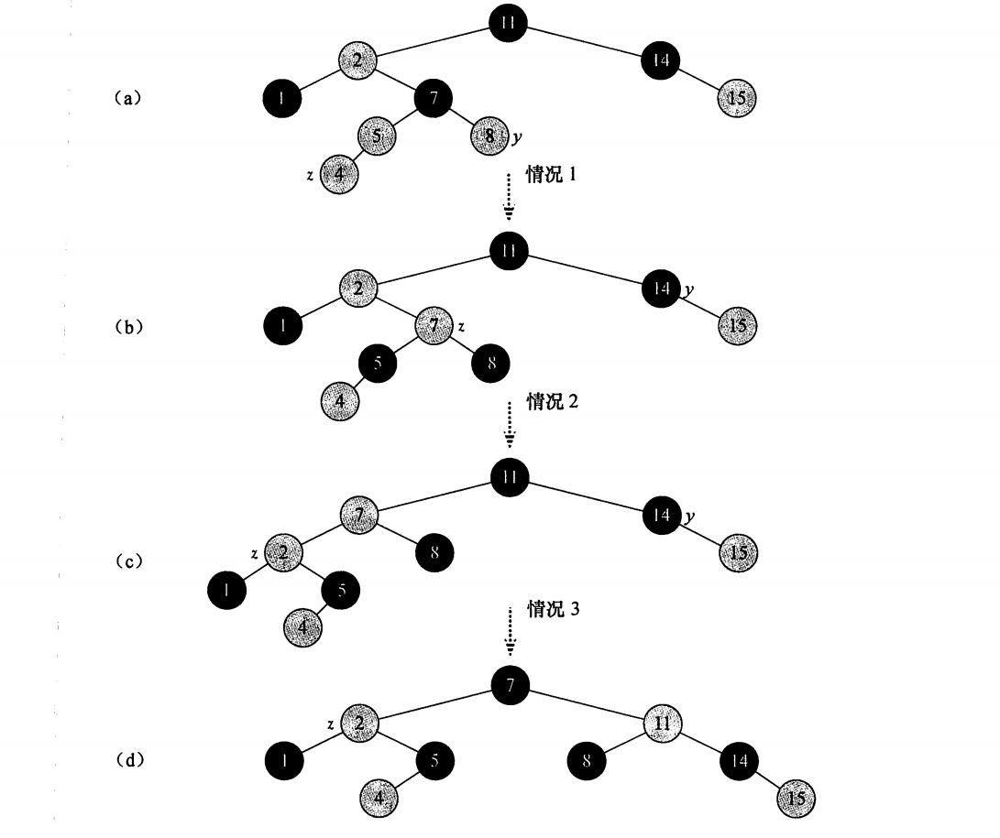

## Chapter 13 红黑树

如果树的高度较高时，二叉搜索树的集合操作可能不比链表上执行得快。红黑树（red-black-tree）是许多AVL中的一种，可以保证在最坏情况下基本动态集合操作的时间复杂度为$O(lgn)$

### 13.1 红黑树的性质

红黑树是一棵二叉搜索树，它在每个结点上增加了一个存储位来表示结点的**颜色**，可以是Red或Black

通过对任何一条从根到叶子的简单路径上各个结点的颜色进行约束，红黑树确保没有一条路径会比其他路径长出2倍，因而是近似于**平衡的**

#### 数据结构

每个结点包含五个属性

- color
- key
- left
- right
- p

如果一个结点没有子结点或父结点，则该结点对应的指针属性值为NIL

- 我们可以把这些NIL视为指向二叉搜索树的叶结点（外部结点）的指针，而把带关键字的结点视为树的内部结点


一棵红黑树例子


>红黑树的黑高为其根结点的黑高

下面的引理说明了为什么红黑树是一棵好的搜索树

##### 引理13.1 一棵有n个内部结点的红黑树的高度至多为2lg(n+1)

证明：


### 13.2 旋转

搜索树操作tree_insert和tree_delete在含n个关键字的红黑树上，运行花费时间为$O(lgn)$

由于这两个操作对树做了需修改，可能违反红黑性质，为了维护这些性质，必须要改变树中某些结点的颜色以及指针结构


Left-rotate伪代码


>```c++
>void left_rotate(Tree * T, node * x)
>{
>    // 左旋要求x的右孩子不为NIL
>    y = x.right;
>    // x右孩子变成y的左孩子
>    x.right = y.left;
>    // 更新y.left的父指针
>    if(y.left != T.nil)
>        y.left.p = x;
>    // 改变y的父指针
>    y.p = x.p;
>    if(x.p == T.nil)
>        T.root = y;
>    else if(x == x.p.left)
>        x.p.left = y;
>    else x.p.right = y;
>    y.left = x;
>    x.p = y;
>}
>```


### 13.3 插入


```c++
void RB_insert(Tree * T, node * z)
{
    y = T.nil;
    x = T.root;
    while(x != T.nil)
    {
       	y = x;
        if(z.key < x.key)
            x = x.left;
        else x = x.right
    }
    z.p = y;
    if(y == T.nil)
    {
        T.root = z;
    }
    else if(z.key < y.key)
        y.left = z;
    else y.right = z;
    z.left = T.nil;
    z.right = T.nil;
    z.coler = RED;
    RB_insert_fixup(T, z);
}
```

RB_insert_fixup（T，z）来保持红黑性质




```c++
void RB_insert_fixup(Tree * T, node * z)
{
    while(z.p.color == RED)
    {
        if(z.p == z.p.p.left)
        {
            y = z.p.p.right;
            if(y.color == RED)
            {
                z.p.color = BLACK;
                y.color = BLACK;
                z.p.p.color = RED;
                z = z.p.p;
            }
            else if z == z.p.right
            {
                z = z.p;
                Left_rotate(T,z);
            }
            z.p.color = BLACK;
            z.p.p.color = RED;
            Right_rotate(T,z.p.p);
        }
        else 
    }
    T.root.color = BLACK;
}
```





- 情况1：z的叔结点y是红色的

  

  

- 情况2：z的叔结点y是黑色的且z是一个右孩子

- 情况3：z的叔结点y是黑色的且z是一个左孩子

  

  

  


RB_insert的运行时间为O（lgn）

### 13.4 删除

与n个结点的红黑树上的其他基本操作一样，删除一个结点要花费O（lgn）时间。

##### RB_transplant


##### RB_delete


