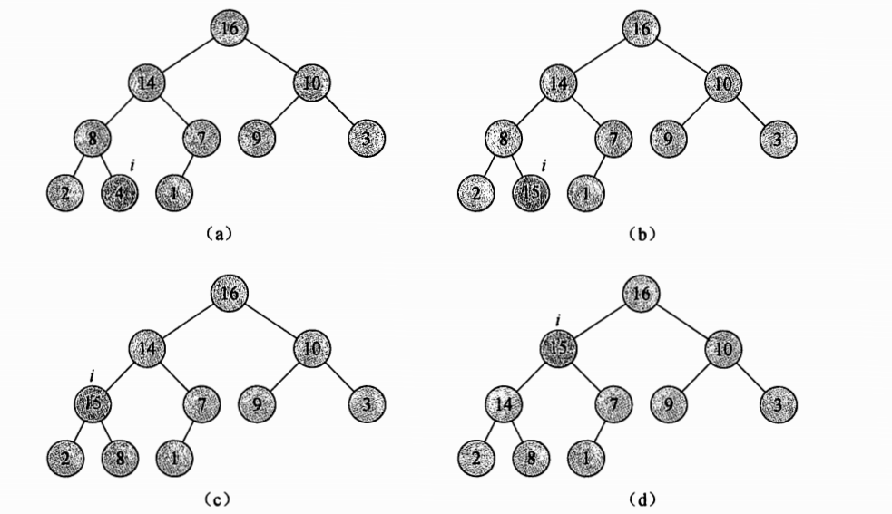

## ch6 堆排序

堆排序的时间复杂度是$O(n\lg n )$

堆排序具有空间原址性：任何时候都只需要常数个额外的元素空间存储临时数据

### 6.1 堆

`（二叉）堆`是一个数组，它可以被看成一个近似的完全二叉树。树上的每一个节点对应数组中的一个元素。除了最底层外，该树是完全充满的，而且是从左向右填充。

表示堆的数组A包括两个属性：

- A.length：给出数组元素的个数
- A.heap_size：表示有多少个堆元素存储在数组中

虽然A[1...A.length]可能都存有数据，但只有A[1.。。A.heap-size]中存放的是堆的有效元素。

树的根节点是A[1]，这样给定一个节点的下标i，我们很容易计算得到它的父节点、左孩子和右孩子的下标

> 在大多数计算机上，通过将i的值左移移位，LEFT过程可以在一条指令内计算出 2i。采用类似方法，在RIGHT过程中也可以通过将i的值左移1位并在低位加1，快速计算得到2i+1.
>
> **这是一种很快的查找方式，而不是采用乘法指令和除法指令**

PARENT过程，则可以通过把i的值右移1位计算得到[i/2]。在堆排序的好的实现中，这三个函数通常是以”宏“或者”内联函数“的方式实现的

#### 最大堆和最小堆

二叉堆分为两种形式：最大堆和最小堆。在这两种堆中，结点的值都要满足堆的性质，但一些细节定义则有所差异。

在最大堆中，最大堆的性质是指除了根以外的所有结点i都要满足：

$A[PARENT(i)]\geq A[i]$

也就是说，某个结点的值至多与其父节点一样大。因此，堆中的最大元素存放在根节点中，并且，在任意子树中，该子树所包含的所有结点的值都不大于该子树根结点的值。

最小堆性质是指除了根以外的所有结点i都有

$A[PARENT(i)] \leq A[i]$

最小堆中的最小元素存放在根节点中

在堆排序算法，我们使用的是最大堆。最大堆通常用于构造优先队列。

如果把堆看成一棵树，我们定义一个堆中的结点的高度就为该节点到叶节点的最长简单路径上边的数目；进而没问可以把堆的高度定义为根节点的高度。

- MAX-HEAPIFY过程：时间复杂度为$O(lgn)$，它是维护最大堆性质的关键
- BUILD-MAX-HEAP过程：具有线性时间复杂度，功能是从无序的输入数据数组中构造一个最大堆
- HEAPSORT过程：其时间复杂度为O（lgn），功能是对一个数组进行原址排序
- MAX-HEAP-INSERT、HEAP-EXTRACT-MAX、HEAP-INCREASE-KEY和HEAP-MAXIMUM过程：时间复杂度为$O(lgn)$，功能是利用堆实现一个优先队列

### 6.2 维护堆的性质

算法Max_heapify(A, i)：

- 输入：以一个数组A和一个下标i
- 作用：让A[i]的值在最大堆中“逐级下降”，从而使得A[i]为根节点的自述满足最大堆条件

执行过程如下图

时间复杂度：

时间代价包括：调整A[i]，A[LEFT(i)], A[RIGHT(i)]的关系的时间代价$\Theta(1)$，加上一棵以i的一个孩子位根节点的子树上运行Max-heapify的时间代价
$$
T(n) \leq T(2n/3) + \Theta(1)
$$
递归式的解为 $T(n) = O(\lg n)$

一个树高为h的节点来说，时间复杂度为 O(lg n)

### 6.3 建堆

对所有树中的叶子结点调用一次 max-heapily

包含n个元素的堆的高度为$\lfloor lgn \rfloor$，高度为h的堆最多包含$\lceil n/2^{h+1}\rceil$

这个算法的时间复杂度为$O(n)$

因此，我们可以在线性时间内，把一个无序数组构造成为一个最大堆。

算法演示如下

类似的，我们也可以通过调用 Build-min-heap构造一个最小堆，第三行的调用替换为

Min-heapify，可以在线性时间内，把一个无序数组构造成为一个最小堆

### 6.4 堆排序算法

初始时候，堆排序算法利用Build-max-heap将输入数组A[1...n]建成最大堆，其中n = A.length。

最大元素总在根节点A[1]中，通过把它与A[n]进行互换，我们可以让该元素放到正确的位置。

这时候从堆中去掉节点n（A.heap_size--），剩余的节点中，原来根的孩子结点仍然是最大堆，而新的根节点可能回违背最大堆的性质。

为了维护最大堆的性质，调用Max-heapify(A, 1)，从而在A[1...n-1]上构造一个新的最大堆。

堆排序算法不断重复这一过程，直到堆的大小从n-1降到2

算法演示如下

Heapsort过程的时间复杂度为$O(lg n)$

### 6.5 优先队列

优先队列有两种形式：

- 最大优先队列
- 最小优先队列

优先队列（priority queue）是一种用来维护由一组元素构成的集合S的数据结构，其中的每一个元素都有一个相关的值，称为**关键字（key）**。一个最大优先队列支持以下操作

- Insert（S，x）：把元素x插入集合S中。这一操作等价于$S = S \cup \{x\}$
- Maximum（S）：返回S中具有最大关键字的元素
- Extract-Max（S）：去掉并返回S中的具有最大关键字的元素
- Increase-key（S，x，k）：将元素x的关键字增加到k，这里假设k的值不小于x的原关键字

最大优先队列的应用：

- 共享计算机系统的作业调度，调度器通过调用Extract-Max从是所有的等待作业中，选出具有最高优先级的作业来执行。Insert可以把一个新作业加入到对列中

最小优先队列的应用：

- 基于事件驱动的模拟器。队列中保存要模拟的事件，每个事件都有一个发生时间作为其关键字。事件必须按照发生的时间顺序进行模拟，因为某一事件的模拟结果可能会触发对其他事件的模拟。在每一步，模拟程序调用Extract-min来选择下一个要模拟的事件。当一个新事件产生时，模拟器通过调用insert将其插入最小优先级队列中。

优先队列可以用堆来实现

需要再堆中的每个元素里存储对应对象的**句柄（handle）**。

- 句柄（如一个指针或一个整型数）的准确含义依赖于具体的应用程序。在应用程序的对象中，我们也需要存储一个堆中对应元素的句柄

Heap-extract-max的时间复杂度为O（lg n）

Heap-increase-key的时间复杂度是O（lg n）

算法演示如下

