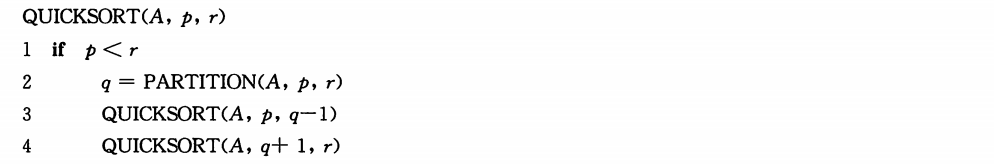
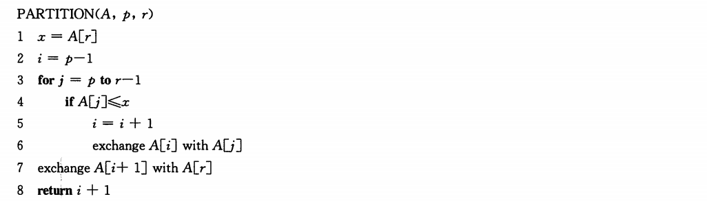
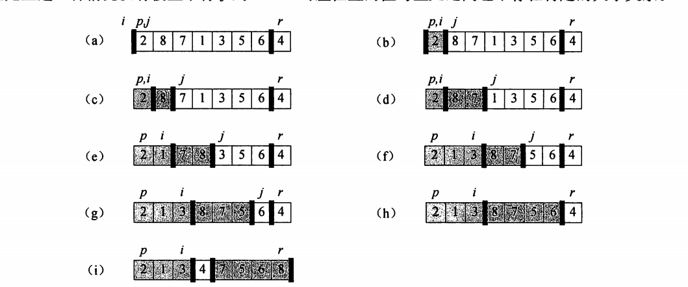
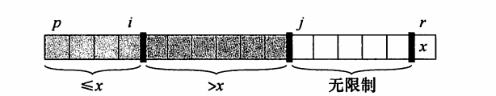
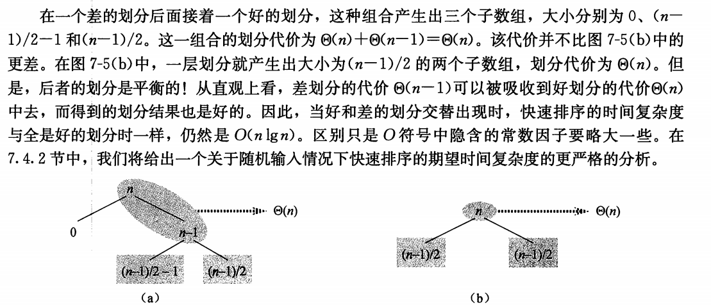
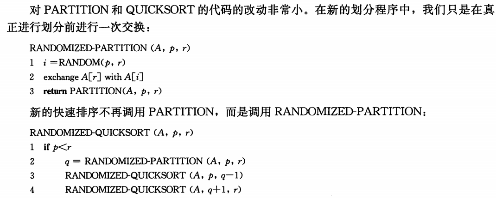
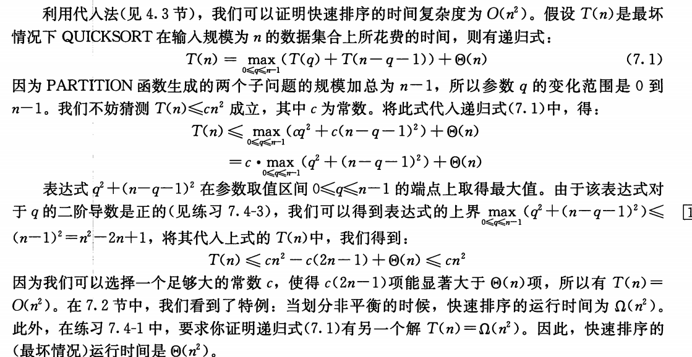
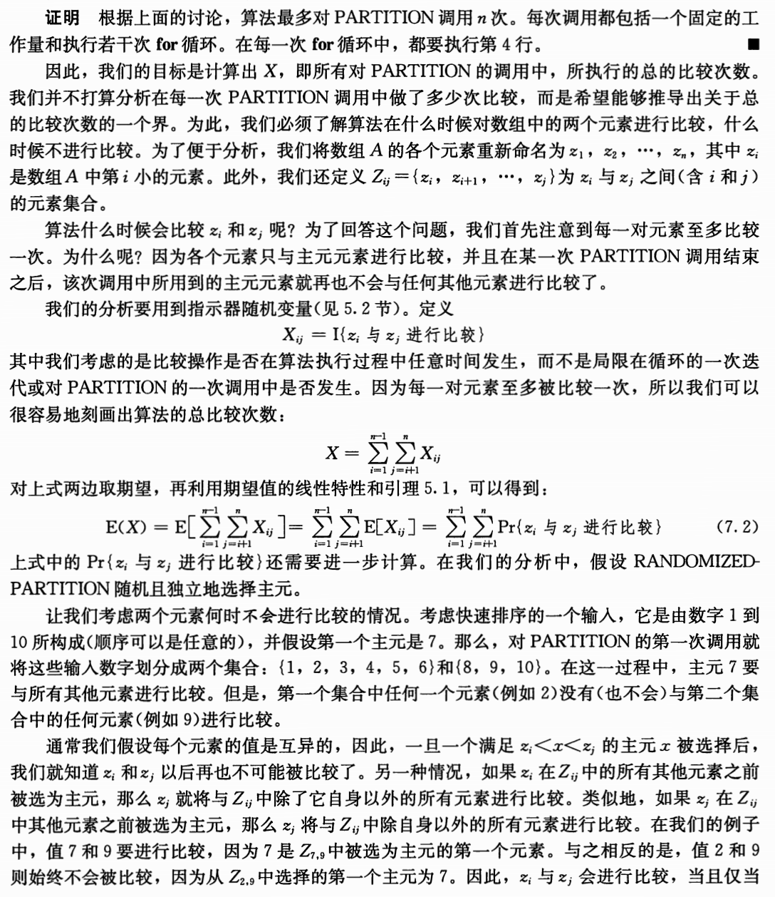
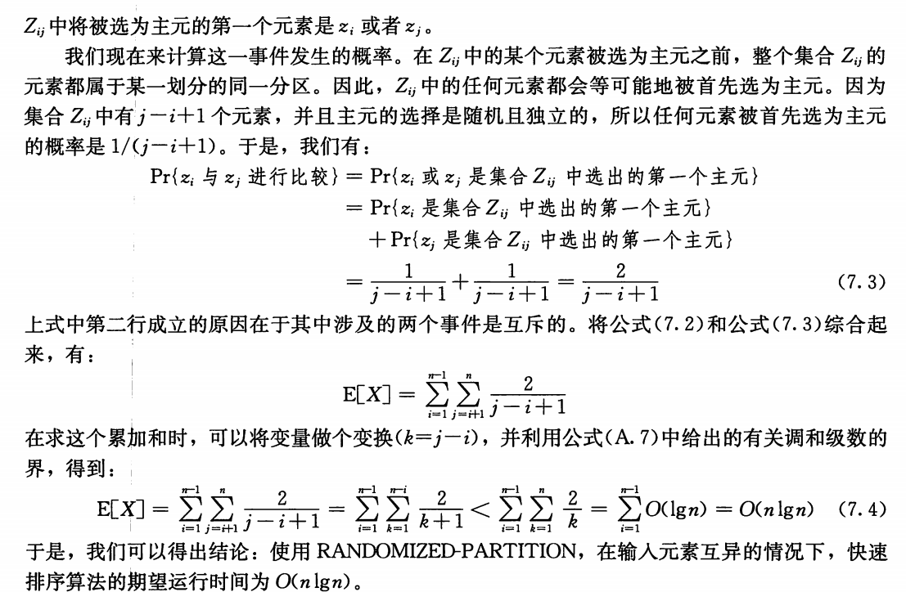

## Chapter 7 快速排序

对于包含n个数的输入数组来说，快速排序

- 最坏时间复杂度为$\Theta(n^2)$
- 期望时间负责度为$\Theta(n\lg n)$，隐含的常数因子非常小
- 能够进行原址排序

### 7.1 快速排序的描述

快速排序使用了分治思想。

对一个典型的子数组A[p..r]进行快速排序的三部分治过程：

- 分解：

  A[p..r]被分为A[p..q-1]和A[q+1..r]，使得A[p..q-1]中的每一个元素都小于等于A[q],而A[q]也小于等于A[q+1..r]中的每个元素。其中，计算下标q也是划分过程的一部分

- 解决

  通过递归调用快速排序，对子数组A[p..q-1]和A[q+1..r]进行排序

- 合并

  因为子数组都是原址排序的，所以不需要合并操作：数组A[p..r]已经有序

为了排序一个数组A的全部元素，初始调用是Quicksort（A，1，A.length）

#### 数组的划分

算法演示如下

选择x = A[r]（区间右端点）作为**主元（pivot element）**

在子数组A[p..r]上，Partition维护了四个区域。A[p..i]区间内的所有值都小于等于x,A[i+1..j-1]区间内的所有值都大于x，A[r] = x。子数组A[j..r-1]中的值可能属于任何一种情况

Partition在子数组A[p..r]上的时间复杂度是$\Theta(n)$，其中n = r - p + 1

### 7.2 快速排序的性能

快速排序的运行时间依赖于划分是否平衡

- 划分平衡，快速排序算法性能与归并排序一样
- 不平衡，快速排序的性能就接近插入排序

#### 最坏情况划分

划分产生的两个子问题分别包含了n-1个元素和0个元素时，发生最坏情况。

不妨假设算法的每一次递归中都出现了这种不平衡划分。划分操作的时间复杂度是$\Theta(n)$，对于一个大小为0的数组进行递归调用会直接返回，因此$T(0) = \Theta(1)$，于是算法运行时间的递归式可以表示为

$T(n) = T(n-1) + \Theta(n)$

最终 $T(n) = \Theta(n^2)$

此外，当输入数组已经完全有序时，快速排序的时间复杂度仍然为$\Theta(n^2)$，同样情况下，插入排序的时间复杂度为$O(n)$

#### 最好情况划分

两个子问题的规模都不大于n/2，这种情况下算法运行时间的递归式为

$T(n) = 2T(n/2) + \Theta(n)$

上述递归式的解为 $T(n) = \Theta(nlg n)$

#### 平衡的划分

快速排序的平均运行时间更接近于其最好情况，而非最坏情况

任何一种常数比例的划分都会产生深度为 $\Theta(lg n)$的递归式，其中每一层的时间代价都是 $O(n)$。因此，只要划分是常数比例的，算法的运行时间总是$O(nlgn)$

#### 对于平均情况的直观观察

快速排序的行为依赖于输入数组中元素的值的相对顺序，而不是某些特定值本身。

在平均情况下，Partition所产生的划分同时混合有“好”和“差”的划分。

基于直觉，假设好和差的划分交替出现在树的各层上，并且好的划分是最好情况划分，而差的划分是最坏情况划分。

### 7.3 快速排序的随机化版本

采用一种称为**随机抽样（random sampling）**的随机化技术，那么可以使得分析变得更加简单。

随机抽象是从子数组A[p..r]中随机选择一个元素作为主元。

- 首先将A[r]与从A[p..r]中随机选出的一个元素交换
- 通过对序列p,...,r的随机抽样，我们可以保证主元元素x = A[r]是等概率地从子数组的r-p+1个元素中选取的。

### 7.4 快速排序分析

#### 7.4.1 最坏情况分析

#### 7.4.2 期望运行时间

假设待排序的元素始终是互异的

##### 运行时间和比较操作

在快速排序算法的整个执行期间，至多只可能调用Partition操作n次。调用一次Partition的时间为O(1)再加上一段循环时间。

##### 引理7.1

当一个包含n个元素的数组上运行Quicksort时，假设在Partition的第4行中所做比较的次数为X，那么Quicksort的运行时间为O(n+X)

