## Chapter 8 线性时间排序

在排序的最终结果中，各元素的次序依赖于它们之间的比较，把这类排序算法成为**比较排序**

对包含n个元素的输入序列来说，任何比较排序在最坏情况下都要经过 $\Omega(nlgn)$次比较。因此，归并排序和堆排序是渐进最优的，并且任何已知的比较排序最多就是在常数因子上优于它们

### 8.1 排序算法的下界

在一个比较排序算法中，我们只使用元素间的比较来获得输入序列$<a_1,a_2,...,a_n>$中的元素间次序的信息。

假设所有输入元素都是互异的，并进一步假设所有比较采用的都是$a_i \leq a_j$形式

#### 决策树模型

比较排序可以被抽象为一棵决策树。决策树是一棵完全二叉树，它可以表示在给定输入规模情况下，某一特定排序算法对所有元素的比较操作。

早决策树中，每个叶节点上都标注一个序列$<\pi(1),\pi(2),...,\pi(n)>$。排序算法的执行对应于一条从树的根节点到叶节点的路径。每一个内部结点表示一次比较$a_i \leq a_j$。

- 左子树表示一旦我们确定 $a_i \leq a_j$之后的后续比较
- 右子树则表示一旦我们确定了$a_i > a_j$后的后续比较

当到达一个叶节点时，表示排序算法已经确定了一个顺序 $a_{\pi(1)} \leq a_{\pi(2)} \leq ...\leq a_{\pi(n)}$

任何正确的排序算法都能够生成输入的每一个排列，所以对一个正确的比较排序算法来说，n个元素的n!种可能的排列都应该出现在决策树的叶节点上。而且，每个叶节点都必须是可以从根节点经由某条路径到达的。

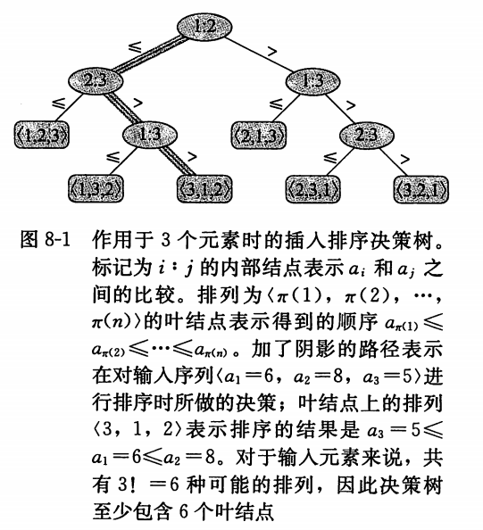

#### 最坏情况的下界

在决策树中，从根节点到任意一个可达叶节点之间最长简单路径的长度，表示的是对应的排序算法中最坏情况下的比较次数。

一个比较排序算法中的最坏情况比较次数就等于其决策树的高度。

当决策树中每种排列都是以可达的叶节点的形式出现时，该决策树高度的下界也就是比较排序算法运行时间的下界。

##### thm 8.1

在最坏情况下，任何比较排序算法都需要做 $\Omega(nlg n)$次比较

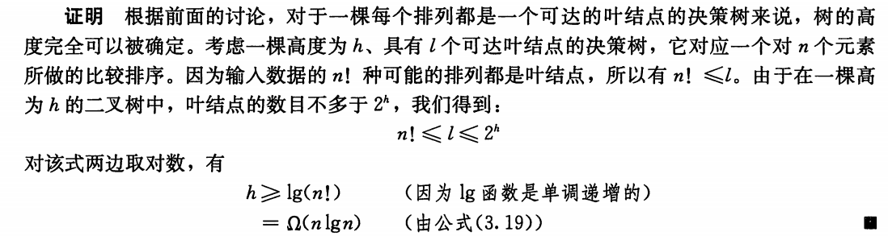

##### 推论8.2 

堆排序和归并排序都是渐进最优的比较排序算法

堆排序和归并排序的运行时间上界为$O(n lgn)$，与下界一致

### 8.2 计数排序

**计数排序**假设n个输入元素中的每一个都是在0到k区间内的一个整数，其中k为某个整数。

当$k = O(n)$，排序的运行时间为$\Theta(n)$

计数排序的基本思想是：对每一个输入元素x，确定小于x的元素个数。利用这一信息，就可以直接把x放到它在输出数组中的位置上了。

假设输入时一个数组A[1..n]，A.length = n

- 需要数组B[1..n]存放排序的输出
- C[0..k]提供临时存储空间

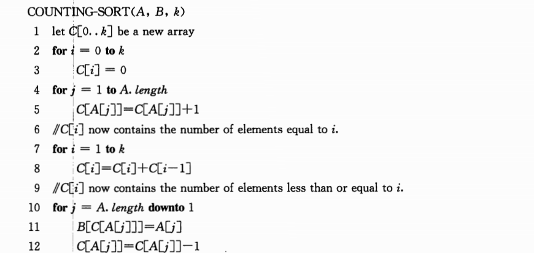

算法演示如下

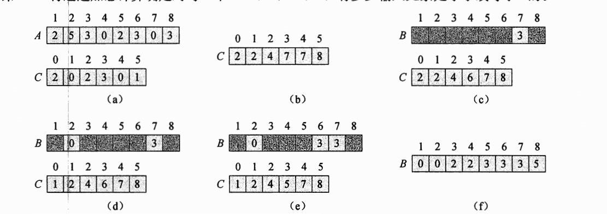

总的时间代价为$\Theta(k+n)$

在实际工作中，当$k = O(n)$时，我们一般会采用计数排序，这时的运行时间为$\Theta(n)$

计数排序的一个重要性质是：**它是稳定的**

- 具有相同值的元素在输出数组中的相对次序与它们在输入数组中的相对次序相同。对两个相同的数来说，在输入数组中先出现的数，在输出数组中也位于前面

计数排序经常会被用作基数排序算法的一个子过程。

### 8.3 基数排序

**基数排序（radix sort）**是一种用在卡片排序机上的算法。

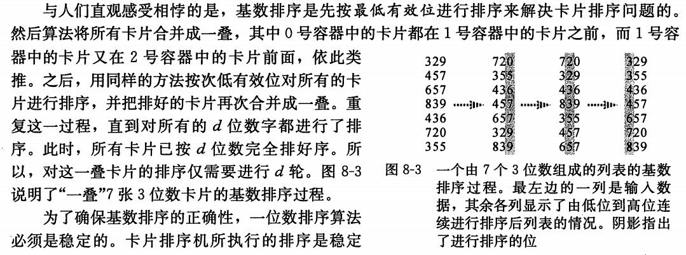

为了确保基数排序的正确性，一位数排序算法必须是稳定的。

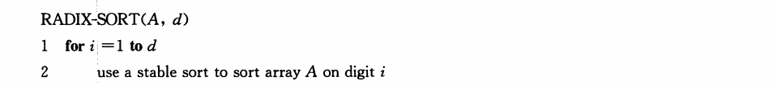

##### 引理8.3

给定n个d位数，其中每一个数位有k个可能的取值。如果Radix-sort使用的稳定排序方法耗时$\Theta(n+k)$，那么它就可以在$\Theta(d(n+k))$时间内将这些数排好序

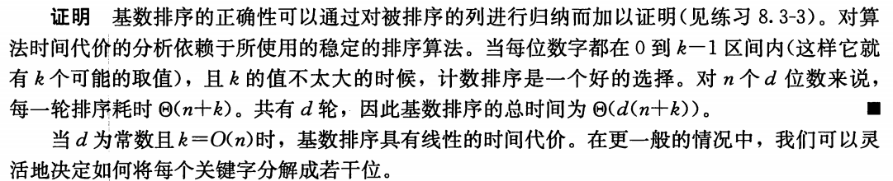

##### 引理8.4 

给定一个b位数和任何正整数$r \leq b$，如果Radix-sort使用的稳定排序算法对数据取值区间是0到k的输入进行排序耗时$\Theta(n+k)$，那么它就可以在 $\Theta(b/r)(n+2^r)$时间内将这些数排好序

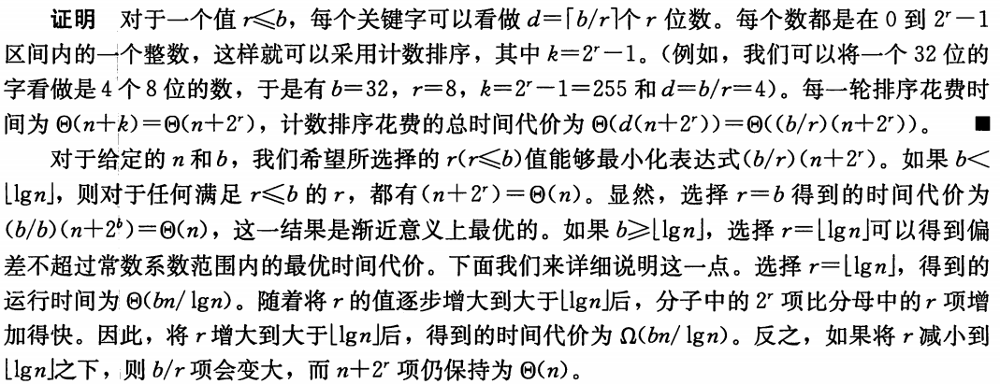

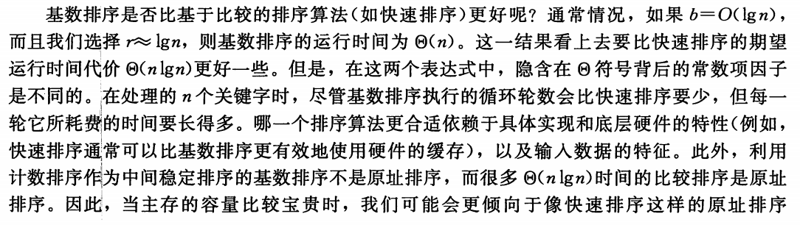

### 8.4 桶排序

**桶排序（bucket sort）**假设输入数据服从均匀分布，平均情况下它的时间代价为$O(n)$。与计数排序类似，因为对输入数据作了某种假设，桶排序的速度也很快。

计数排序假设输入都输入一个小区间内的整数，而桶排序则假设输入是由一个随机过程产生，该过程将元素均匀，独立的分布在[0,1)区间上。

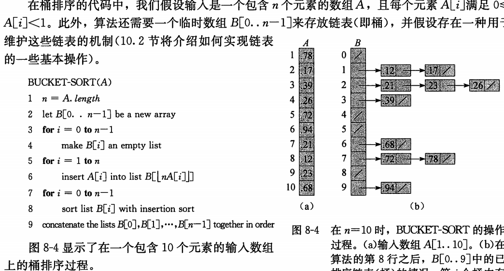

桶排序的期望运行时间为 $\Theta(n)$

即使输入数据不服从均匀分布，桶排序也仍然可以在线性时间内完成。只要输入数据满足

- 所有桶的大小的平方和与总的元素数呈线性关系

  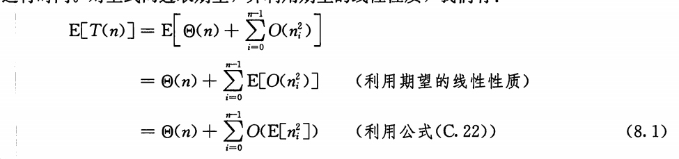

  故桶排序仍然能在线性时间完成。

