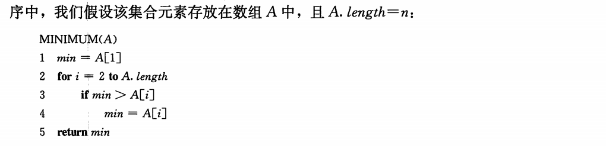
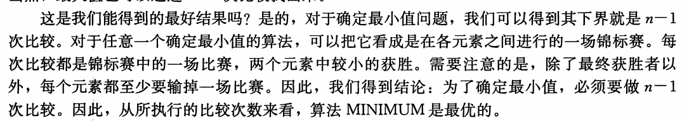
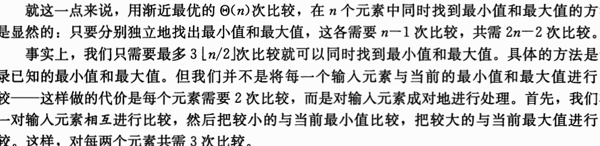
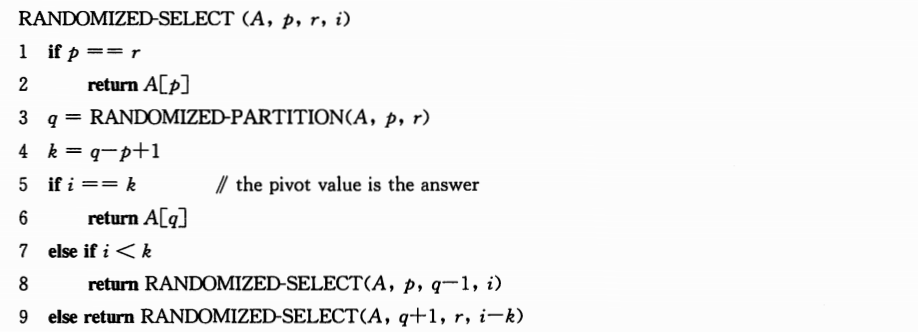
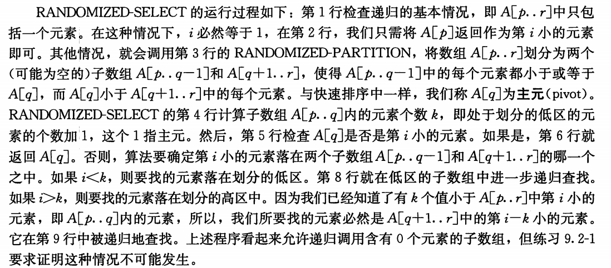
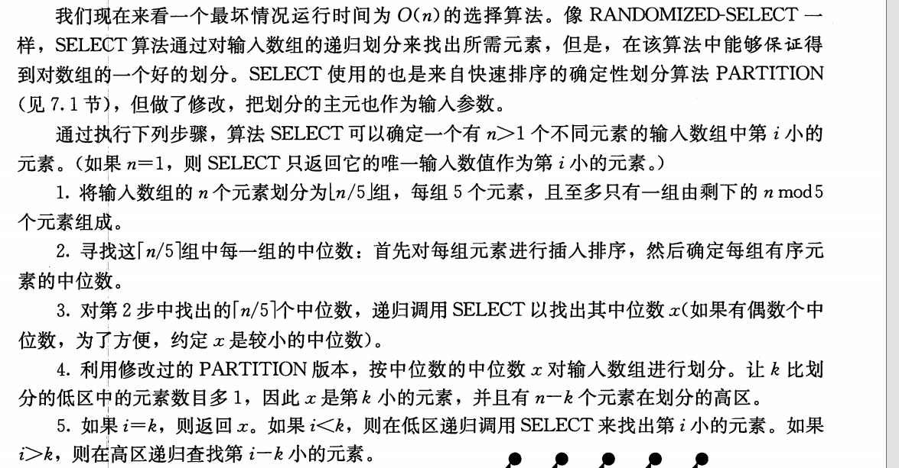

## Chapter 9 中位数和顺序统计量

在一个由n个元素组成的集合中，第i个**顺序统计量（order statistic）**是该集合中第i小的元素。

- **最小值**是第1个顺序统计量（i=1）
- **最大值**是第n个顺序统计量（i=n）
- **中位数（median）**是它所属集合的“中点元素”
  - n为奇数，中位数唯一i = (n+1)/2
  - n为偶数，分下中位数和上中位数（本书特指下中位数，向下取整）

由n个互异的元素构成的集合中选择第i个顺序统计量的问题。假设集合中的元素都是互异的，将这一问题形式化定义为如下的选择问题：

- 输入：一个包含n个（互异的）数的集合A和一个整数i, $1\leq i \leq n$
- 输出：元素$x\in A$，且A中恰好有i-1个其他元素小于它

### 9.1 最小值和最大值

在一个有n个元素的集合中，需要最多n-1次比较就可以确定最小元素：

- 一次遍历集合中的每个元素，并记录下当前的最小元素。

最大值同理。

##### 同时找到最小值和最大值

如何设定已知的最小值和最大值的初始值依赖于n是奇数还是偶数

- 如果n是奇数，我们就将最小值和最大值的初值都设为第一个元素的值，然后成对的处理余下的元素
- 如果n是偶数，就对前两个元素做一次比较，以决定最小值和最大值的初值，然后与n是奇数的情形一样，成对处理余下的元素

不管是哪一种情况，总的比较次数至多是$3 \lfloor n/2 \rfloor$

### 9.2 期望为线性时间的选择算法

一般选择问题的渐进运行时间也是 $\Theta(n)$

Randomized-select算法

Randomized-select 的最坏情况运行时间为$\Theta(n^2)$，即使是找最小元素也是如此，因为在每次划分时可能极不走运的总是按余下的元素中最大的来进行划分，而划分操作需要 $\Theta(n)$时间。

$E[T(n)] = O(n)$

### 9.3 最坏情况为线性时间的选择算法

Select的运行时间是线性的