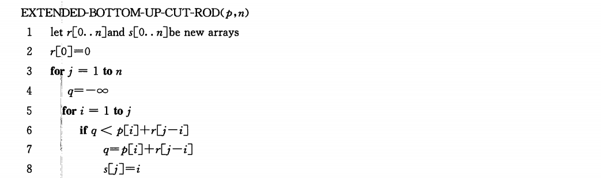

## chapter 15 动态规划

动态规划（dynamic programming）是通过组合子问题的解来求解原问题

- 分治方法将问题划分为互不相交的子问题，递归的求解子问题，再将它们的解组合起来，取出原问题的解
- 动态规划应用于子问题重叠的情况，即不同的子问题具有公共的子子问题。动态规划算法对每个子子问题只求解一次，将其解保存在一个表格中，从而无需每次求解一个子子问题时都重新计算

动态规划方法通常用来求解 **最优化问题（optimization problem）**

这类问题有很多可行的解，每个解都有一个值，我们希望寻找具有最优值的解。这是**一个最优解（an optimal solution）**，而不是**最优解（the optimal solution）**


### 15.1 钢条切割

#### 问题描述


##### example：


更一般地，对于$r_n(n \geq 1)$，我们可以用更短的钢条的最有切割收益来描述它

$r_n = max(p_n,r_1 + r_{n-1},r_2+r_{n-2},...,r_{n-1}+r_1)$

- 参数$p_n$对应不切割，直接出售长度为n英寸的钢条的方案
- 其他n-1个参数对应另外n-1种方案，首先将钢条切割为长度为i和n-i的两段，接着求解这两段的最有切割收益$r_i$和$r_{i-1}$

为了求解规模为n的原问题，我们先求解形式完全一样，但规模更小的子问题。

我们称钢条切割问题满足 **最优子结构（optimal substructure）**

- 问题的最优解由相关子问题的最优解组合而成，而这些子问题可以独立求解

##### 另一种方案


###### 实现方式


###### 效率分析


#### 使用动态规划方法求解最优钢条切割问题

朴素递归算法之所以效率很低，是因为它反复求解相同的子问题。

动态规划方法安排求解顺序，对每个子问题只求解一次，并将结果保存下来。如果随后再次需要此子问题的解，只需查找保存的结果，而不必重新计算。

>付出额外的内存空间来节省计算时间，time-memory trade-off

两种方法

- 带备忘的自顶向下法（top-down with memoization）

  

- 自底向上法（bottom-up method）

  

这两种算法具有相同的渐进运行时间

自顶向下Cut-Rod过程的伪代码

```
Memoized-cut-rod(p,n)
let r[0..n] be a new array
for i = 0 to n
	r[i] = -∞
return memoized-cut-rod-aux(p, n, r)
memoized-cut-rod-uax(p,n,r)
if r[n] >= 0
	return r[n]
if n == 0
	q = 0
else
	q = -∞
	for i = 1 to n
		q = max(q, p[i]+memoized-cut-rod-aux(p,n-i,r))
r[n] = q
return q
```

自底向上版本

```
bottom-up-cut-rod(p, n)
let r[0..n] be a new array
r[0] = 0
for j = 1 to n
	q = -∞
	for i = 1 to j
		q = max(q, p[i]+r[j-i])
	r[j] = q
return r[n]
```


过程的运行时间为$\Theta(n^2)$

#### 子问题图


#### 重构解

扩展动态规划算法，使之对每个子问题不仅保存最优收益值，还保存最优解对应的第一段钢条的切割长度$s_j$



### 15.2 矩阵链乘法

#### 问题描述

给定一个n个矩阵的序列（矩阵链）$<A_1,A_2,...,A_n>$，计算它们的乘积

$A_1A_2...A_n$


##### example of 矩阵链相乘


##### 矩阵链乘法问题（matrix-chain multiplication problem）描述


#### 计算括号化方案的数量

穷举所有可能的括号化方案不会产生一个高效的算法

对于一个n个矩阵的链，令P（n）表示可供选择的括号化方案的数量。

- n=1时，只有一个矩阵，因此只有一种完全括号化方案
- $n \geq 2$，完全括号化的矩阵乘积可描述为两个完全括号化的部分积相乘的形式，而两个部分积的划分点在第k个矩阵和第k+1个矩阵之间


括号化方案的数量与n呈指数关系，通过暴力搜索穷尽所有可能的括号化方案来寻找最优方案，是一个糟糕的策略

#### 应用动态规划方法


##### 步骤1：最优括号化方案的结构特征


##### 步骤2：一个递归求解方案


##### 步骤3：计算最优代价


##### 步骤4：构造最优解


### 15.3 动态规划原理

适合应用动态规划方法求解的最优化问题应该具备两个要素

- 最优子结构
- 子问题重叠

#### 最优子结构

如果一个问题的最优解包含其子问题的最优解，我们就称此问题具有 **最优子结构** 性质

某个问题是否适合应用动态规划算法，它是否具有最优子结构性质是一个好线索。

- 长度为n的钢条的最有切割方案是由第一次切割后（如果最优切割方案需要进行切割）得到的两段钢条的最优切割方案组成的。
- 矩阵连乘的最优括号化方案首先在$A_k$和$A_{k+1}$之间划分，然后对$A_iA_{i+1}...A_k$ 和$A_{k+1}A_{k+2} ...A_{j}$继续进行最优括号化


一个刻画子问题空间的好经验是：

- 保持子问题空间尽可能简单，只在必要时才扩展它

对于不同问题领域，最优子结构的不同体现在两个方面

- 原问题的最优解中涉及多少个子问题
- 在确定最优解使用哪些子问题时，我们需要考察多少种选择


