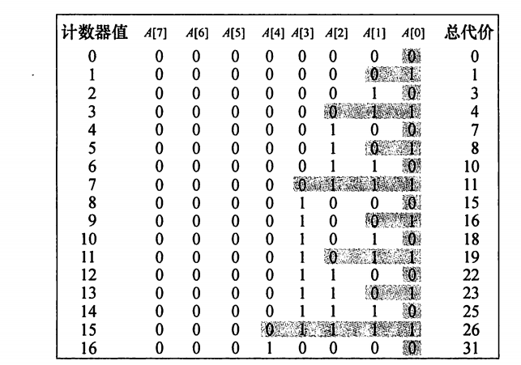

# chapter 17 摊还分析

**摊还分析（amortized analysis）**

求一个数据结构的一个操作序列中所执行的所有操作的平均时间来评价操作的代价。

摊还分析不涉及概率，可以保证最坏情况下每个操作的平均性能。

## 17.1 聚合分析（aggregate analysis）

对所有n，一个n个操作的序列最坏情况下花费的总时间为T(n)，因此，在最坏情况下，每个操作的平均代价，或摊还代价为$T(n)/n$

两个聚合分析的例子

### 栈操作

三种基本的栈操作：

- PUSH(S, x) : 将对象x压入栈S中

  操作是O（1）的，假定代价为1

- POP(S)：将栈S的栈顶对象弹出，并返回该对象。对空栈调用POP会产生一个错误

  操作是O(1)的，假定代价为1

- MULTIPOP(S，k)：删除栈S栈顶的k个对象，如果栈中对象数少于k，则将整个栈的内容都弹出

  总代价为min(s,k)，真正的运行时间为此代价的线性函数

一个由n个PUSH、POP和MULTIPOP组成的操作序列在一个空栈上的执行情况

代价至多是O(n)的，因为可以执行POP操作的次数最多与PUSH操作的次数相当，即最多n次

因此三种栈操作的摊还代价都是O(n)/n = O(1)

###  二进制计数器递增

问题描述：

一个k位二进制计算器递增的问题，计数器的初值为0，用一个位数组A[0..k-1]作为计数器，其中A.length = k

- 计数器保存的二进制值为x时，x的最低值保存在A[0]中，最高位保存在A[k-1]中
- $x = \sum_{i=0}^{k-1} A[i]\cdot 2^i$

递增函数（increment）

```
increment(A)
while i < A.length and A[i] == 1
	A[i] = 0
	i = i + 1
if i < A.length
	A[i] = 1
```

将一个二进制计数器递增16次，初始值为0，最终变为16.



对于n个increment操作组成的序列，可以得到一个更紧的界：

- 在执行一个由n个increment操作组成的序列的过程中，A[i]会反转$\lfloor n/2^i \rfloor$次

- 翻转操作的总数为

  $\sum_{i=0}^{k-1}{\lfloor \frac{n}{2^i}\rfloor} < n \sum_{i=0}^{\infty}\frac{1}{2^i} = 2n$

因此，对一个初值为0的计数器，执行一个n个increment操作的序列的最坏情况时间为O（n）

摊还代价为$O(n)/n = O(1)$

## 17.2 核算法（accounting method）


