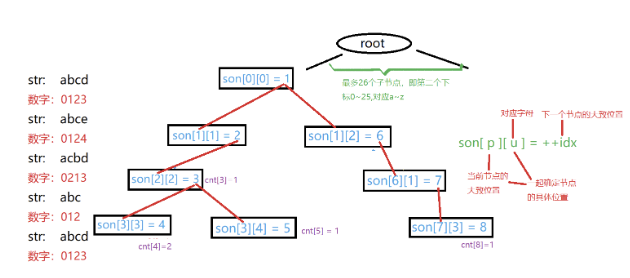
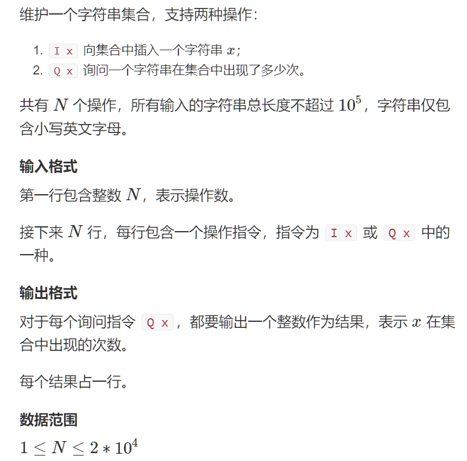

## Trie树

Trie树又称字典树、单词查找树。是一种能够高效存储和查找字符串集合的数据结构



### 模版

```c++
int son[N][26], cnt[N], idx;
// 0号点既是根节点，又是空节点
// son[][]存储树中每个节点的子节点
// cnt[]存储每个节点结尾的单词数量

// 插入一个字符串
void insert(char *str)
{
    int p = 0;	// 类似指针，指向当前结点
    for(int i = 0; str[i] ;i++)
    {
        int u = str[i] - 'a';
        if(!son[p][u]) son[p][u] = ++idx;
        p = son[p][u];
    }
    cnt[p] ++;
}
int query(char *str)
{
    int p = 0;
    for(int i = 0; str[i]; i++)
    {
        int u = str[i] - 'a';
        if(!son[p][u])	return 0;
        p = son[p][u];
    }
    return cnt[p];
}
```

### 题目

#### 1.Trie字符串统计



```c++
#include<iostream>
using namespace std;
const int N = 1e5 + 10;
int son[N][26], cnt[N], idx;
char str[N];

void insert(char *str)
{
    int p = 0;
    for(int i = 0; str[i]; i++)
    {
        int u = str[i] - 'a';
        if(!son[p][u])	son[p][u] = ++idx;
        p = son[p][u];
    }
    cnt[p]++;
}
int query(char *str)
{
    int p = 0;
    for(int i = 0; str[i]; i++)
    {
        int u = str[i] - 'a';
        if(!son[p][u])	return 0;
        p = son[p][u];
    }
    return cnt[p];
}
int main(void)
{
    int m;
    cin >> m;
    while(m--)
    {
        char op[2];
        cin >> op >> str;
        if(*op == 'I') insert(str);
        else
            cout << query(str);
    }
    return 0;
}
```

#### 2.最大异或对

```c++
#include<iostream>
#include<algorithm>
using namespace std;
const int N = 1e5 + 10;
const int M = 31 * N;
int n;
int a[N];
int son[M][2], idx;

void insert(int x)
{
    int p = 0;
    for(int i = 30; i >= 0; i--)
    {
        int u = x >> i & 1;
        if(!son[p][u]) son[p][u] = ++idx;
        p = son[p][u];
    }
}
int search(int x)
{
    int p = 0;
    int res = 0;
    for(int i = 30; i >= 0; i--)
    {
        int u = x >> i & 1;
        if(son[p][u])
        {
            p = son[p][!u];
            res = res *2 + 1;
        }
        else
        {
            p = son[p][u];
            res = res * 2 + 0;
        }
    }
    return res;
}
int main(void)
{
    cin.tie(0);
    cin >> n;
    idx = 0;
    for(int i = 0; i < n; i++)
    {
        cin >> a[i];
        insert(a[i]);
    }
    int res = 0;
    for(int i = 0; i < n; i++)
    {
        res = max(res, search(a[i]));
    }
    cout << res << endl;
}
```

