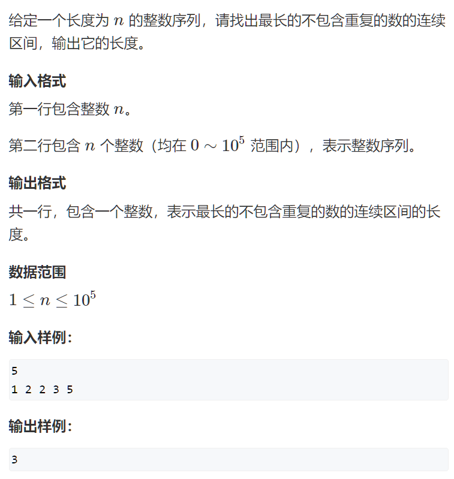
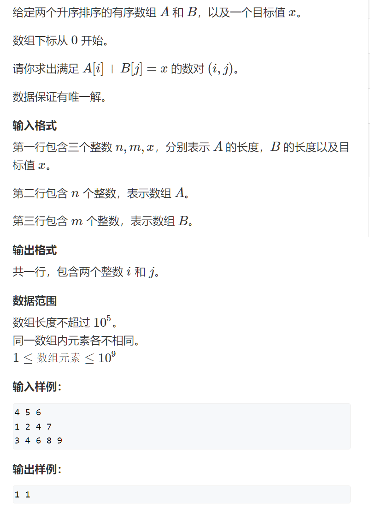
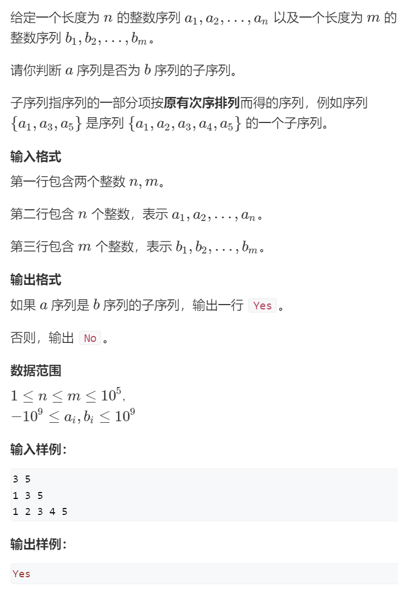
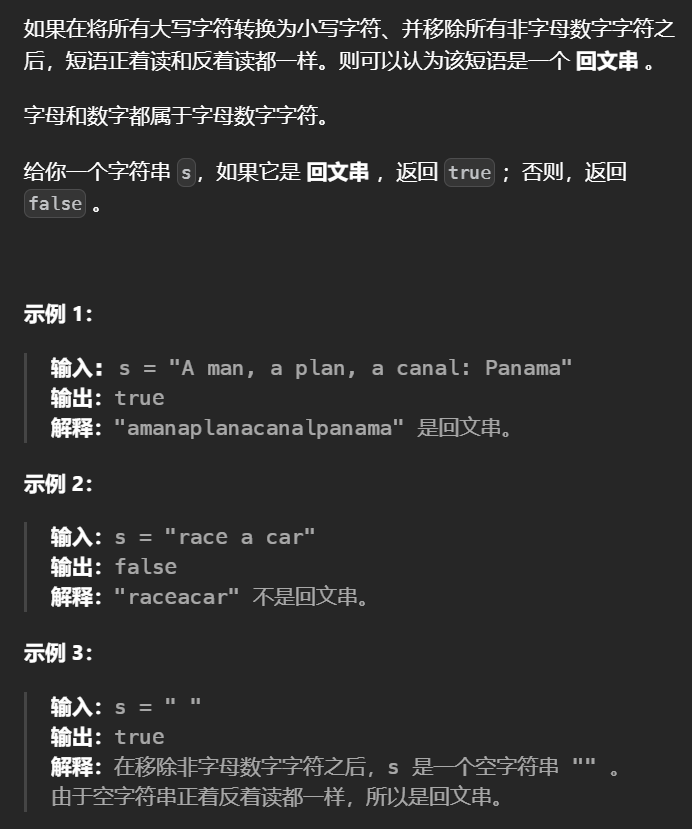
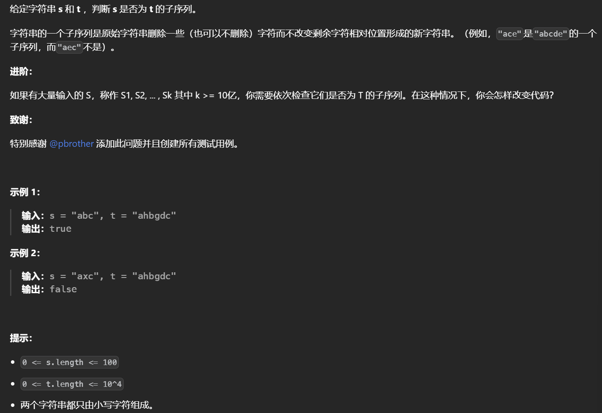
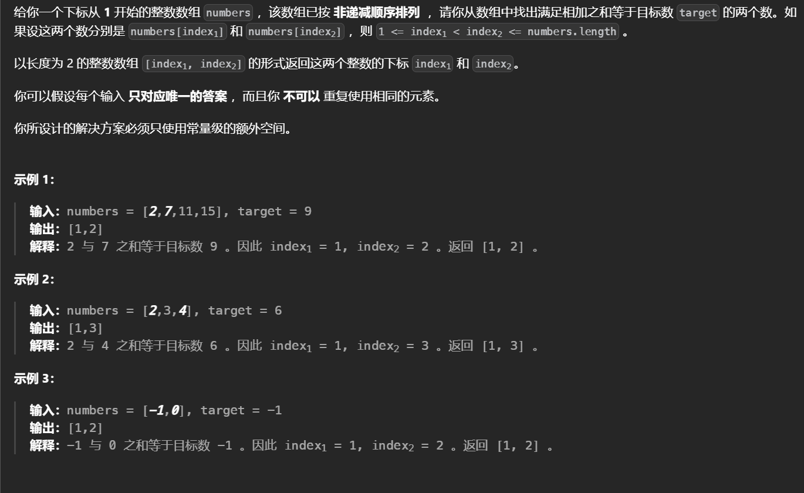
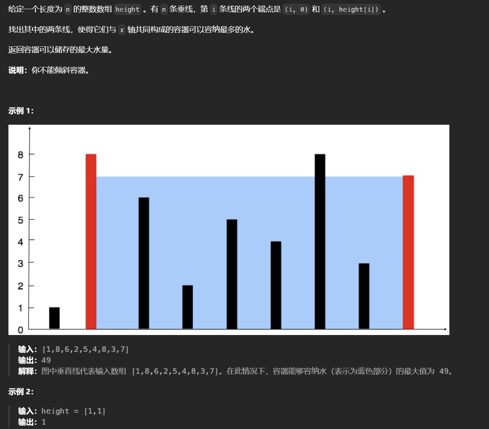
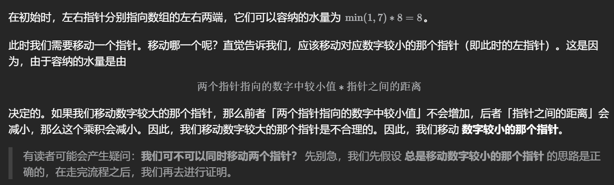
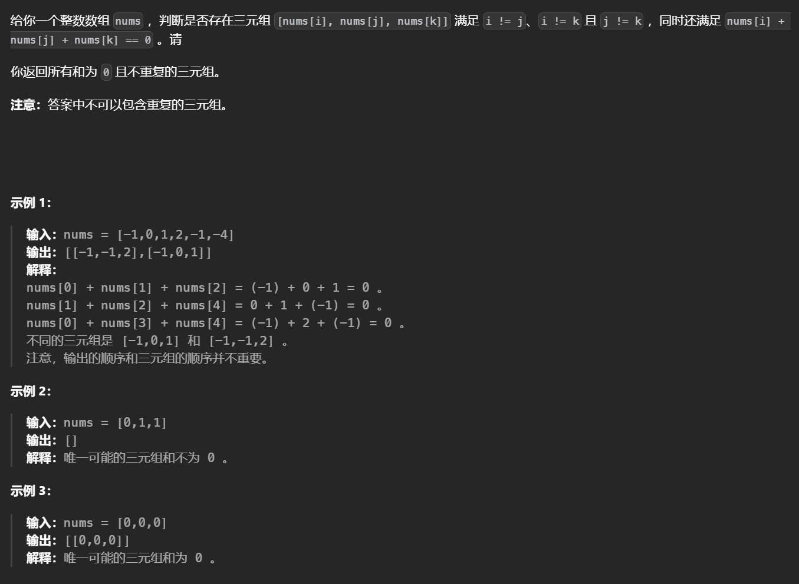

# 双指针问题

## 双指针算法

通过使用两个指针，分别从数组或链表的头部和尾部开始向中间移动，常用来解决数组或链表问题

- 判断是否满足满足条件的两个数
- 寻找满足某条件的连续子序列
- 判断一个字符串是否是回文串
- 讲一个数组或链表按照某种方式重新排序

分类

- 快慢指针

  通常用于链表问题中，如判断链表是否有环或找到链表的中间节点等。通过使用两个指针，一个快指针和一个慢指针，快指针每次移动2步，慢指每次移动1步，当快指到达链表尾部时，慢指针就到达了链表中间位置。

- 左右指针

  常用于数组问题中，如在有序数组中查找目标元素等。通过使用两个指针，一个左指针和一个右指针，左指针从数组头部开始向右移动，右指针从数组尾部开始向左移动，根据具体问题来移动指针，最终得出结果

- 对撞指针

  通常用于有序数组或链表问题中，如判断回文字符串或找到两个数的平方和等。通过使用两个指针，一个指向数组或链表的头部，另一个指向尾部，根据具体问题来移动指针，最终得出结果。

## 模版

```c++
for(int i = 0, j = 0; i < n; i++)
{
    while(j < i && check(i, j)) j++;
    // 具体问题的逻辑
}
常见问题分类
    对于一个序列，用两个指针维护一段区间
    对于两个序列，维护某种次序，比如归并排序中合并两个有序序列的操作
```

## Acwing题目

### 1.最长连续不重复子序列

#### 题目描述



#### 代码

```c++
#include<iostream>
using namespace std;
const int N = 1e5 + 10;

int n;
int a[N], s[N];

int main(void)
{
    int r = 0;
    cin >> n;
    
    for(int i = 0, j = 0; i < n; i++)
    {
        cin >> a[i];
     	s[a[i]]++;
        
        while(s[a[i]] > 1) s[a[j++]] --;
        r = max(r, i - j + 1);
    }
    cout << r;
    return 0;
}
```

#### 思路

遍历数组a中的每一个元素a[i], 对于每一个i，找到j使得双指针[j, i]维护的是以a[i]结尾的最长连续不重复子序列，长度为i - j + 1, 将这一长度与r的较大者更新给r。
对于每一个i，如何确定j的位置：由于[j, i - 1]是前一步得到的最长连续不重复子序列，所以如果[j, i]中有重复元素，一定是a[i]，因此右移j直到a[i]不重复为止（由于[j, i - 1]已经是前一步的最优解，此时j只可能右移以剔除重复元素a[i]，不可能左移增加元素，因此，j具有“单调性”、本题可用双指针降低复杂度）。
用数组s记录子序列a[j ~ i]中各元素出现次数，遍历过程中对于每一个i有四步操作：cin元素a[i] -> 将a[i]出现次数s[a[i]]加1 -> 若a[i]重复则右移j（s[a[j]]要减1） -> 确定j及更新当前长度i - j + 1给r。

### 2.数组元素的目标和

#### 题目描述



#### 思路

i 从0开始遍历，从前往后遍历

j 从 m - 1开始遍历，从后往前遍历

j指针不后退，因为 如果 当前 a[i] + b[j] > x ，那么a[i+1] + b[j] 必然 > x，所以j没有后退的必要

#### 代码

```c++
#include<iostream>
#include<cstdio>
using namespace std;
const int N = 1e5 + 10;

int n, m, k;
int a[N], b[n];
int main(void)
{
    cin >> n >> m >> k;
    for(int i = 0; i < n; i++) cin >> a[i];
    for(int j = 0; j < m; j++) cin >> b[j];
    
    for(int i = 0, j = m - 1; i < n; i++)
    {
        while(j >= 0 && a[i] + b[j] > k) j--;
        if(j >= 0 && a[i] + b[j] == k) 
            cout << i << " " << j << endl;
    }
    return 0;
}
```

### 3.判断子序列

#### 题目描述



#### 思路

1.j指针用来扫描整个b数组，i指针用来扫描a数组。若发现a[i] == b[j]，则让i指针后移一位。
2.整个过程中，j指针不断后移，而i指针只有当匹配成功时才后移一位，若最后若i == n，则说明匹配成功。

#### 代码

```c++
#include<iostream>
using namespace std;
const int N = 1e5 + 10;
int n, m;
int a[N], b[N];
int main(void)
{
    cin >> n >> m;
    for(int i = 0; i < n; i++) cin >> a[i];
    for(int i = 0; i < m; i++) cin >> b[i];
    
    int i = 0, j = 0;
    while(i < n && j < m)
    {
        if(a[i] == b[j]) i++;
        j++;
    }
    if(i == n) puts("Yes");
    else puts("No");
    return 0;
}
```

## Leetcode 题目

### 1.验证回文串

#### 题目描述



#### 思路及代码

思路1：双指针

使用双指针。初始时，左右指针分别指向 sgood 的两侧，随后我们不断地将这两个指针相向移动，每次移动一步，并判断这两个指针指向的字符是否相同。当这两个指针相遇时，就说明 sgood 时回文串

```c++
class Solution{
    public:
    	bool isPalindrome(string s){
            string s_good;
            for(auto ch : s)
            {
                if(isalnum(ch))
                    s_good += tolower(ch);
            }
        	int n = s_good.size();
            int i = 0, j = n - 1;
            while(i < j)
            {
                if(s_good[i] != s_good[j])
                    return false;
               	i++;
                j--;
            }
            return true;
        }
}
```

>`isalnum` 是判断 字符串中的每个字符是否是字母或数字
>
>`tolower`函数将字符串中每个字符转换成小写
>
>这两个函数都在 `cctype`库中

### 2.判断子序列

#### 题目描述



#### 思路及代码

思路1：双指针

本题询问的是，s 是否是 t 的子序列，因此只要能找到任意一种 s 在 t 中出现的方式，即可认为 s 是 t 的子序列。

而当我们从前往后匹配，可以发现每次贪心地匹配靠前的字符是最优决策。

这样，我们初始化两个指针 i 和 j，分别指向 s 和 t 的初始位置。每次贪心地匹配，匹配成功则 i 和 j 同时右移，匹配 s 的下一个位置，匹配失败则 j 右移，i 不变，尝试用 t 的下一个字符匹配 s。

最终如果 i 移动到 s 的末尾，就说明 s 是 t 的子序列。

```c++
class Solution {
    public: 
    	isSubsequence(string s, string t)
        {
            int n = s.length(), m = t.length();
            int i = 0, j = 0;
           	while(i < n && j < m)
            {
                if(s[i] == s[j])
                    i++;
                j++;
            }
            if(i == n)
                return true;
           	return false;
        }
}
```

### 3.两数之和

#### 题目描述



#### 思路及代码

初始时两个指针分别指向第一个元素位置和最后一个元素的位置。每次计算两个指针指向的两个元素之和，并和目标值比较。如果两个元素之和等于目标值，则发现了唯一解。如果两个元素之和小于目标值，则将左侧指针右移一位。如果两个元素之和大于目标值，则将右侧指针左移一位。移动指针之后，重复上述操作，直到找到答案。

```c++
class Solution {
public:
    vector<int> twoSum(vector<int>& numbers, int target) {
        int low = 0, high = numbers.size() - 1;
        while (low < high) {
            int sum = numbers[low] + numbers[high];
            if (sum == target) {
                return {low + 1, high + 1};
            } else if (sum < target) {
                ++low;
            } else {
                --high;
            }
        }
        return {-1, -1};
    }
};
```

### 4.盛最多水的容器

#### 题目描述



#### 思路及代码



```c++
class Solution {
public:
    int maxArea(vector<int>& height) {
        int n = height.size();
        int l = 0, r = n - 1;
        int result = 0;
        while(l < r)
        {
            int len = min(height[l], height[r]) * (r - l);
            result = max(result, len);
            if(height[l] < height[r])
                l ++;
            else
                r --;
        }
        return result;
    }
};
```

### 5.三数之和

#### 题目描述



#### 思路及代码

唉，把第一个数num[i]的相反数当成target，对j 和k求两数之和就可以了

>md，为什么当年算法期末这都不会啊

```c++
class Solution {
    public:
    vector<vector<int>> threeSum(vector<int>& nums) {
        int n = nums.size();
        sort(nums.begin(), nums.end());
        vector<vector<int>> results;

        for(int i = 0; i < n; i ++)
        {
            // 去重
            if(nums[i] > 0)
                break;
            if(i > 0 && nums[i] == nums[i - 1])
                continue;
            int target = -nums[i];
            int j = i + 1, k = n - 1;
            while(j < k)
            {
                int sum = nums[j] + nums[k];
                if(j > i + 1 && nums[j] == nums[j - 1])
                {
                    j ++;
                    continue;
                }
                else if(k < n - 1 && nums[k] == nums[k + 1])
                {
                    k --;
                    continue;
                }
                if(sum == target)
                {
                    results.push_back({nums[i], nums[j], nums[k]});
                    j ++;
                    k --;
                }
                else if(sum < target)
                    j ++;
                else
                    k --;
            }
        }
        return results;
    }
};
```

