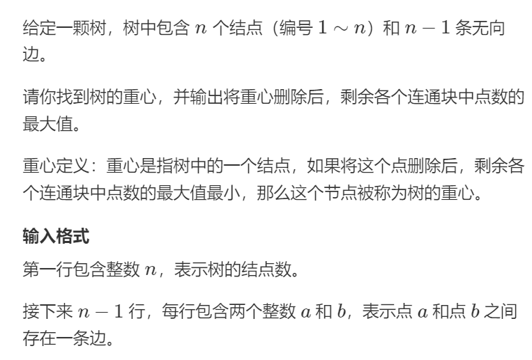

## DFS与BFS

### 模版

#### 数与图的存储

```c++
int h[N], e[N], e[N], idx;
void add(int a, int b)
{
    e[idx] = b, ne[idx] = h[a], h[a] = idx++;
}
// 初始化
idx = 0;
memset(h, -1, sizeof h);
```

#### DFS

```c++
int dfs(int u)
{
    st[u] = true;
    for(int i = h[u]; i != -1; i = ne[i])
    {
        int j = e[i];
        if(!st[j]) dfs(j);
    }
}
```

#### BFS

```c++
queue<int> q;
st[1] = true;
q.push(1);
while(q.size())
{
    int t = q.front();
    q.pop();
    for(int i = h[t]; i != -1; i = ne[i])
    {
        int j = e[i];
        if(!st[j])
        {
            st[j] = true;
            q.push(j);
        }
    }
}
```


### DFS

#### 1.排列数字

##### 题目


##### 解答

```c++
#include <iostream>

using namespace std;

const int N = 10;

int n;
int path[N];
int state[N];
void dfs(int u, int state)
{
	if(u > n)
    {
        for(int i = 1; i <= n ;i++)
            	cout << path[i] << " ";
       	cout << endl;
    }
    for(int i = 1; i <= n ;i++)
    {
        if(!state[i])
        {
            path[u] = i;
            state[i] = 1;
            dfs(u + 1);
            state[i] = 0;
        }
    }
}

int main()
{
	cin >> n;
    dfs(1);
    return 0;
}
```

#### 2.n-皇后问题

##### 题目


##### 解答

```c++
#include<iostream>
using namespace std;
const int N = 11;
char q[N][N];
bool dg[N * 2], udg[N * 2], cor[N];
int n;
void dfs(int r)
{
    if(r == n)
    {
        for(int i = 0; i < n; i++)
        {
            for(int j = 0; j < n; j++)
                	cout << q[i][j];;
           	cout << endl;
        }
        cout << endl;
        return ;
    }
    for(int i = 0; i < n; i++)
    {
        if(!cor[i] && !dg[i + r]&&!udg[n - i + r])
        {
            q[r][i] = 'Q';
            cor[i] = dg[i + r] = udg[n - i + r] = 1;
            dfs(r + 1);
            cor[i] = dg[i + r] = udg[n - i + r] = 0;
            q[r][i] = '.';
        }
    }
}

int main(void)
{
    cin >> n;
    for(int i = 0; i < n ;i++)
        for(int j = 0; j < n; j++)
            q[i][j] = '.';
   	dfs(0);
}
```

### 树与图的遍历（DFS）

#### 1.树的重心

##### 题目



##### 解答

```c++
#include<iostream>
#include<algorithm>
#include<cstring>
using namespace std;
const int N = 1e5 + 10;
const int M = 2 * N;
int h[N], e[M], ne[M], idx;
int n;
int ans = N;
bool st[N];

void add(int a, int b)
{
    e[idx] = b;
    ne[idx] = h[a];
    h[a] = idx++:
}

int dfs(int u)
{
    int res = 0;
    st[u] = true;
    int sum = 1;
    for(int i = h[u]; i != - 1; i = ne[i])
    {
        int j = e[i];
        if(!st[j])
        {
            int s = dfs(j);
            res = max(res, s);
            sum += s;
        }
    }
    res = max(res, n - sum);
    ans = min(res, ans);
    return sum;
}

int main(void)
{
    memset(h, -1, sizeof h);
    cin >> n;
    for(int i = 0; i < n; i++)
    {
        int a, b;
        cin >> a >> b;
        add(a, b);
        add(b, a);
    }
    dfs(1);
    cout << ans << endl;
    return 0;
}
```

### 树与图的遍历（BFS）

#### 1.图中点的层次

##### 题目


##### 解答

```c++
#include<iostream>
#include<cstring>
#include<queue>
#include<algorithm>
using namespace std;
const int N = 1e5 + 10;
int h[n], e[N], ne[N], idx;
int dist[N];
int st[N];
int n, m;
void add(int a, int b)
{
    e[idx] = b;
    ne[idx] = h[a];
    h[a] = idx++;
}

void bfs()
{
    memset(dist, 0x3f3f3f3f, sizeof(dist));
    dist[1] = 0;
    queue<int> q;
    q.push(1);
    st[1] = 1;
    while(q.size())
    {
        int t = q.front();
        q.pop();
        for(int i = h[t]; i != -1; i = ne[i])
        {
            int j = e[i];
            if(!st[j])
            {
                dist[j] = dist[t] + 1;
                q.push(j);
                st[j] = 1;
            }
        }
    }
}

int main(void)
{
    cin >> n >> m;
    memset(h, -1, sizeof h);
    for(int i = 0 ; i < m; i++)
    {
        int a, b;
        cin >> a >> b;
        add(a, b);
    }
    bfs();
    cout << (dist[n] == 0x3f3f3f3f ? - 1: dist[n]);
}
```

## 有向图的拓扑序列

### 模版

```c++
bool topsort()
{
    int hh = 0, tt = -1;
    for(int i = 1; i <= n; i++)
        if(!d[i])
            q[++tt] = i;
   	while(hh <= tt)
    {
        int t = q[hh++];
        for(int i = h[t]; i != -1; i = ne[i])
        {
            int j = e[i];
            if(-- d[j] == 0)
                	q[ ++ tt] = j;
        }
    }
    return tt == n - 1;
}
```

#### 1.有向图的拓扑序列

##### 题目


##### 解答

```c++
#include<iostream>
#include<algorithm>
#include<cstring>
using namespace std;
const int N = 1e5 + 10;
int e[N], ne[N], idx;
int h[N];
int q[N], hh = 0, tt = -1;
int n, m;
int d[N];
void add(int a, int b)
{
    e[idx] = b;
    ne[idx] = h[a];
    h[a] = idx++;
}

void topsort()
{
    for(int i = 1; i <= n; i++)
        if(d[i] == 0)
            q[++tt] = i;
    while(tt >= hh)
    {
        int a = q[hh++];
        for(int i = h[a]; i != -1; i = ne[i])
        {
            int b = e[i];
            d[b]--;
            if(d[b] == 0)
                q[++tt] = b;
        }
    }
    if(tt == n - 1)
        for(int i = 0; i < n; i++)
            cout << q[i] << " ";
   	else
        cout << - 1;
}

int main(void)
{
    cin >> n >> m;
    memset(h, -1, sizeof h);
    while(m--)
    {
        int a,b;
        cin >> a >> b;
        d[b] ++;
        add(a, b);
    }
    topsort();
    return 0;
}
```

