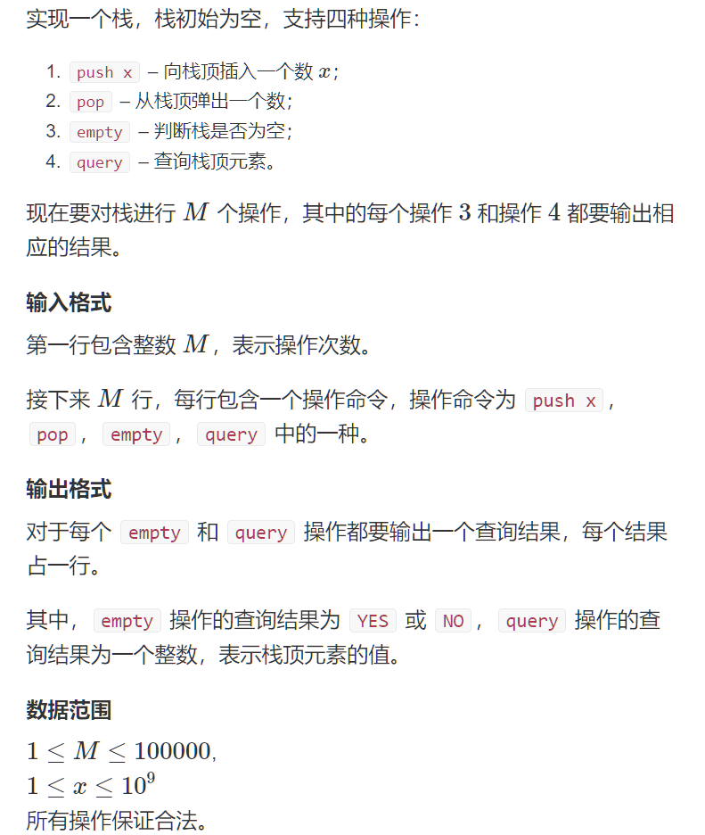
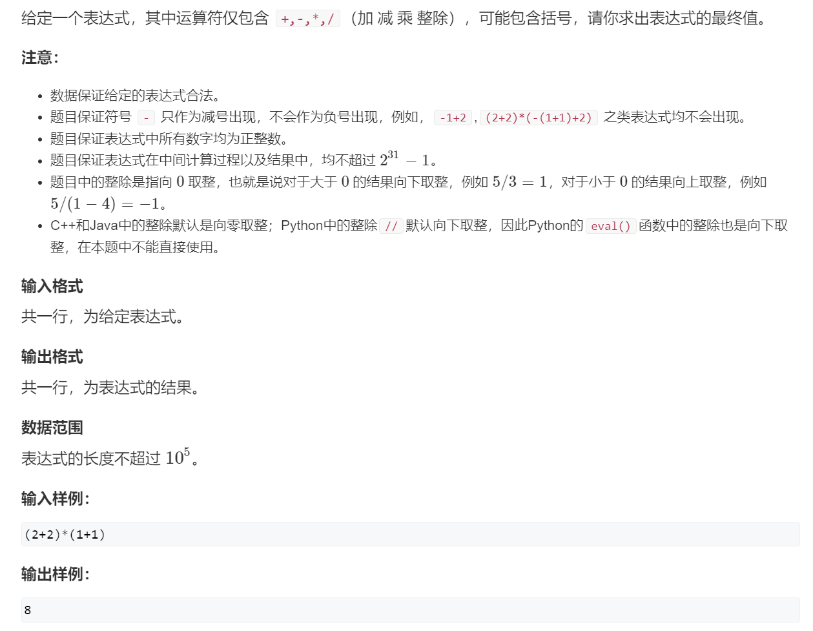

## Acwing

### 模版

```c++
// tt表示栈顶
int stk[N], tt = 0;
// push
stk[++tt] = x;
// pop
tt --;
// top
stk[++t];
// empty
if(tt > 0)
{
    
}
```


### 1.模拟栈

#### 题目描述



#### 解答

```c++
#include <iostream>

using namespace std;

const int N = 100010;

int m;
int stk[N], tt;

int main()
{
    cin >> m;
    while (m -- )
    {
        string op;
        int x;

        cin >> op;
        if (op == "push")
        {
            cin >> x;
            stk[ ++ tt] = x;
        }
        else if (op == "pop") tt -- ;
        else if (op == "empty") cout << (tt ? "NO" : "YES") << endl;
        else cout << stk[tt] << endl;
    }

    return 0;
}
```

### 2.表达式求值

#### 题目描述



#### 解答

```c++
#include <iostream>
#include <cstring>
#include <algorithm>
#include <stack>
#include <unordered_map>

using namespace std;

stack<int> num;
stack<char> op;

void eval()
{
    auto b = num.top(); num.pop();
    auto a = num.top(); num.pop();
    auto c = op.top(); op.pop();
    int x;
    if (c == '+') x = a + b;
    else if (c == '-') x = a - b;
    else if (c == '*') x = a * b;
    else x = a / b;
    num.push(x);
}

int main()
{
    unordered_map<char, int> pr{{'+', 1}, {'-', 1}, {'*', 2}, {'/', 2}};
    string str;
    cin >> str;
    for (int i = 0; i < str.size(); i ++ )
    {
        auto c = str[i];
        if (isdigit(c))
        {
            int x = 0, j = i;
            while (j < str.size() && isdigit(str[j]))
                x = x * 10 + str[j ++ ] - '0';
            i = j - 1;
            num.push(x);
        }
        else if (c == '(') op.push(c);
        else if (c == ')')
        {
            while (op.top() != '(') eval();
            op.pop();
        }
        else
        {
            while (op.size() && op.top() != '(' && pr[op.top()] >= pr[c]) eval();
            op.push(c);
        }
    }
    while (op.size()) eval();
    cout << num.top() << endl;
    return 0;
}
```

