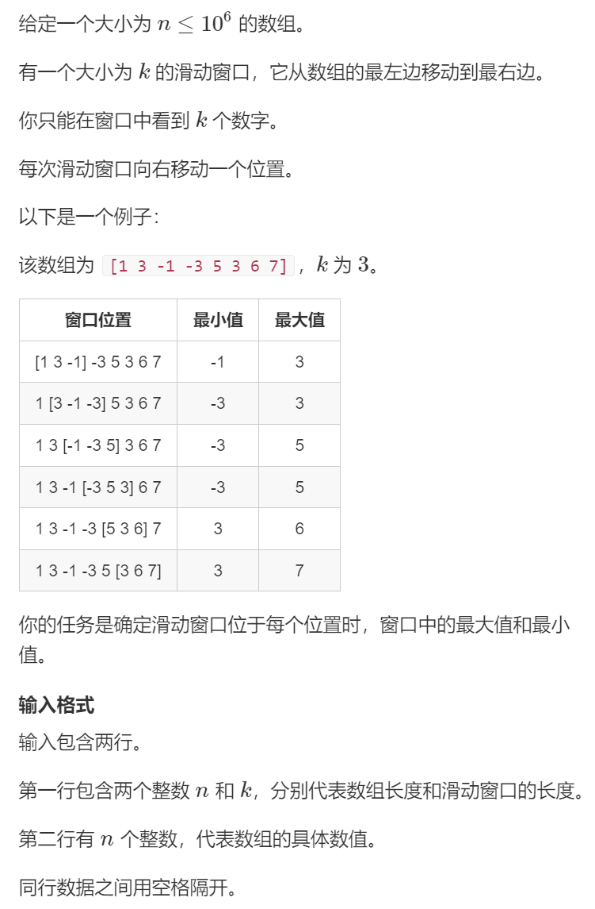
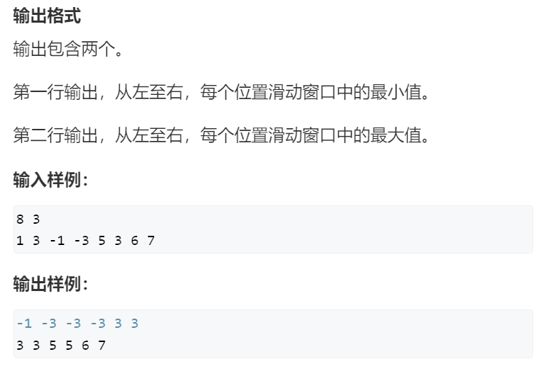
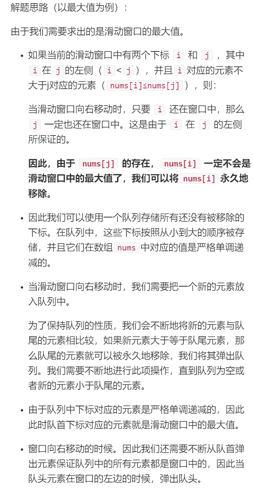
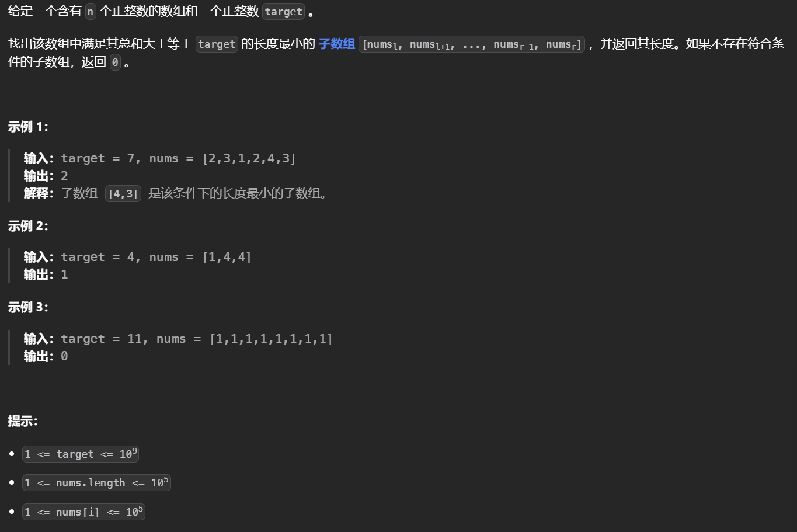
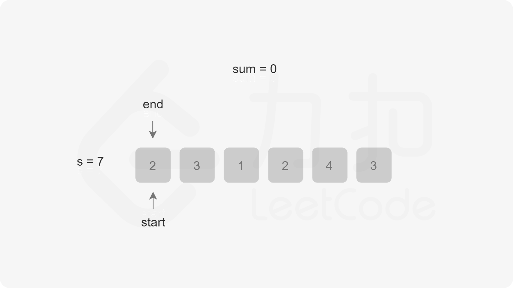
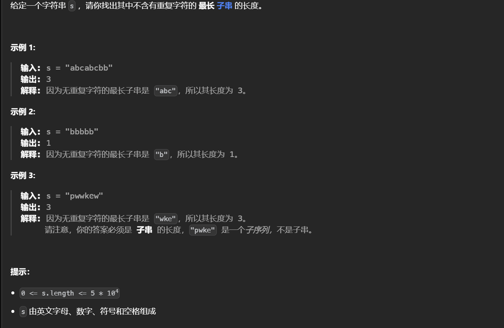
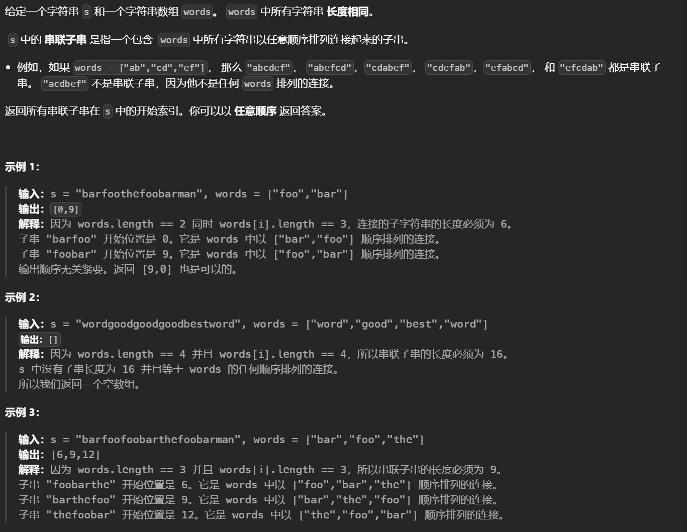
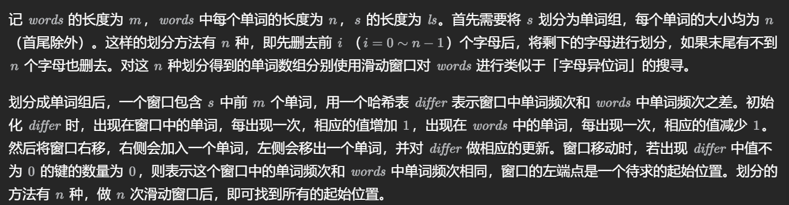
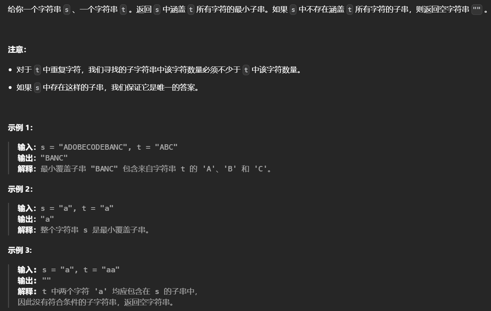
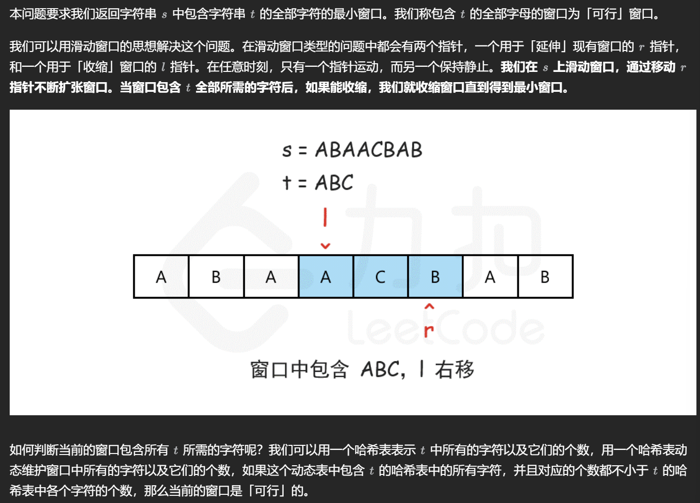

# 滑动窗口

## 滑动窗口概念

### 单调队列

滑动窗口模型本质上用到了单调队列的思想

```c++
常见模型: 找出滑动窗口中的最大值/最小值
int hh = 0, tt = 0;
for(int i = 0; i < n; i++)
{
    while(hh <= tt && check_out(q[hh])) hh++;
    while(hh <= tt && check_out(q[tt], i)) tt--;
    q[ ++ tt] = i;
}
```

## Acwing

### 1.滑动窗口

#### 题目描述





#### 思路

在示例中，我们从数组中第一个元素开始遍历，由于窗口的大小是3，因此当遍历到第三个元素时，窗口就形成了。


之后，继续遍历元素时，为了保持窗口的大小为3，左侧元素就需要从窗口中剔除。这样使得窗口一直在向右移动，直到考察到最后一个元素结束，这就是所谓的滑动窗口。




#### 代码

```c++
#include<iostream>
using namespace std;
const int N = 1e6 + 10;
int a[N];

int main(void)
{
    int n, k;
    cin >> n >> k;
    for(int i = 1; i <= n; i++)
        cin >> a[i];
   	deque<int> q;
    for(int i = 1; i <= n; i++)
    {
        while(q.size() && q.back() > a[i]) //	新进入窗口
            q.pop_back();
       	q.push_back(a[i]); // 将新进入的元素入队
        if(i - k >= 1 && q.front() == a[i - k]) // 若队头滑出窗口，队头出队
            q.pop_front();
        if(i >= k)	// 当窗口形成，输出队头的值
            cout << q.front() << " ";
    }
    q.clear();
    cout << endl;
    for(int i = 1; i <= n; i++)
    {
        while(q.size() && q.back() < a[i])	q.pop_back();
        q.push_back(a[i]);
        if(i - k >= 1 && a[i - k] == q.front()) q.pop_front();
        if(i >= k)
            cout << q.front() << " ";
    }
}
```

## LeetCode

### 模版

```c++
int fn(vector<int>& arr)
{
    int left = 0, ans = 0, curr = 0;
    
    for(int right = 0; right < arr.size(); right ++)
    {
       	// 根据题意补充代码来将arr[right]添加到curr
        while(WINDOW_CONDITION_BROKEN){
            // 从curr中删除arr[left]
            left++;
        }
        // 更新ans
    }
    return ans;
}
```


### 1.长度最小的子数组

#### 问题描述



#### 思路及代码

在方法一和方法二中，都是每次确定子数组的开始下标，然后得到长度最小的子数组，因此时间复杂度较高。为了降低时间复杂度，可以使用滑动窗口的方法。

定义两个指针 start 和 end 分别表示子数组（滑动窗口窗口）的开始位置和结束位置，维护变量 sum 存储子数组中的元素和（即从 nums[start] 到 nums[end] 的元素和）。

初始状态下，start 和 end 都指向下标 0，sum 的值为 0。

每一轮迭代，将 nums[end] 加到 sum，如果 sum≥s，则更新子数组的最小长度（此时子数组的长度是 end−start+1），然后将 nums[start] 从 sum 中减去并将 start 右移，直到 sum<s，在此过程中同样更新子数组的最小长度。在每一轮迭代的最后，将 end 右移。



```c++
class Solution {
    public:
    	int minSubArrayLen(int s, vector<int>& nums){
            int n = nums.size();
            if(n == 0)
                return 0;
           	int result = INT_MAX;
            int i = 0, j = 0;
            int sum = 0;
            while(j < n)
            {
                sum += nums[j];
                while(sum >= s)
                {
                    result = min(result, j - i + 1);
                    sum -= nums[i];
                    i++;
                }
                j++;
            }
            return result == INT_MAX ? 0 : result;
        }
}
```

### 2.无重复字符的最长子串

#### 问题描述



#### 思路及代码

用`hash_table`维护一下窗口中每个元素，然后每次查找`hash_table`中是否有右端点，有就把左端点全部从`hash_table`中移除，直到右端点唯一

```c++
class Solution {
public:
    int lengthOfLongestSubstring(string s) {
        int n = s.length();
        if(n == 0)
            return 0;
        int i = 0, j = 0;
        int len = 0;
        unordered_map<char, int> hash_table;
        while(j < n)
        {
            while(hash_table.count(s[j]) != 0)
                hash_table.erase(s[i++]);
            hash_table.insert({s[j], 1});
            len = max(len, j - i + 1);
            j++;
        }
        return len;
    }
};
```

### 3.串联所有单词的子串

#### 问题描述



#### 思路及代码



```c++
class Solution {
    public:
    vector<int> findSubstring(string &s, vector<string> &words)
    {
        vector<int> res;
        int m = words.size(), n = words[0].size(), ls = s.size();
        for(int i = 0; i < n && i + m * n <= ls; i++)
        {
            unordered_map<string, int> differ;
            for(int j = 0; j < m; j++)
                ++differ[s.substr(i + j * n, n)];
            for(string &word: words){
                if(--differ[word] == 0)
                    differ.erase(word);
            }
            for(int start = i; start < ls - m * n + 1; start += n)
            {
                if(start != i){
                    string word =s.substr(start + (m - 1) * n, n);
                    if(++differ[word] == 0){
                        differ.erase(word);
                    }
                    word = s.substr(start - n, n);
                    if(--differ[word] == 0)
                        differ.erase(word);
                }
                if(differ.empty())
                    res.emplace_back(start);
            }
        }
        return res;
    }
};
```

### 4.最小覆盖子串

#### 问题描述



#### 思路及代码

