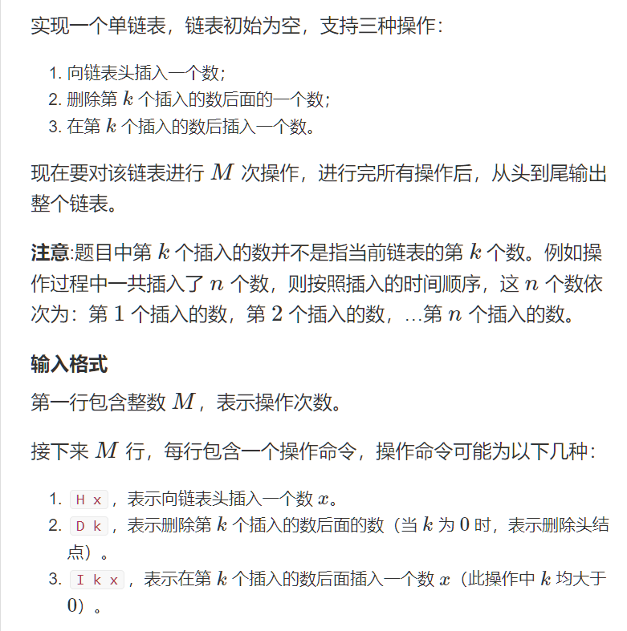
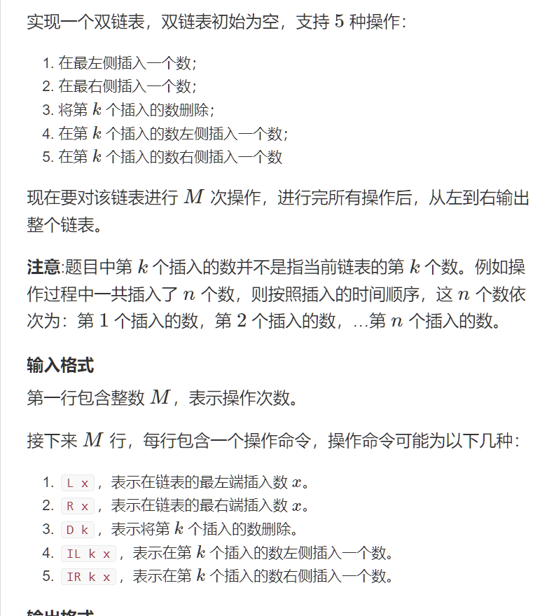

# 链表

## Acwing

### 模版

#### 单链表

```c++
// head 存储链表头, e[]存储节点的值， ne[]存储节点的next指针, idx 表示当前用到了哪个节点
int head, e[N], ne[N], idx;
// 初始化
void init()
{
    head = -1;
    idx = 0;
}
// 在链表头插入一个数
void insert(int a)
{
    e[idx] = a;
    ne[idx] = head;
    head = idx++;
}
// 将头结点删除，需要保证头结点存在
void remove()
{
    head = ne[head];
}
```

#### 双链表

```c++
// e[]表示节点的值
// l[]表示节点的左指针
// r[]表示节点的右指针
// idx表示当前用到了哪个节点
int e[N], l[N], r[N], idx;
// 初始化
void init()
{
    // 0是左端点, 1是右端点
    r[0] = 1, l[1] = 0;
    idx = 2;
}
// 在节点a的右边插入一个数
void insert(int a, int x)
{
    e[idx] = x;
    l[idx] = a, r[idx] = r[a];
    l[r[a]] = idx;
    r[a] = idx++;
}
// 删除节点a
void remove(int a)
{
    l[r[a]] = l[a];
    r[l[a]] = r[a];
}
```


### 1.单链表

#### 题目



#### 解答

```c++
#include <iostream>

using namespace std;

const int N = 100010;


// head 表示头结点的下标
// e[i] 表示节点i的值
// ne[i] 表示节点i的next指针是多少
// idx 存储当前已经用到了哪个点
int head, e[N], ne[N], idx;

// 初始化
void init()
{
    head = -1;
    idx = 0;
}

// 将x插到头结点
void add_to_head(int x)
{
    e[idx] = x, ne[idx] = head, head = idx ++ ;
}

// 将x插到下标是k的点后面
void add(int k, int x)
{
    e[idx] = x, ne[idx] = ne[k], ne[k] = idx ++ ;
}

// 将下标是k的点后面的点删掉
void remove(int k)
{
    ne[k] = ne[ne[k]];
}

int main()
{
    int m;
    cin >> m;

    init();

    while (m -- )
    {
        int k, x;
        char op;

        cin >> op;
        if (op == 'H')
        {
            cin >> x;
            add_to_head(x);
        }
        else if (op == 'D')
        {
            cin >> k;
            if (!k) head = ne[head];
            else remove(k - 1);
        }
        else
        {
            cin >> k >> x;
            add(k - 1, x);
        }
    }

    for (int i = head; i != -1; i = ne[i]) cout << e[i] << ' ';
    cout << endl;

    return 0;
}
```

```c++
#include <bits/stdc++.h>
using namespace std;
const int N = 100010;
int cur=1, e[N], ne[N];

void add_k(int k, int x)
{
    e[cur] = x; ne[cur] = ne[k]; ne[k] = cur++;
}

void del_k(int k)
{
    ne[k] = ne[ne[k]];
}


int main()
{
    int m; cin >> m;
    while (m--) {
        char op; int k,x;
        cin >> op;
        if (op == 'H') {
            cin >> x;
            add_k(0,x);
        } else if (op == 'I') {
            cin >> k >> x;
            add_k(k,x); 
        } else {
            cin >> k;
            del_k(k);
        }
    }

    for (int j = ne[0]; j ; j = ne[j]) cout << e[j] << ' ';
    cout << endl;
    return 0;
}
```

### 2.双链表

#### 题目



#### 解答

```c++
#include <iostream>

using namespace std;

const int N = 100010;

int m;
int e[N], l[N], r[N], idx;

// 在节点a的右边插入一个数x
void insert(int a, int x)
{
    e[idx] = x;
    l[idx] = a, r[idx] = r[a];
    l[r[a]] = idx, r[a] = idx ++ ;
}

// 删除节点a
void remove(int a)
{
    l[r[a]] = l[a];
    r[l[a]] = r[a];
}

int main()
{
    cin >> m;

    // 0是左端点，1是右端点
    r[0] = 1, l[1] = 0;
    idx = 2;

    while (m -- )
    {
        string op;
        cin >> op;
        int k, x;
        if (op == "L")
        {
            cin >> x;
            insert(0, x);
        }
        else if (op == "R")
        {
            cin >> x;
            insert(l[1], x);
        }
        else if (op == "D")
        {
            cin >> k;
            remove(k + 1);
        }
        else if (op == "IL")
        {
            cin >> k >> x;
            insert(l[k + 1], x);
        }
        else
        {
            cin >> k >> x;
            insert(k + 1, x);
        }
    }

    for (int i = r[0]; i != 1; i = r[i]) cout << e[i] << ' ';
    cout << endl;

    return 0;
}
```


## LeetCode

