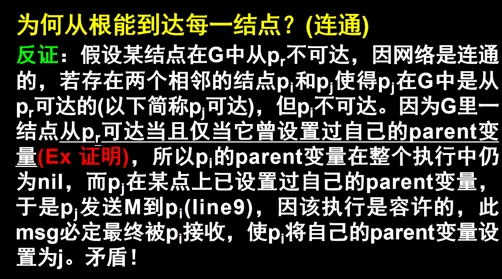

## 算法设计与分析 HW 2

>SA25011049 李宇哲

### T1

>
>
>证明：连通图G内任意结点从根节点  $p_r$ 可达当且仅当它曾设置过自己的 parent 变量。

证明方向1：$p_i$ 从 $p_r$ 可达 $\rightarrow$ $p_i$ 设置过 parent 变量

归纳证明如下：

n=0，$p_r$ 从自己可达，根节点在初始化时设置过 parent = nil 或 parent = self，所以 $p_i$ 设置过 parent 变量

假设距离 $p_r$ 为 k 步的所有可达节点都设置过 parent 变量，待证明 距离 $p_r$ 为 k + 1 步的结点 $p_i$也是设置过 parent 的变量。

如果$p_i$ 为 k + 1 步，则存在一个距离 为 k 步的结点 $p_j$，使得 $p_j$ 可达 $p_i$ ，由归纳假设，$p_j$ 已经设置过 parent 变量。

$p_j$ 在某个时刻会探索其邻居，当 $p_j$ 探索到 $p_i$ 时，会发送消息 M 给 $p_i$，当 $p_i$ 收到消息后汇之星 parent = $p_j$，因此 $p_i$ 设置过 parent 变量

证明方向2：$p_i$ 设置过 parent 变量 $\rightarrow$ $p_i$ 从 $p_r$ 可达

假设$p_i$设置过 parent 变量，但 $p_i$ 从 $p_r$ 不可达。

$p_i$ 设置过 parrent，则存在某个邻居 $p_j$ ，存在边 $p_j \rightarrow p_i$ ，且 $p_j$ 执行了 发送 M 的操作，因此 $p_j$ 已经设置过 parent 变量。

递归追溯，由于图是有限的，因此起点必定是根节点 $p_r$，因此存在 从 $p_r$ 到 $p_i$的路径，与假设矛盾，因此证明方向2成立