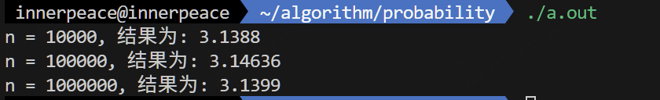
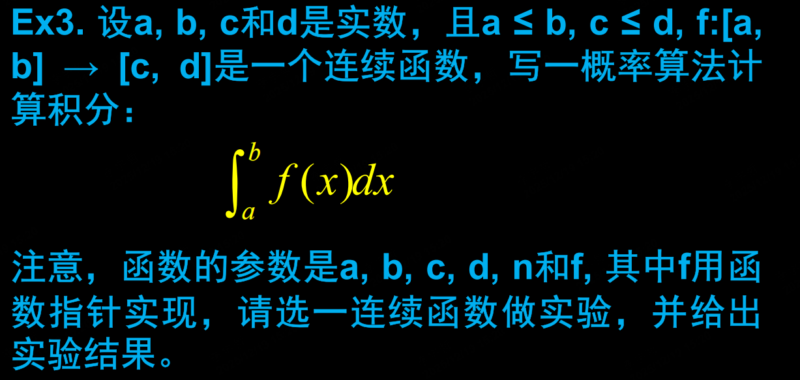
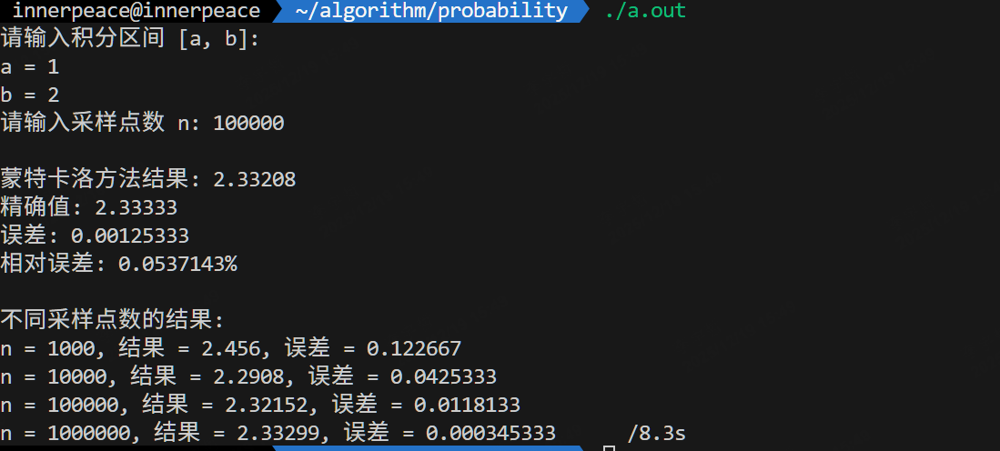
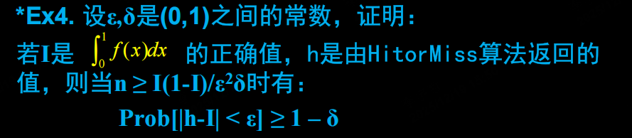
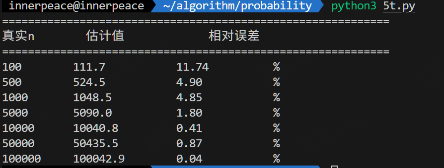
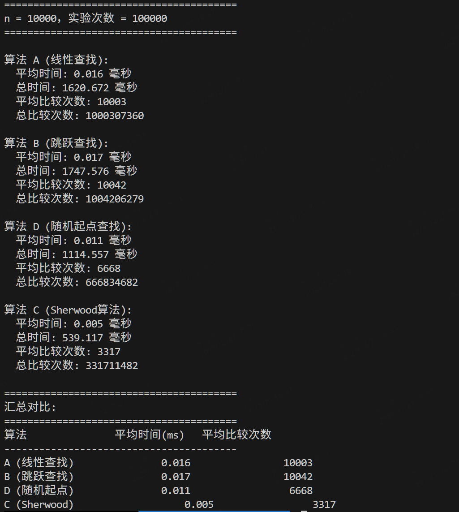
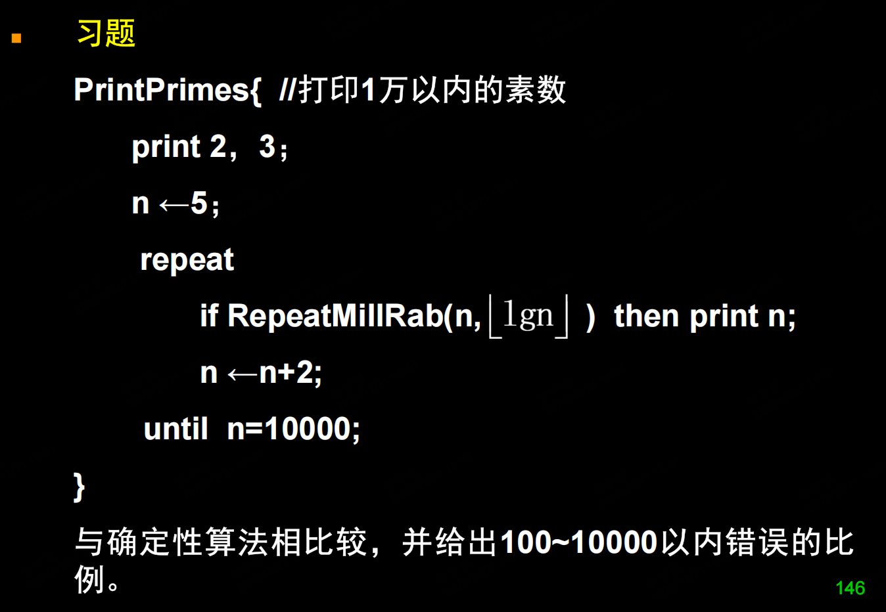
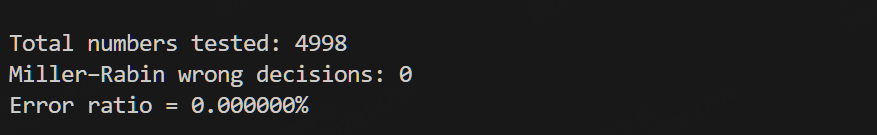

# 概率算法 HW2

>SA25011049 李宇哲

## T1


修改算法后，等价于在线段 $y =x, 0 \le x \le 1$ 内随机取点，线段长度为 $\sqrt{2}$，落在圆内的长度为 1。

估值 $\frac{4k}{n} = 4 \times \frac{1}{\sqrt{2}} = 2\sqrt{2}$

## T2


```c++
#include <iostream>
#include <cmath>
#include <cstdlib>
#include <ctime>
using namespace std;

double f(double x) {
    return sqrt(1 - x * x);
}
double result(int n) {
    double x, y;
    int k = 0;
    for (int i = 0; i < n; i++) {
        x = rand() / (double)RAND_MAX;  
        y = rand() / (double)RAND_MAX;  
        if (y <= f(x)) {
            k++;
        }
    }
    return 4.0 * k / n;  
}
int main(void) {
    srand(time(NULL));  

    double result1 = result(10000);
    double result2 = result(100000);
    double result3 = result(1000000);
    std::cout << "n = 10000, 结果为: " << result1 << std::endl;
    std::cout << "n = 100000, 结果为: " << result2 << std::endl;
    std::cout << "n = 1000000, 结果为: " << result3 << std::endl;

    return 0;
}
```

运行结果如下：



## T3



```c++
#include <iostream>
#include <cmath>
#include <cstdlib>
#include <ctime>
using namespace std;

// 被积函数 f(x) = x^2
double f(double x) {
    return x * x;
}

double monte_carlo_integral(double a, double b, int n) {
    if (a >= b) {
        cerr << "错误: a 必须小于 b" << endl;
        return 0.0;
    }
    double max_val = max(f(a), f(b));
    
    if (a <= 0 && 0 <= b) {
        max_val = max(max_val, 0.0);
    }
    
    int k = 0;  
    
    for (int i = 0; i < n; i++) {
        double x = a + (b - a) * (rand() / (double)RAND_MAX);
        double y = max_val * (rand() / (double)RAND_MAX);
        
        if (y <= f(x)) {
            k++;
        }
    }

    double rectangle_area = (b - a) * max_val;
    return rectangle_area * k / n;
}

int main() {
    srand(time(NULL));
    
    double a, b;
    int n;
    
    cout << "请输入积分区间 [a, b]:" << endl;
    cout << "a = ";
    cin >> a;
    cout << "b = ";
    cin >> b;
    
    cout << "请输入采样点数 n: ";
    cin >> n;
    
    double result = monte_carlo_integral(a, b, n);
    double exact_value = (b * b * b - a * a * a) / 3.0;  // 精确值: ∫x^2 dx = x^3/3
    
    cout << "\n蒙特卡洛方法结果: " << result << endl;
    cout << "精确值: " << exact_value << endl;
    cout << "误差: " << abs(result - exact_value) << endl;
    cout << "相对误差: " << abs(result - exact_value) / abs(exact_value) * 100 << "%" << endl;
    
    // 测试不同采样点数
    cout << "\n不同采样点数的结果:" << endl;
    for (int test_n : {1000, 10000, 100000, 1000000}) {
        double test_result = monte_carlo_integral(a, b, test_n);
        cout << "n = " << test_n << ", 结果 = " << test_result 
             << ", 误差 = " << abs(test_result - exact_value) << endl;
    }
    
    return 0;
}

```

选择 $f(x) = x^2, x \in [1,2]$ 

运行结果如下：



## T4



设 $f:[0,1] \rightarrow [0,1]$ 是一个连续函数，记 $I = \int_0^1 f(x) dx$

考虑随机变量 $K \sim B(n,p),p = \frac{I}{1}$

算法面积为 $h = \frac{K}{n}$，有

 $E[h] = E[\frac{K}{n}] = \frac{nI}{n} = I$

$Var[h] = Var[\frac{K}{n}] = \frac{1}{n^2}Var[K] = \frac{I(1-I)}{n}$

由切比雪夫不等式

$Pr[|h-E[h]| \ge \epsilon] \le \frac{Var[h]}{\epsilon^2}$

得到

$Pr[|h-I| \ge \epsilon] \le \frac{I(1-I)}{n\epsilon^2}$

令 $\delta \ge \frac{I(1-I)}{n\epsilon^2}$，有 $n \ge \frac{I(1-I)}{\delta\epsilon^2}$

此时

$Pr[[h-I] \lt \epsilon] \ge 1 - \delta$

## T5


估算算法 $\hat{n} =\frac{2k^2}{n}$，即 $E[\hat{n}] = \frac{2E^2[k]}{n}$

考虑 $E[k]$的渐进表达式 $\sqrt{\frac{\pi n}{2}} + O(1)$，有

$\frac{2E^2[k]}{\pi} = \frac{2}{\pi}(\frac{\pi}{2} n + O(\sqrt{n}))$

$相对误差 = \frac{E[\hat{n}] - n }{n} = \frac{\frac{2E^2[k]}{\pi} - n}{n} = O(\frac{1}{\sqrt{n}})$

相对误差随着 n 的增大而减小

对 n 为 [100, 500, 1000, 5000, 10000, 50000, 100000]  取 k 的均值平方作为预测结果，每轮实验重复1000次

```python
import random
import math
import statistics
import matplotlib.pyplot as plt

def estimate_set_size(n, trials=1000):
    """用随机取样 + 第一次重复公式估计集合大小
    使用 E[k]² 方法：n_hat = 2 * (mean(k))² / π
    """
    k_values = []
    
    for _ in range(trials):
        seen = set()
        k = 0
        while True:
            k += 1
            x = random.randint(1, n)
            if x in seen:
                break
            seen.add(x)
        k_values.append(k)

    mean_k = statistics.mean(k_values)
    n_hat = 2 * (mean_k ** 2) / math.pi
    
    return n_hat

# 测试不同 n 的估计效果
ns = [100, 500, 1000, 5000, 10000, 50000, 100000]

print("=" * 60)
print(f"{'真实n':<10} {'估计值':<15} {'相对误差':<15}")
print("=" * 60)

for n in ns:
    n_hat = estimate_set_size(n, trials=5000)
    error = abs(n_hat - n) / n * 100
    print(f"{n:<10} {n_hat:<15.1f} {error:<15.2f}%")
```



## T6


对于给定的 g，a，p和随机选择的r，有

$\log_{g,p}c \equiv \log_{g,p} a + \log_{g,p} b \pmod{p-1}$

$\log_{g,p}a \equiv \log_{g,p} c - \log_{g,p} b \pmod{p-1}$

$\log_{g,p}a \equiv \log_{g,p} c-r \pmod{p-1}$

因此

$u(a,r) = ag^r \pmod p, v(r,y) = (y-r) \pmod{p-1}$

## T7


改写后的算法C

```c
int val[MAXN];   
int ptr[MAXN];   
int n;
int compare_count;  // 全局变量：统计比较次数

int Search(int x, int i) {
    while (i < n && x > val[i]) {
        compare_count += 2;  
        i = ptr[i];
    }
    if (i < n) {
        compare_count += 2; 
        if (x == val[i]) {
            compare_count++;  
        }
    } else {
        compare_count++;  
    }
    return i;
}
int C(int x) {
    int r = rand() % n;
    int i = r;
    return Search(x, i);
}

```

对于一个长度 n = 10000 的表，宠物实验100000次后，得到的实验结果如下



## T8


对 nb 纪行归纳假设：

nb = 1时，每个位置被选中的概率相等

假设 nb = n 时，每个位置被选中的概率都相等

当 nb = n + 1 时，对于前 n 个位置，被选中的概率为 

$\frac{1}{n} \times \frac{1}{n+1} +\frac{n-1}{n} \times \frac{1}{n+1} = \frac{1}{n+1}$ 

对于第 n+1 个位置，被选中的概率为

$\frac{1}{n+1}$，因此每个位置被选中的概率均相等

## T9


Las Vegas 随机防止前 **setpV** 个皇后，如果中途出现冲突无无法位置，则提前终止。剩余的皇后用 backtrace() 继续搜索，若找到解返回 true，否则false

```c++
bool backtrace(int n, int k, int col, int l, int r) {
    if (k == n) return true;
    int avial = ((1 << n) - 1) & ~(col | l | r);
    for (int tmp = avial; tmp; tmp -= lowbit(tmp)) {
        int j = lg(lowbit(tmp));
        queen[k + 1] = j;
        int tcol = col | 1 << (j - 1);
        int tl = (l | 1 << (j - 1)) >> 1;
        int tr = (r | 1 << (j - 1)) << 1;
        if (backtrace(n, k + 1, tcol, tl, tr))
            return true;
    }
    return false;
}

/*------------------------------
    Las Vegas 随机 + Backtrace 混合算法
------------------------------*/
bool QueenLV(int n, int stepV) {
    memset(queen, 0, sizeof(queen));
    int col = 0, l = 0, r = 0;
    int k = 0;
    int m = 0;
    int j = 0;

    do {
        m = 0;
        j = 0;
        int avial = ((1 << n) - 1) & ~(col | l | r);
        for (int tmp = avial; tmp; tmp -= lowbit(tmp)) {
            ++m;
            uniform_int_distribution<> dis(1, m);
            int x = dis(gen);
            if (x == 1)
                j = lg(lowbit(tmp));
        }
        if (m > 0) {
            ++k;
            queen[k] = j;
            col |= 1 << (j - 1);
            l = (l | 1 << (j - 1)) >> 1;
            r = (r | 1 << (j - 1)) << 1;
        }
    } while (m > 0 && k < stepV);

    if (m > 0)
        return backtrace(n, k, col, l, r);
    return false;
}
```

对 n = 12 ~ 20，枚举 **stepV**，各执行 10000 次实验以平滑随机性，总计总运行时间，选择最小值作为最优 stepVegas

```
n       Best stepVegas  Time(s)
----------------------------------
12      4               0.043
13      5               0.043
14      6               0.055
15      7               0.066
16      8               0.063
17      8               0.078
18      9               0.089
19      10              0.082
20      10              0.116 
```

## T10



```c++
using ull = unsigned long long;
ull modpow(ull a, ull b, ull m) {
    ull res = 1;
    a %= m;
    while (b > 0) {
        if (b & 1) res = (__int128)res * a % m;
        a = (__int128)a * a % m;
        b >>= 1;
    }
    return res;
}
bool MillerRabinTest(ull n, ull a, ull d, int s) {
    ull x = modpow(a, d, n);
    if (x == 1 || x == n - 1) return true;
    for (int r = 1; r < s; ++r) {
        x = (__int128)x * x % n;
        if (x == n - 1) return true;
    }
    return false;
}

// RepeatMillRab(n, t) —— 重复 t 次
bool RepeatMillRab(ull n, int t) {
    if (n < 2) return false;
    if (n == 2 || n == 3) return true;
    if (n % 2 == 0) return false;

    ull d = n - 1;
    int s = 0;
    while ((d & 1) == 0) {
        d >>= 1;
        ++s;
    }

    random_device rd;
    mt19937_64 gen(rd());
    uniform_int_distribution<ull> dist(2, n - 2);

    for (int i = 0; i < t; ++i) {
        ull a = dist(gen);
        if (!MillerRabinTest(n, a, d, s))
            return false;
    }
    return true;
}

// 确定性素数检测（试除法）
bool DeterministicPrime(int n) {
    if (n < 2) return false;
    if (n == 2 || n == 3) return true;
    if (n % 2 == 0) return false;
    for (int i = 3; i * i <= n; i += 2)
        if (n % i == 0)
            return false;
    return true;
}
```

实验结果如下：

