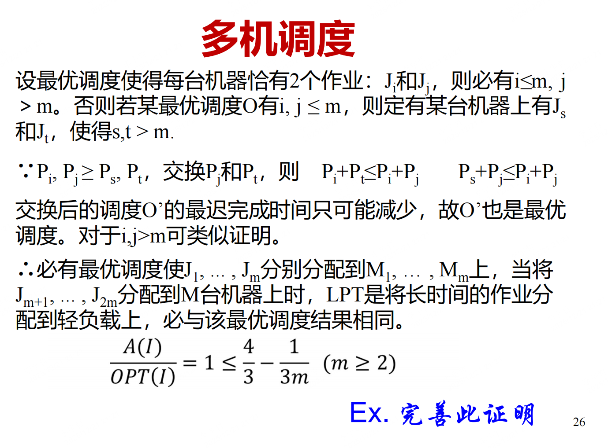

# 近似算法 HW2

>SA25011049 李宇哲

## T1

 先证明 $\Rightarrow$

假设图 G 的最大团大小为 $\alpha$，将 G 的第 i 个拷贝记作 $G_i, 1 \le i \le m$

在每个子图 $G_i$ 中，取一个最大团 $C_i$，

于是：$|C_i| = \alpha, C_i \subseteq V(G_i)$

定义：$C^m = \bigcup_{i=1}^m C_i$

因为：

-  对同一个 $G_i$ 中的任意两点 $(u,v) \in E(G_i)$，在图 $G^m$ 中也连边
- 同时对不同 $G_i, G_j(i\ne j)$，图 $G^m$ 的定义中也有 $(u,v)\in E(G^m)$

所以 $C^m$ 中任两点都相连，即 $C^m$ 是 $G^m$ 的团

显然：

$|C^m| = \sum_{i=1}^m |C_i| = m\alpha$

再取 $G^m$ 的任意一个团 $C^{‘}$，定义：

$C_i^{’} = C^{‘} \bigcap V(G_i)$，则 $C^{’}_i$ 是 $G_i$ 的一个团，故有：$|C_i^{'}| \le \alpha$

于是，$|C^{‘}| = \sum_{i=1}^{m} |C_i^{’}| \le m\alpha$

因此，$C^m$ 是 $G^m$ 的最大团，且大小为 $m\alpha$

方向 $\Leftarrow$

假设 $G^m$ 的最大团的大小为 $m\alpha^{’}$，设 $G$ 的最大团大小为 $\alpha$

根据上面的推理，在 $G^m$ 中由 $G$ 的团构成的团大小上限为 $m\alpha$

若 $G^m$ 的最大团能达到 $m\alpha^{‘}$，则由可加性推出 $m\alpha = m\alpha^{’}$

于是 $\alpha = \alpha^{‘}$

所以，$G$中最大团的 size 为 $\alpha$ $\Leftrightarrow$ $G^m$ 中最大团的 size 为 $m\alpha$

## T2

claim：存在一个最优调度，使得每台机器 $M_i$ 上的两个任务分别是：$(J_i, J_{m+i}) (1\le i \le m)$

若在某个最优调度 $O$ 中存在 $i,j \le m$，而有某台机器上有 $J_s,J_k$ 其中 $s,t >m$，那么调换它们不会使最大负载增大，因为 $p_i,p_j \ge p_s,p_t$

交换后： $p_i +p_t \le p_i + p_j, p_s +p_j \le p_i + p_j$

所以新调度只会变得更优或相同。

因此可以保证，存在最优调度使任务配对形式： $(J_i,J_{m+i})$

claim2：在每台机器恰有两个任务的情况下，LPT 的调度结果与最优调度一致，即 $A(I) = OPT(I)$

定义最优调度表示，用排列 $\sigma_0$ 表示： $J_i, J_{m+\sigma_0(i)}$分配给 $M_i$

最优调度：$OPT(I) = max_i(p_i + p_{m+\sigma_0(i)})$

如果存在 $i < j$ 但 $\sigma_0(i) < \sigma_0(j)$，说明 “任务时间较短的机器分配了较短任务”

通过交换这两对不会让最大负载增加。

因此可证明：可以换成另一个“更整齐”的调度：$\sigma^{‘}(i) = m-i+1$

即最优调度可写成：$(J_i,J_{2m+1-i})$ 配对

LPT 是把最大的任务分到当前最轻负载的机器上。

对于 $J_i$ 较大的任务，会先分配给较空机器，与上面的规律一致，因此它会得到：$(J_i, J_{2m+1-i})$这样的配对。

这正好与最优调度对应，于是：

$A(I) = OPT(I)$

推广到一般情形上 $\frac{A(I)}{OPT(I)\le \frac{4}{3} - \frac{1}{3m}}$