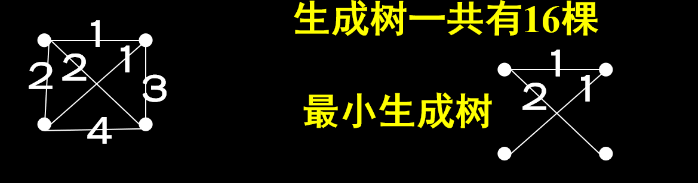
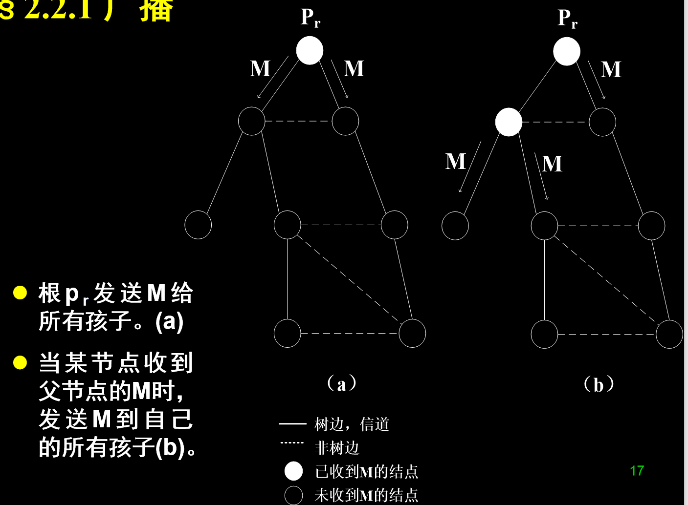

# 分布式算法

>李宇哲 SA25011049  
>
>write in 2025.11.8

## chapter 1 导论

### 1.1 分布式系统

**def**

一个分布式系统是一个能彼此通信的单个计算装置的集合（计算单元：硬——处理器；软——进程）

**与并行处理的分别**(具有更高程度的不确定性和行为的独立性)

- 并行处理的目标是使用所有处理器来执行一个大任务
- 而分布式系统中，每个处理器一般都有自己独立的任务，但由于各种原因（为共享资源，可用性和容错等），处理机之间需要协调彼此的动作。

分布式系统无处不在，**作用**是：

- 共享资源
- 改善性能：并行地解决问题
- 改善可用性：提高可靠性，以防某些成分发生故障

面临**困难**

- 异质性：软硬件环境
- 异步性：事件发生的绝对、甚至相对时间不可能总是精确的指导
- 局部性：每个计算实体只有全局情况的一个局部视图
- 故障：各计算实体会独立地出故障，影响其他计算实体的工作。

### 1.2 分布式计算的理论

**目标**：针对分布式系统完成类似于顺序式计算中对算法的研究

- 对各种分布式情况发生的问题进行抽象，精确地陈述这些问题，设计和分析有效算法解决这些问题，证明这些算法的最优性。

**计算模型**：

- 通信：计算实体间 msg 传递还是共享变量？
- 哪些计时信息和行为是可用的
- 容许哪些错误

**复杂性度量标准**：

- 时间、空间
- 通信成本：msg个数，共享变量的大小及个数
- 故障和非故障的数目

**否定结果、下界和不可能的结果**：

常常要证明在一个特定的分布式系统中，某个特定问题的不可解性。   

就像NP-完全问题一样，表示我们不应该总花精力去求解这些问题。   

当然，可以改变规则，在一种较弱的情况下去求解问题。

**侧重研究**：

- 可计算型：问题是否可解
- 计算复杂性：求解问题的代价是什么

### 1.3 理论和实际之关系

**种类**

- **支持多任务的OS**：互斥，死锁检测和防止等技术在分布式系统中同样存在。

- **MIMD机器**：紧耦合系统，它由分离的硬件运行共同的软件构成。

- **更松散的分布式系统**：由网络（局域、广域等）连接起来的自治主机构成

  特点是由分离的硬件运行分离的软件。实体间通过诸如TCP/IP栈、CORBA或某些其它组件或中间件等接口互相作用。

**模型**：基于通信介质（共享内容/消息传递）和同步程度（同步/异步）考虑

- 异步共享存储模型

  **通信方式**：通过共享内存完成（多个处理器可以访问同一块存储）

  **同步性**：异步。即每个处理机有自己的时钟，不是来自同一个信号源。

  **典型应用场景**：用于紧耦合（tightly coupled）系统，比如多核 CPU 系统、对称多处理器（SMP）。

- 异步msg传递模型

  **通信方式**：靠**消息传递（message passing）**，即节点之间发送和接收消息。

  **同步性**：异步通信 —— 发送和接收之间的延迟可能是任意的，消息传输时间不可预测。

  **典型应用场景**：用于松耦合（loosely coupled）系统，例如局域网或广域网内的分布式节点。

- 同步msg传递模型

  **通信方式**：同样是消息传递，但有**同步假设**。

  **同步性**：系统中存在**全局时钟假设**或**已知的通信延迟上界（如消息延迟 ≤ D）**。

  **特征**：

  - 某些时间信息是**已知**的；
  - 系统可以按轮次（rounds）执行，每一轮包括发送、接收、计算；
  - 是异步系统的一个“理想化特例”。

**错误的种类**：

- 初始死进程：局部算法中没有执行过一步
- crash failure崩溃错误：指处理机没有任何警告而在某点上停止操作
- byzantine failure 拜占庭错误：一个出错可引起任意的动作，即执行了与局部算法不一致的任意步。拜占庭错误的进程发送的笑嘻可能包含任意内容

## chapter 2 消息传递系统中的基本算法

>无故障的 message 传递系统，考虑 同步及异步模型

### 2.1 消息传递系统的形式化模型

#### 2.1.1系统

##### 基本概念

- 拓扑：无向图：节点为处理机，边为双向信道

- 算法：由系统中每个处理器上的局部程序构成

  - 局部程序：
    - 本地机器：执行局部计算
    - 邻居：发送和接受message
  - 形式地：一个系统或一个算法是由n个处理器p0, p1,…pn-1构成，每个处理器pi可以模型化为一个具有状态集Qi的状态机（可能是无限的）

- 状态（进程的局部状态）

  由 $p_i$ 的变量，$p_i$的msgs构成，$p_i$的每个状态由2r个msg集过程：

  - $outbuf_i[l])1\le l \le r$：$p_i$经第l条关联的信道发送给邻居，但尚未传到邻居的msg
  - $inbuf_i[l])1\le l \le r$：在$p_i$的第l条信道上已传递到 $p_i$，但尚未经 $p_i$ 内部计算步骤处理的 msg

  模拟在信道上传输的msgs

- 初始状态：

  $Q_i$ 包含一个特殊的初始状态子集：每个 $inbuf_i[l]$必须为空，但$outbuf_i[l]$未必为空

- 转换函数（transition）：

  处理器$p_i$的转换函数（实际上是一个局部程序）

  - 输入：$p_i$可访问的状态
  - 输出：对每个信道l，至多产生一个msg输出
  - 转换函数使输入缓冲区($1\le l \le r$)清空

- 配置：配置是分布式系统在某点上整个算法的全局状态

  向量=(q0, q1,…qn-1), qi是pi的一个状态

  一个配置里的outbuf变量的状态表示在通信信道上传输的信息，由del事件模拟传输

  一个初始的配置是向量=(q0, q1,…qn-1), 其中每个qi是pi的初始状态，即每个处理器处于初始状态

- 事件：系统里所发生的事情均被模型化为事件，对于msg传递系统，有两种：

  - comp(i)：计算事件。代表处理器pi的一个计算步骤。其中，pi的转换函数被用于当前可访问状态
  - del(i,j,m)——传递事件，表示msg m从pi传送到pj

- 执行：系统在时间上的行为被模型化为一个执行。

  - Safety条件： (安全性)	

    表示某个性质在每次执行中每个可到达的配置里都必须成立

    在序列的每个有限前缀里必须成立的条件

  - liveness条件： (活跃性)

    表示某个性质在每次执行中的某些可达配置里必须成立。	

    必须成立一定次数的条件(可能是无数次)

  对特定系统，满足所有要求的安全性条件的序列称为一个执行;若一个执行也满足所有要求的活跃性条件，则称为容许(合法的)(admissible)执行

##### **异步系统**

- 异步：msg传递的时间和一个处理器的两个相继步骤之间的时间无固定上界。

  因此异步算法设计时，须使之独立于特殊的计时参数，不能依赖于该上界。

- 执行片段：一个异步msg传递系统的一个执行片断α是一个有限或无限的序列：          

  C0, Φ1, C1, Φ2, C2, Φ3, … , (C0不一定是初始配置)	

  这里Ck是一个配置， Φk是一个事件。若α是有限的，则它须结束于某个配置，且须满足下述条件：

  - 若Φk =del(i,j,m)，则m必是Ck-1里的outbufi[l]的一个元素，这里l是pi的信道{pi,pj}的标号	

    从Ck-1到Ck的唯一变化是将m从Ck-1里的outbufi[l]中删去，并将其加入到Ck里的inbufj[h]中，h是pj的信道{pi,pj}的标号。

    即：传递事件将msg从发送者的输出缓冲区移至接收者的输入缓冲区。

  - 若Φk =comp(i)，则从Ck-1到Ck的变化是

    改变状态：转换函数在pi的可访问状态(在配置Ck-1里)上进行操作，清空inbufi[l]，(1≤l≤r)

    发送msg：将转换函数指定的消息集合加到Ck里的变量outbufi上。(Note:发送send，传递delivery之区别)	即： pi以当前状态(在Ck-1中)为基础按转换函数改变状态并发出msg。

- 调度：一个调度(或调度片段)总是和执行(或执行片断)联系在一起的，它是执行中的事件序列：Φ1, Φ2, … 。

  并非每个事件序列都是调度。例如，del(1,2,m)不是调度，因为此事件之前，p1没有步骤发送(send)m。	若局部程序是确定的，则执行(或执行片断)就由初始配置C0和调度(或调度片断)σ唯一确定，可表示为exec(C0 , σ)。

- 容许执行：(满足活跃性条件)	

- 异步系统中，若某个处理器有无限个计算事件，每个发送的msg都最终被传递，则执行称为容许的。	Note: 无限个计算事件是指处理器没有出错，但它不蕴含处理器的局部程序必须包括一个无限循环	

  非形式地说：一个算法终止是指在某点后转换函数不改变处理器的状态。

- 容许的调度：若它是一个容许执行的调度。

##### **同步系统**

在同步模型中，处理器按锁步骤(lock-step)执行：		

执行被划分为轮，每轮里

- 每个处理器能够发送一个msg到每个邻居，这些msg被传递。
- 每个处理器一接到msg就进行计算。

**轮**：在同步系统中，配置和事件序列可以划分成不相交的轮，每轮由一个传递事件(将outbuf的消息传送到信道上使outbuf变空)，后跟一个计算事件(处理所有传递的msg)组成。

容许的执行：指无限的执行。因为轮的结构，所以		

- 每个处理器执行无限数目的计算步
- 每个被发送的msg最终被传递

**同步与异步系统的区别**：

- 在一个无错的同步系统中，一个算法的执行只取决于初始配置
- 但在一个异步系统中，对于相同的初始配置及无错假定，因为处理器步骤间隔及消息延迟均不确定，故同一算法可能有不同的执行

#### 2.1.2 复杂性度量

分布式算法性能：

- 消息复杂度
- 时间复杂度
- 空间复杂度
- 性能衡量：最坏性能、期望性能

终止：假定每个处理器的状态集包括终止状态子集，每个的$p_i$的转换函数对终止状态只能映射到终止状态

当所有处理机均处于终止状态且没有msg在传输时，称系统已终止。

**算法的msg复杂性(最坏情况)**：算法在所有容许的执行上发送msg总数的最大值(同步和异步系统)

**消息复杂度度量** ：

- 消息复杂度：消息总数l消息中总的位数长度

**时间复杂度**

- 同步系统：最大轮数，即泛的任何容许执行直到终止的最大轮数
- 异步系统：
  - 节点计算任何有限数目事件的时间为0
  - 一条消息发送和接收之间的时间至多为1个时间单位，定义为：所有计时容许执行中直到终止的最大时间。

**计时执行(timed execution)**

每个事件关联一个非负实数，表示事件发生的时间。时间起始于零，且须是非递减的。但对每个单个的处理器而言是严格增的。		

- 若执行是无限的，则执行的时间是无界的。因此执行中的事件可根据其发生时间来排序		

- 不在同一处理器上的多个事件可以同时发生，在任何有限时间之前只有有限数目的事件发生。

消息的延迟：

- 发送msg的计算事件和处理该msg的计算事件之间所逝去的时间
- 它主要由msg在发送者的outbuf中的等待时间和在接收者的inbuf中的等待时间所构成

**异步算法的时间复杂性**：

定义中，每个msg延时至多为1，但实际中，至多1个时间单位会很难计算，因此修改假设：

- 一条消息发送和接收之间时间恰好为1个时间单位
- 一条消息发送和接收之间时间介于α和1之间(0< α<1)
- 假设消息传递的延迟满足某种概率分布，并由此来计算

#### 2.1.3 伪代码约定

在形式模型中，一个算法将根据状态转换来描述。但实际上很少这样做，因为这样做难于理解。

实际描述算法有两种方法：

- 叙述性：对于简单问题
- 伪码形式：对于复杂问题

**异步算法**：对于每个处理器，用**中断驱动**来描述异步算法

- 在形式模型中，每个计算事件1次处理所有输入缓冲区中的msgs。而在算法中，一般须描述每个msg是如何逐个处理的
- 异步算法也可在同步系统中工作，因为同步系统是异步系统的一个特例
- 一个计算事件中的局部计算的描述类似于顺序算法的伪代码描述

**同步算法**：逐轮描述

伪代码约定：	

- 在pi的局部变量中，无须用i做下标，但在讨论和证明中，加上下标i以示区别。	
- “//”后跟注释

### 2.2 生成树上的广播和汇集

> 消息收集（敛播/汇集）及分发(广播)是许多分布式算法的基础。故通过介绍这两个算法来说明模型、伪码、正确性证明及复杂性度量等概念。

> 由于分布式系统中，每个节点并不知道全局拓扑状态，但某些算法需要在特定的结构下才能达到最优。

**生成树**

一个无向连通图G的**生成树(Spanning Tree)**是指满足下列条件的G的子图T：    

- G和T具有相同的顶点数；    
- 在T中有足够的边能够连接G的所有顶点且不出现回路。

**最小生成树**

如果图的每一条边都指定有一个权，那么所有的边权最小的生成树，就成为最小代价生成树(Minimum Cost Spanning Tree, MCST) ，简称最小生成树(MST)。

>example：
>
>

#### 2.2.1 广播

假定我哪里过的生成树已给定。某处理器$p_r$希望将消息M发送至其余处理器

假定生成树的根为 $p_r$，每个处理器有一个信道连接其双亲（$p_r$除外），有若干个信道连接其孩子

>example：
>
>

1.伪码算法

```c
Alg2.1 Broadcast 
pr:	//发动者。假设初始化时M已在传输状态
	1.	upon receiving no msg:	//pr发送M后执行终止
	2.	      terminate;		//将terminated置为true。
pi(i≠r,0≤i ≤ n-1):
	3.	upon receiving M from parent:
	4.	       send M to all children;
	5.	       terminate;

```

2.用状态转换来分析算法

- 每个处理器$p_i$包含状态
  - 变量 $parent_i$：表示处理器 $p_i$双亲节点的标号或为nil
  - 变量 $chilren_i$：$p_i$的孩子节点标号的集合
  - 布尔变量 $termianted_i$：表示$p_i$是否处于终止状态

**复杂度**

- 时间复杂度：O(h)，h为生成树的高度
- msg复杂度：O(n)，msg复杂性为n-1（n为节点数）

**广播算法**

```c
输入：根节点上的消息<m>
输出：每个节点都收到消息<m>
Code for Pi
Begin
  while (receiving no message) do
      (1) if i=r then  \\此节点为根节点
        (1.1) send <m> to all children
        (1.2) terminates
       end if
  end while
  while (receiving <m> from Pj) do
    (1) send <m> to all children
    (2) terminates
  end while
end 
```

>while表示满足条件时，节点所做的动作

**时间复杂性**：

- 同步模型：时间由轮来度量

  Lemma2.1：在同步模型中，广播算法的每个容许执行里，树种每个距离$p_r$为t的处理器在第t轮里接收消息M

  Th2.2：当生成树高度为d时，存在一个消息复杂度为n-1，时间复杂度为d的同步广播算法

- 异步模型：

  Lemma2.3：在异步模型的广播算法的每个容许执行里，树中每个距离pr为t的处理器至多在时刻t接收消息M。

  Th2.4：同 th2.2

#### 2.2.2 convergecast（汇集，敛播）

> 与广播问题相反，汇集是从所有结点收集信息至根。
>
> 为简单起见，先考虑一个特殊的变种问题：假定每个pi开始时有一初值xi，我们希望将这些值中最大者发送至根pr。

**算法**：每个叶子结点pi发送xi至双亲。//启动者	

对每个非叶结点pj，设pj有k个孩子pi1,…,pik，pj等待k个孩子的msg vi1,vi2,…,vik，当pj收到所有孩子的msg之后将vj=max{xj,vi1,…,vik}发送到pj的双亲。

**复杂性**：

- Th2.5：当生成树高为d时，存在一个异步的敛播方法，其msg复杂性为n-1，时间复杂度为d。(与Th2.2相同)

广播和敛播算法用途：初始化某一信息请求(广播发布)，然后用敛播响应信息至根。

### 2.3 构造生成树

**Algorithm2.2**

```c
（code for pi 0≤i≤n-1）
	初值：parent=nil；集合children和other均为φ
upon receiving no message:
    if i=r and parent=nil then {  //根尚未发送M
        send M to all neighbors;
        parent:=i;} //根的双亲置为自己
upon receiving M from neighbor pj:
    if parent=nil then {//pi此前未收到过M，M是pi收到的第1个msg
        parent:=j;
        send <parent> to pj;  //pj是pi的双亲
        send M to all neighbors except pj;
	    }else  //pj不可能是pi的双亲，pi收到的M不是第1个msg
         send<reject> to pj;
upon receiving <parent> from neighbor pj:
    children:=children∪{ j };  //pj是pi的孩子，将j加入孩子集
    if children∪other 包含了除parent外的所有邻居 then terminate;
upon receiving <reject> from neighbor pj:
    other:=other∪{ j };  //将j加入other，通过非树边发送的msg。
    if children∪other包含了除pi的双亲外的所有邻居 then terminate
```

Lemma2.6

在异步模型的每个容许执行中，算法2.2构造一棵根为pr的生成树。(正确性)

- 一旦处理器设置了parent变量，它绝不改变，即它只有一个双亲
- 处理器的孩子集合决不会减小。

>可以看出 由于引入了新的 reject和 parent 消息，所以相对于 flooding 算法，增加了 msg 复杂性

**Th 2.7**

对于具有m条边和直径D的网络，给定一特殊结点，存在一个msg复杂性为O(m)，时间复杂性为O(D)的异步算法找到该网络的一棵生成树。

Alg2.2在同步模型下仍可工作。其分析类似于异步情形。然而，与异步不同的是，它所构造的生成树一定是一棵广度优先搜索(BFS)树。

**Lemma2.8** 

在同步模型下，Alg2.2的每次容许执行均构造一棵根为pr的BFS树。

**Th2.9** 

对于具有m条边直径为D的网络，给定一个特殊结点，存在一个同步算法在msg复杂性为O(m)，时间复杂性为O(D)内找到一棵BFS树。

**信息的请求和收集**

>组合算法：先构造生成树，然后沿这棵树进行消息 聚合/汇集

将算法2.2(求生成树)和汇集算法组合即可完成。组合算法的时间复杂性在同步和异步模型中不同,设网是**完全图**

- 求生成树算法：同步和异步均为：
  - 消息复杂性 O(m)
  - 时间复杂性 O(D)
- 汇集算法：同步和异步均有：
  - msg：n-1
  - time d // 生成树高

### 2.4 构造 DFS 生成树（指定根）

**Algorithm 2.3** 构造 DFS 生成树，为 $P_r$ 为根

```c
Code for processor Pi, 0≤i ≤ n-1
var		parent:	init nil;
		children:	init φ;
		unexplored:	init all the neighbors of Pi
 					//未访问过的邻居集
1: upon receiving no msg:
2:    if (i=r) and (parent=nil) then {  //当Pi为根且未发送M时
3:       parent := i;  //将parent置为自身的标号
4:           Pj ∈ unexplored;
5:       将Pj从unexplored中删去; //若Pr是孤立结点,4-6应稍作修改
6:       send M to Pj;
       }//endif
7: upon receiving M from neighbor Pj:
8:     if parent=nil then {  //Pi此前未收到M
9:         parent := j;  //Pj是Pi的父亲
10:       从unexplored中删Pj
11:       if unexplored ≠φthen {
12:              Pk ∈ unexplored;
13:           将Pk从unexplored中删去；
14:           send M to Pk;
15:       } else send <parent> to parent;  
		            //当Pi的邻居均已访问过，返回到父亲
16:   }else send <reject> to Pj;  //当Pi已访问过时
17: upon receiving <parent> or <reject> from neighbor Pj:
18:     if received <parent> then add j to children; 
          //Pj是Pi的孩子
19:     if unexplored = φ then {  //Pi的邻居均已访问
20:         if parent ≠ i then send <parent> to parent;  
              //Pi非根，返回至双亲
21:         terminate;  //以Pi为根的DFS子树已构造好！
22:      }else {  //选择Pi的未访问过的邻居访问之
23:                 Pk ∈ unexplored;
24:              将Pk从unexplored中删去；
25:              send M to Pk;
           }

```

**引理2.10** 在异步模型里的每个容许执行，Algorithm 2.3 构造一棵以 $P_r$ 为根的DFS树

**Th2.11** 对于一个具有m条边，n个结点的网络，以及给定的特殊顶点，存在一个时间复杂性和消息复杂性均为O(m)的异步算法找到一棵DFS树。

