# 计算机应用数学第二次作业

>李宇哲 SA25011049

## T1


Manhattan 距离：$d_1(p_i,p_j) = |x_i - x_j| + |y_i -y_j|$

Euclidean 距离：$d_2(p_i,p_j) = \sqrt{(x_i-x_j)^2 +(y_i-y_j)^2}$

聚类1，左下角(A,B,C,D)

欧式距离下：A-B=1，A-C=1均临近

A-D=$\sqrt{2} \approx 1.414>1.1$ ，不相连

B-C=$\sqrt{2} \approx 1.414 >1.1$，不相连

C-D=1，邻近

在 $\epsilon=1.1$下，每个点至少与2个点以内相连，因此四个点联通，形成一个 cluster

- Core：A,B,C,D
- Cluster 1 = {A,B,C,D}

曼哈顿距离：

AB=1，AC=1，AD=2>1.1，CD=1

四点联通

- Core：A,B,C,D
- Cluster 1 = {A,B,C,D}

无 noise point

聚类2，N,M,L,K

欧氏距离下：

NM=$\sqrt{2}\approx1.414$，ML=$\sqrt{2}\approx1.414$，LK=1

由于 $\epsilon = 1.1 <1.414$，N与M不会互连，不形成聚类

欧氏距离下无法形成联通簇，曼哈顿距离下也无法形成cluster

因此 N，M，L，K均为 noise points

聚类3，E，F，G，H，I，J

欧氏距离下：

EF=1.414>1.1，EG=1，EI=1，GH=1，IJ=1，形成cluster

- Core points = G，E，I，J
- Border：F，H

曼哈顿距离下：

EG=1，EI=1，IJ=1，GH=1

- core points = G，E，I，J
- Border = F，H

聚类4：O，P，Q，R，S，T

欧氏距离下：

OP=1.414>1.1，PQ=1，QR=1，RS=1，PS=1.414 >1.1，ST=3>1.1

PQRS形成一个cluster，OT为noist points，core为 QRS

曼哈顿距离下形成相同cluster

| cluster | points      | core points | Border |
| ------- | ----------- | ----------- | ------ |
| C1      | A,B,C,D     | A,B,C,D     |        |
| C2      | E,F,G,H,I,J | E,G,I,J     | F,H    |
| C3      | P,Q,R,S     | Q,R,S       | P      |
| Noise   | O,N,M,L,K,T |             |        |

## T2 

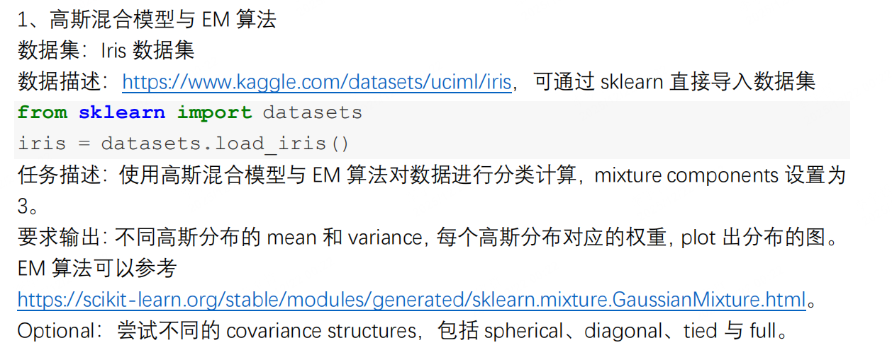

定义三个高斯分布

```python
# 定义三个高斯分布的参数
n_samples_per_component = 200
n_components = 3

# 第一个高斯分布
mean1 = [2, 2]
cov1 = [[1, 0.3], [0.3, 1]]
X1 = np.random.multivariate_normal(mean1, cov1, n_samples_per_component)

# 第二个高斯分布
mean2 = [6, 6]
cov2 = [[1, -0.3], [-0.3, 1]]
X2 = np.random.multivariate_normal(mean2, cov2, n_samples_per_component)

# 第三个高斯分布
mean3 = [4, 8]
cov3 = [[0.8, 0], [0, 0.8]]
X3 = np.random.multivariate_normal(mean3, cov3, n_samples_per_component)
```

合并之后，数据形状为：`(600,2)`，一共有三个分布，每个分布的样本数为200

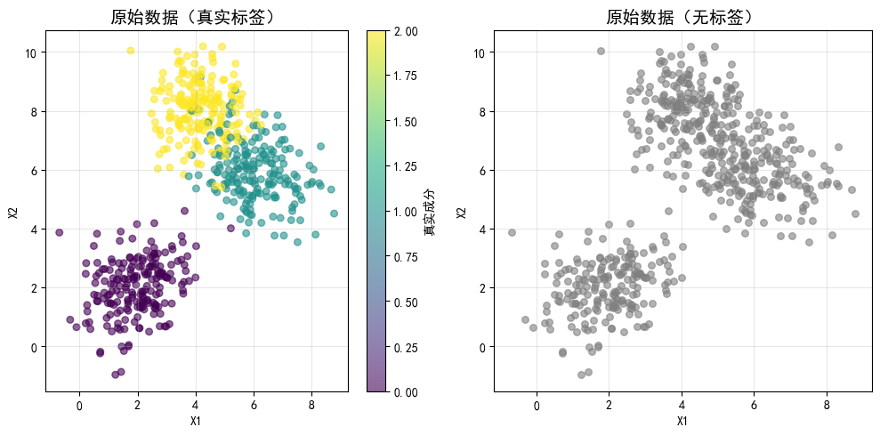

创建并训练 GMM 模型，得到参数如下：

```python
class GaussianMixtureModel:
    """
    高斯混合模型（GMM）使用EM算法进行训练
    
    参数:
        n_components: 混合成分的数量（高斯分布的数量）
        max_iter: 最大迭代次数
        tol: 收敛阈值
        random_state: 随机种子
    """
    
    def __init__(self, n_components=3, max_iter=100, tol=1e-6, random_state=42):
        self.n_components = n_components
        self.max_iter = max_iter
        self.tol = tol
        self.random_state = random_state
        self.weights_ = None  
        self.means_ = None    
        self.covariances_ = None  
        self.log_likelihood_history_ = []
        
    def _initialize_parameters(self, X):
        """初始化模型参数"""
        np.random.seed(self.random_state)
        n_samples, n_features = X.shape
        self.weights_ = np.ones(self.n_components) / self.n_components
        self.means_ = X[np.random.choice(n_samples, self.n_components, replace=False)]
        cov = np.cov(X.T)
        self.covariances_ = np.array([cov for _ in range(self.n_components)])
        
    def _e_step(self, X):
        """
        E步：计算每个样本属于每个高斯分布的后验概率（责任）
        
        返回:
            responsibilities: (n_samples, n_components) 形状的数组
        """
        n_samples = X.shape[0]
        responsibilities = np.zeros((n_samples, self.n_components))
        
        for k in range(self.n_components):
            try:
                responsibilities[:, k] = self.weights_[k] * multivariate_normal.pdf(
                    X, self.means_[k], self.covariances_[k]
                )
            except:
                responsibilities[:, k] = self.weights_[k] * multivariate_normal.pdf(
                    X, self.means_[k], self.covariances_[k] + np.eye(self.covariances_[k].shape[0]) * 1e-6
                )
        
        responsibilities_sum = responsibilities.sum(axis=1, keepdims=True)
        responsibilities_sum[responsibilities_sum == 0] = 1e-10  
        responsibilities = responsibilities / responsibilities_sum
        
        return responsibilities
    
    def _m_step(self, X, responsibilities):
        """
        M步：根据当前的责任更新模型参数
        """
        n_samples, n_features = X.shape
        Nk = responsibilities.sum(axis=0)
        self.weights_ = Nk / n_samples
        self.means_ = np.zeros((self.n_components, n_features))
        for k in range(self.n_components):
            self.means_[k] = (responsibilities[:, k][:, np.newaxis] * X).sum(axis=0) / Nk[k]
        self.covariances_ = np.zeros((self.n_components, n_features, n_features))
        for k in range(self.n_components):
            diff = X - self.means_[k]
            self.covariances_[k] = np.dot(
                responsibilities[:, k] * diff.T, diff
            ) / Nk[k]
            self.covariances_[k] += np.eye(n_features) * 1e-6
    
    def _compute_log_likelihood(self, X):
        """计算对数似然"""
        n_samples = X.shape[0]
        log_likelihood = 0
        
        for k in range(self.n_components):
            try:
                log_likelihood += self.weights_[k] * multivariate_normal.pdf(
                    X, self.means_[k], self.covariances_[k]
                )
            except:
                log_likelihood += self.weights_[k] * multivariate_normal.pdf(
                    X, self.means_[k], self.covariances_[k] + np.eye(self.covariances_[k].shape[0]) * 1e-6
                )
        
        log_likelihood = np.log(log_likelihood + 1e-10).sum()
        return log_likelihood
    
    def fit(self, X):
        """
        使用EM算法训练模型
        
        参数:
            X: 训练数据，形状为 (n_samples, n_features)
        """
        X = np.array(X)
        self._initialize_parameters(X)
        
        prev_log_likelihood = -np.inf
        
        for iteration in range(self.max_iter):
            responsibilities = self._e_step(X)
            self._m_step(X, responsibilities)
            log_likelihood = self._compute_log_likelihood(X)
            self.log_likelihood_history_.append(log_likelihood)
            if abs(log_likelihood - prev_log_likelihood) < self.tol:
                print(f"在第 {iteration + 1} 次迭代后收敛")
                break
            
            prev_log_likelihood = log_likelihood
        
        return self
    
    def predict(self, X):
        """
        预测每个样本最可能属于哪个高斯分布
        
        参数:
            X: 测试数据
            
        返回:
            预测的类别标签
        """
        responsibilities = self._e_step(X)
        return np.argmax(responsibilities, axis=1)
    
    def predict_proba(self, X):
        """
        返回每个样本属于每个高斯分布的概率
        
        参数:
            X: 测试数据
            
        返回:
            概率矩阵，形状为 (n_samples, n_components)
        """
        return self._e_step(X)

```


```
混合权重: [0.30550761 0.36355525 0.33093714]

均值:
  成分 0: [4.14921376 8.19712045]
  成分 1: [5.91278011 5.97285756]
  成分 2: [1.9522406  2.00239555]

协方差矩阵:
  成分 0:
    [[ 0.62674337 -0.03586796]
 [-0.03586796  0.75217523]]
  成分 1:
    [[ 1.20828202 -0.30783855]
 [-0.30783855  0.94087822]]
  成分 2:
    [[0.84119349 0.22985615]
 [0.22985615 0.91581628]]
```

对数虽然随着迭代次数的变化如下

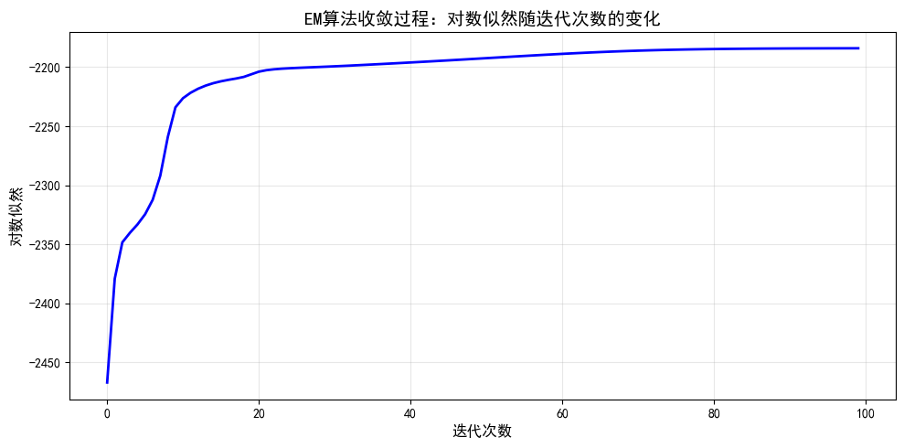

用训练处的 GMM 模型进行预测，可视化预测结果如下：

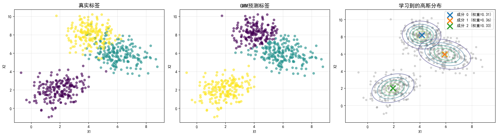

可以发现，学习到三个高斯分布，评估指标如下：

```
调整兰德指数 (ARI): 0.7985
标准化互信息 (NMI): 0.7831

最终对数似然: -2184.1402

各成分的统计信息:

成分 0:
  样本数: 186
  权重: 0.3055
  均值: [4.14921376 8.19712045]
  协方差矩阵的行列式: 0.470134

成分 1:
  样本数: 215
  权重: 0.3636
  均值: [5.91278011 5.97285756]
  协方差矩阵的行列式: 1.042082

成分 2:
  样本数: 199
  权重: 0.3309
  均值: [1.9522406  2.00239555]
  协方差矩阵的行列式: 0.717545
```

比较不同成分数量的效果，

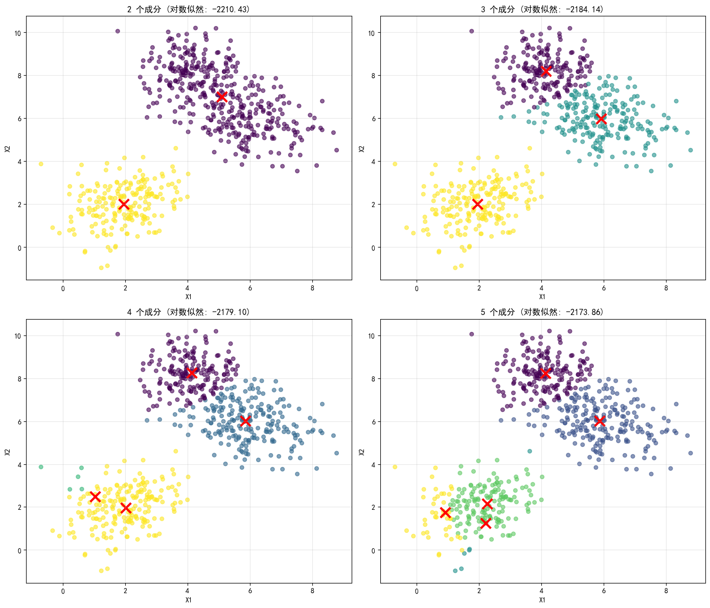

不同成分数量的对数似然: 在第 21 次迭代后收敛  

- 2 个成分: -2210.4259  
- 3 个成分: -2184.1402  
- 4 个成分: -2179.0959  
- 5 个成分: -2173.8606

## T3

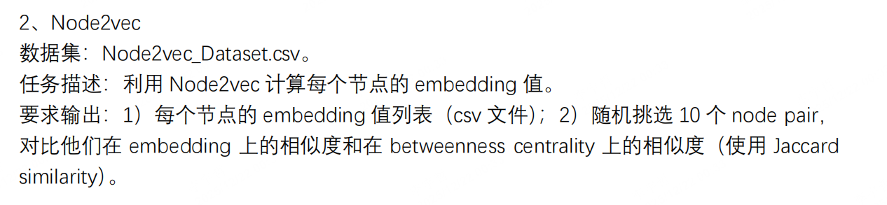

加载数据集，构建图。数据集形状为`(27806,2)`

图基本信息如下：

```
节点数: 7624
边数: 27806
```

并且图也是连通图

```python
class Node2Vec:
    """
    Node2vec算法实现
    使用随机游走生成节点序列，然后使用Word2Vec学习节点嵌入
    """
    
    def __init__(self, graph, walk_length=80, num_walks=10, p=1, q=1):
        self.graph = graph
        self.walk_length = walk_length
        self.num_walks = num_walks
        self.p = p
        self.q = q
        self.walks = []
        
    def _get_alias_edge(self, src, dst):
        """获取边的alias采样表（用于biased random walk）"""
        unnormalized_probs = []
        for dst_nbr in sorted(self.graph.neighbors(dst)):
            if dst_nbr == src:
                unnormalized_probs.append(1.0 / self.p)
            elif self.graph.has_edge(dst_nbr, src):
                unnormalized_probs.append(1.0)
            else:
                unnormalized_probs.append(1.0 / self.q)
        
        norm_const = sum(unnormalized_probs)
        normalized_probs = [float(u_prob) / norm_const for u_prob in unnormalized_probs]
        
        return self._alias_setup(normalized_probs)
    
    def _alias_setup(self, probs):
        """设置alias采样表"""
        K = len(probs)
        q = np.zeros(K)
        J = np.zeros(K, dtype=np.int32)
        
        smaller = []
        larger = []
        for kk, prob in enumerate(probs):
            q[kk] = K * prob
            if q[kk] < 1.0:
                smaller.append(kk)
            else:
                larger.append(kk)
        
        while len(smaller) > 0 and len(larger) > 0:
            small = smaller.pop()
            large = larger.pop()
            
            J[small] = large
            q[large] = q[large] - (1.0 - q[small])
            
            if q[large] < 1.0:
                smaller.append(large)
            else:
                larger.append(large)
        
        return J, q
    
    def _alias_draw(self, J, q):
        """从alias表中采样"""
        K = len(J)
        kk = int(np.floor(np.random.rand() * K))
        if np.random.rand() < q[kk]:
            return kk
        else:
            return J[kk]
    
    def node2vec_walk(self, start_node):
        """从起始节点开始biased random walk"""
        walk = [start_node]
        
        while len(walk) < self.walk_length:
            cur = walk[-1]
            cur_nbrs = sorted(self.graph.neighbors(cur))
            if len(cur_nbrs) > 0:
                if len(walk) == 1:
                    walk.append(cur_nbrs[random.randint(0, len(cur_nbrs) - 1)])
                else:
                    prev = walk[-2]
                    J, q = self._get_alias_edge(prev, cur)
                    next_node = cur_nbrs[self._alias_draw(J, q)]
                    walk.append(next_node)
            else:
                break
        
        return [str(node) for node in walk]
    
    def generate_walks(self):
        """为所有节点生成随机游走序列"""
        print("生成随机游走序列...")
        nodes = list(self.graph.nodes())
        
        for walk_iter in range(self.num_walks):
            print(f"  游走轮次 {walk_iter + 1}/{self.num_walks}")
            random.shuffle(nodes)
            for node in nodes:
                walk = self.node2vec_walk(node)
                self.walks.append(walk)
        
        print(f"生成了 {len(self.walks)} 条游走序列")
        return self.walks
```


训练 word2vec模型，并随机挑选10个 node 对比相似度

```
随机选择的10个节点对:
  节点对 1: (6329, 4426)
  节点对 2: (20, 5258)
  节点对 3: (5319, 2524)
  节点对 4: (4279, 2387)
  节点对 5: (2423, 5644)
  节点对 6: (4241, 2461)
  节点对 7: (4812, 4258)
  节点对 8: (1327, 2769)
  节点对 9: (792, 3418)
  节点对 10: (7287, 1149)
```

```
节点对相似度对比结果:
   node_pair  embedding_similarity  bc_jaccard_similarity  betweenness_node1  betweenness_node2
(6329, 4426)              0.327357                    0.0           0.000055           0.003086
  (20, 5258)              0.205177                    0.0           0.000603           0.000120
(5319, 2524)              0.172813                    0.0           0.002025           0.000198
(4279, 2387)              0.273827                    0.0           0.000027           0.000762
(2423, 5644)              0.158943                    0.0           0.000000           0.000026
(4241, 2461)              0.225201                    0.0           0.000381           0.000000
(4812, 4258)              0.191887                    0.0           0.000010           0.000000
(1327, 2769)              0.216749                    0.0           0.000049           0.000019
 (792, 3418)              0.153511                    0.0           0.000750           0.002815
(7287, 1149)              0.323942                    0.0           0.000516           0.000164
```

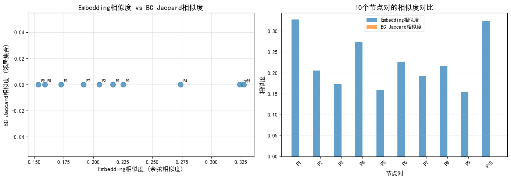

## T4

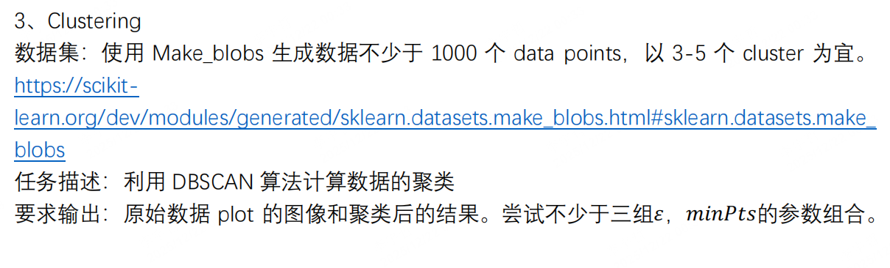

生成 1000 个 data points

```python
np.random.seed(42)

# 生成4个cluster的数据，总共1200个点
X, y_true = make_blobs(
    n_samples=1200,
    centers=4,
    n_features=2,
    cluster_std=0.8,
    random_state=42
)
```

```
数据形状: (1200, 2)
真实簇数: 4
每个簇的样本数:
  簇 0: 300 个样本
  簇 1: 300 个样本
  簇 2: 300 个样本
  簇 3: 300 个样本
```

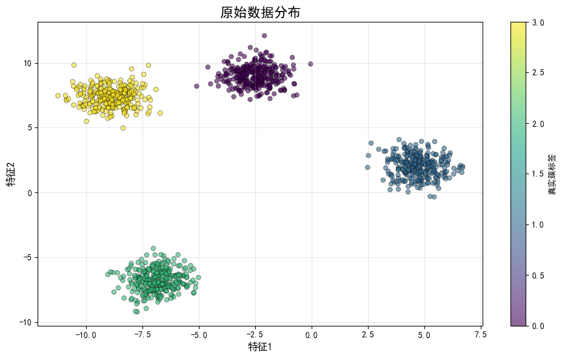

使用 DBSCAN 进行聚类，结果如下：

```
参数组合1: eps=0.3, min_samples=5:
  检测到的簇数: 11
  噪声点数: 117
  聚类点数: 1083

参数组合2: eps=0.5, min_samples=10:
  检测到的簇数: 4
  噪声点数: 65
  聚类点数: 1135

参数组合3: eps=0.7, min_samples=15:
  检测到的簇数: 4
  噪声点数: 21
  聚类点数: 1179

参数组合4: eps=0.4, min_samples=8:
  检测到的簇数: 4
  噪声点数: 119
  聚类点数: 1081
```

可视化结果如下：

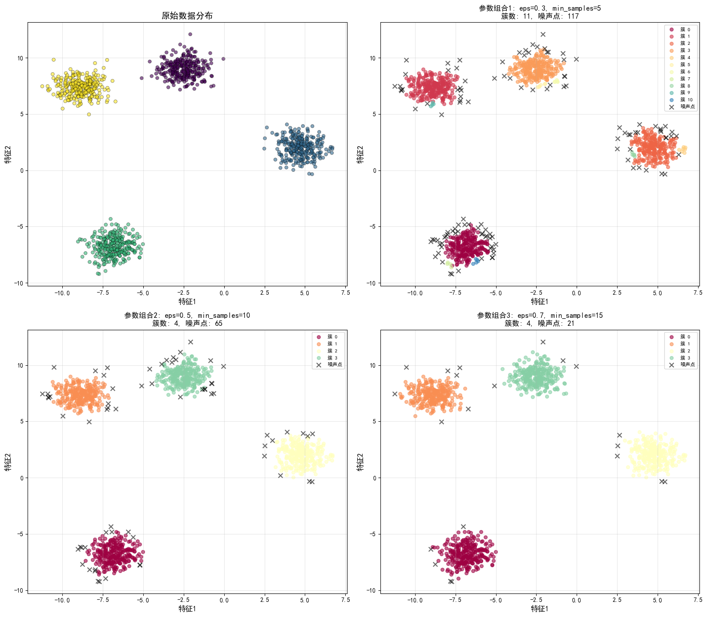

使用不同的参数组合

```
参数组合对比:
                          参数组合  eps  min_samples  检测到的簇数  噪声点数  聚类点数
 参数组合1: eps=0.3, min_samples=5  0.3            5      11   117  1083
参数组合2: eps=0.5, min_samples=10  0.5           10       4    65  1135
参数组合3: eps=0.7, min_samples=15  0.7           15       4    21  1179
 参数组合4: eps=0.4, min_samples=8  0.4            8       4   119  1081
```

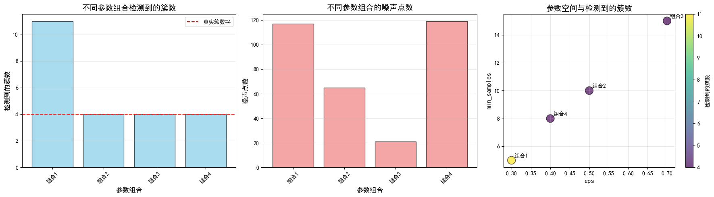

```
参数组合1: eps=0.3, min_samples=5:
  eps = 0.3, min_samples = 5
  结果: 检测到 11 个簇，117 个噪声点
  各簇大小: {0: 248, 1: 274, 2: 261, 3: 264, 4: 7, 5: 6, 6: 5, 7: 4, 8: 5, 9: 4, 10: 5}
  聚类比例: 90.25%

参数组合2: eps=0.5, min_samples=10:
  eps = 0.5, min_samples = 10
  结果: 检测到 4 个簇，65 个噪声点
  各簇大小: {0: 282, 1: 284, 2: 289, 3: 280}
  聚类比例: 94.58%

参数组合3: eps=0.7, min_samples=15:
  eps = 0.7, min_samples = 15
  结果: 检测到 4 个簇，21 个噪声点
  各簇大小: {0: 295, 1: 293, 2: 295, 3: 296}
  聚类比例: 98.25%

参数组合4: eps=0.4, min_samples=8:
  eps = 0.4, min_samples = 8
  结果: 检测到 4 个簇，119 个噪声点
  各簇大小: {0: 265, 1: 278, 2: 271, 3: 267}
```

- eps参数控制邻域半径，值越大，越容易形成更大的簇
- min_samples参数控制形成核心点的最小样本数，值越大，对噪声越敏感

